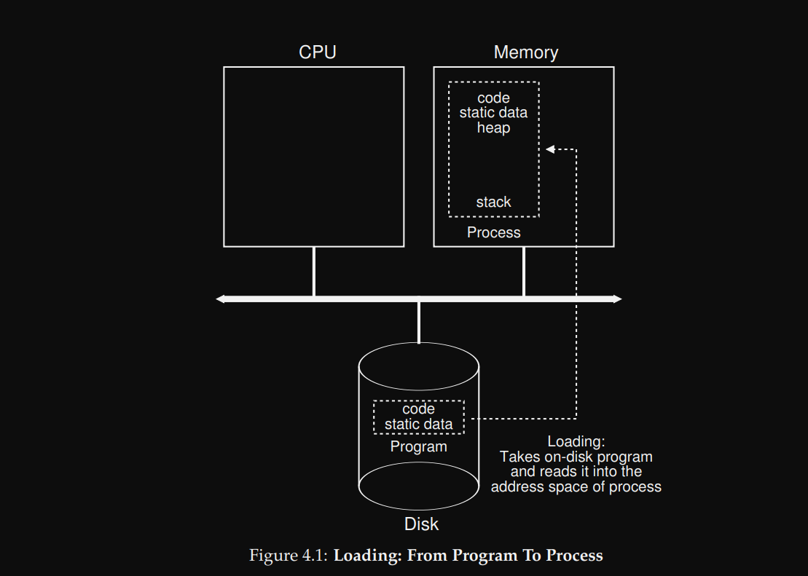
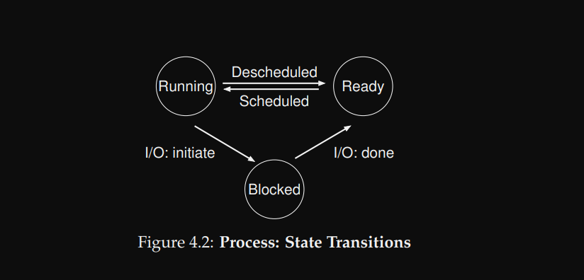
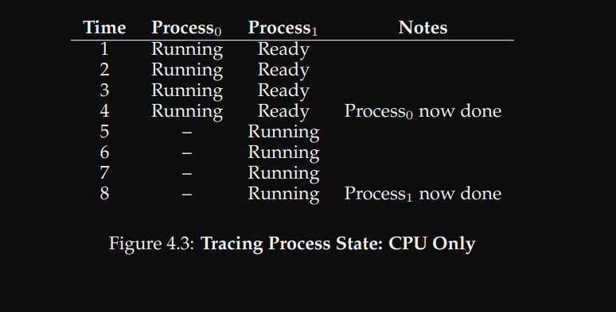
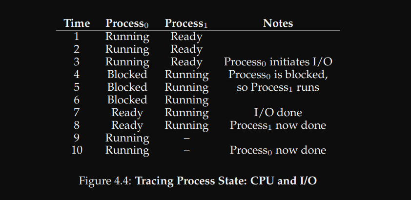
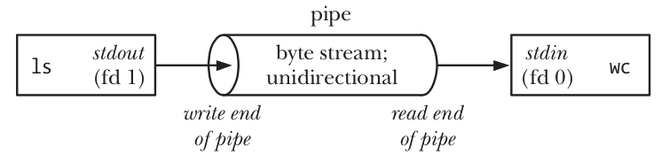

#+TITLE: Operating System: Three Easy Pieces Book
#+AUTHOR: Ziad Ahmed
#+DATE: Jun 02 2026
:PROPERTIES:
#+STARTUP:  content inlineimages
:END:

\\

* Introduction
** Resource Management

- الـOS بيسمح لبرامج كتير انها تشتغل في نفس الوقت (sharing CPU), بيسمح لبرامج كتير انها تقرأ من الmemory في نفس الوقت (sharing memory), وبيسمح لبرامج كتير انها تقرأ وتكتب علي الdisk في نفس الوقت.
- اذا فهو بيدير الـresources بتاعت الجهاز.

** Virtualization

- الOS بياخد physical resources زي الـCPU, memory, disk وبيحولهم لـvirtual form من نفسهم, اقوي واسهل في الاستخدام.
- الـOS ممكن نعتبره اكنه *virtual machine* مبنية فوق الـhardware.
- طبعا عشان نقدر نستفيد من الـvirtual machine دي ونطلب منها اللي احنا عاوزينه, فا الـOS بيوفرلنا APIs بالحاجات اللي نقدر نطلبها منه, والـAPIs دي بيكون اسمها *system calls*.

*** CPU Virtualization

- الـOS بيوهم كل برنامج انه عنده CPU خاص بيه لوحده ومتاح طول الوقت عشان بينفذله الـinstructions بتاعته.
- فالـOS بياخد الـCPU ويحوله لعدد لا متناهي من الـvirtual CPUs, ولكن في الحقيقة هو CPU واحد (او 4/6/8 حسب عدد الـcores) ولكن بيخدم او بيبدل علي كل البرامج (time sharing).

*** Memory Visrtualization

- الـOS بيعمل virtual address space لكل برنامج بيكون private مفيش برنامج تاني يقدر يقرأ منه او يكتب فيه, وبيوهم البرنامج انه واخد الـphysical memory كلها لوحده.
- والـOS بيـmap الـvirtual address space ده لـphysical address حقيقية في الـmemory بمساعدة الpage tables.
- والـmemory virtualization مش بس بيسمح للبرامج انها تتشارك في الmemory, لا ده كمان بيخلي الmemory اسهل في الاستخدام, البرنامج بيطلب الـmemory من الـOS من غير ما يشغل باله هل في مساحة فاضية ولا لا؟ ازاي احمي الdata بتاعتي من البرامج التانية, الخ...

  - هنا هنلاحظ ان الـchild والـparent عندهم نفس الـvirtual address ولكن بتـMap لـphysical adresses مختلفة.

#+begin_src c
int var = 5;

// Child
if (fork() == 0) {
    var = 10;
 }
// parent
printf("var: %d", var); // 5
#+end_src

** Concurrency

*** Atomicity:

- تنفيذ عدة instruction دفعة واحدة بدون ما توقف (pause) او مقاطعة (interrupt).

** Persistence

*** File system

- الـfile system هو software بيعمل abstraction للـdisk, وبينظم تخزين الملفات علي الdisk.
- الـabstraction هنا مش معناه ان كل برنامج ليه virtual disk خاص بيه, بالعكس احنا عاوزين الملفات تكون مشتركة بين البرامج, يعني مثلا ممكن نعمل ملف فيه C code, ونفس الملف ده هيعدي علي الtext editor ثم الcompiler ثم الOS هينفذه.
  ولكن الabstraction هنا معناه ان البرنامج ممكن يقرأ ويكتب علي الdisk بدون ما يشغل باله , هل في مساحة فاضية؟ ايه نوع الdisk ده؟ ازاي اتكلم معاه؟, الخ...

* The Process

** Abstraction

- الـprogram هو مجرد ملف فيه مجموعة من الـinstructions والـstatic data متخزنين علي الـdisk.
- الـprocess هي الـprogram لما يشتغل والـinstructions بتاعته تبدا تتنفذ. وهي اساس الـ *isolation* في الـOS
- الـprocess هي عبارة عن حزمة كاملة فيها:
  - ء *address space* خاص بيها معزول عن الـprocesses التانية. (stack, heap, data, code, ...).
  - ء *execution context* زي الـPC, registers, stack pointer وحاجات تانية بتعرف الCPU الحالة بتاعت process عشان يعرف يكمل من اخر نقطة وقف عندها.
  - ء *resources* ملفات مفتوحة, etc..., sockets.
- الـOS بيشغل اكتر من process في نفس الوقت, والـprocess بتوفرلنا مفهوم الـsoftware threads اللي بتعمل مسارات تنفيذ متعددة داخل نفس الـprocess
- اذا الـprocess هي اساس الـ *virtualization* و *conurrency* في الـOS.

** Process API

- الـOS بيوفر APIs كتير جدا لكل المميزات اللي هو بيوفرها.
- من اهم الـAPIs اللي لازم تكون متوفرة
  - process creation
  - process killing
  - waiting
  - process status

** Process Creation
:PROPERTIES:
:ID:       4c6db0cc-bb93-4848-8aa2-5db3975f3873
:END:

#+DOWNLOADED: screenshot @ 2026-06-02 17:42:03

الـprogram بيبقي متخزن علي الـdisk في شكل قابل للتنفيذ (executable format), الـOS بيقرأ الـexecutable ده ويعمل load للـinsturctions والـdata اللي فيه علي الـmemory في الـaddress space الخاص بالـprocess.

** Process States
:PROPERTIES:
:ID:       80392b68-62b9-473f-a1aa-343aa381655d
:END:

#+DOWNLOADED: screenshot @ 2026-06-02 18:16:14

- الـprocess ليها 3 حالات مختلفة:
  - ء Running: معناها ان الـprocess شغالة دلوقتي والـCPU بينفذ الـinstructions بتاعتها.
  - ء Ready: الـprocess جاهزة انها تكمل تنفيذ ولكن الـOS لسببا ما اختار انه يركنها دلوقتي (policy).
  - ء Blocked: الـprocess عملت حاجة بتطلب انتظار زي طلب كتابة علي الـdisk, فالـOS بيركن الـprocess شوية لحد ما الـdisk يرد ويخلي الـCPU يروح يكمل تنفيذ process تانية.

#+DOWNLOADED: screenshot @ 2026-06-02 18:27:43

#+DOWNLOADED: screenshot @ 2026-06-02 18:28:00

** Introduction to UNIX System Calls
*** fork()
- when we call fork() it will clone the address space of the *parent*, and
  create new process called *child*.
- the parent and child has the same virtual address space but it maps to
  different pyhsical addresses, so they same to identical but they are two
  different processes.
#+BEGIN_SRC C :tangle ./code/fork.c
#include <unistd.h>
#include <stdio.h>
#include <stdlib.h>
#include <sys/wait.h>

int main() {
    pid_t pid = fork();

    if (pid < 0)
        exit(1);
    if (pid > 0) {
        printf("parent: hello from parent\n");
        wait((int*) 0);
    } else {
        printf("child: hello from child\n");
        exit(1);
    }

    return 0;
}
#+END_SRC
*** exec()
- the exec() function overrites the address space of the current process with
  the data and instruction of the new executable
- it doesn't return to main() function again, unless an error occurred.
- by convention it ignores the first string in the argv, because it doesn't to
  know the name of the executable when have the executable itself.
#+BEGIN_SRC C :tangle ./code/exec.c
#include <unistd.h>
#include <stdlib.h>
#include <stdio.h>

int main() {
    // change "echo" to "bla bla" and it will still work fine.
    char *argv[] = {"echo", "hello", 0};
    execv("/bin/echo", argv);
    fprintf(stderr, "exec error");
}
#+END_SRC

#+RESULTS:
: hello
** Pipes & Redirects
*** The low-level idea behind them

- لما بنفتح ملف باستخدام =open()= بيتعمل حاجتين:
  1. في الmemory space بتاعت الprocess بيتعمل FD Table.
  2. في الkernel بيتعمل Open File Descriptions في الOpen File Table.

#+BEGIN_EXAMPLE
PROCESS A (FD Table)          OPEN FILE TABLE            INODE/VNODE TABLE
    +-----------------------+     +----------------------+      +-------------------+
    | Index (FD) | Pointer  |     |  Flags, Offset, Ptr  |      | File Metadata/Ops |
    |------------|----------|     |----------------------|      |-------------------|
    |   fd = 0   |    *-----+---->| [ Flags | * ]--------+--+-->| Inode: /dev/pts/0 |
    |------------|----------|     +----------------------+  |   | (Terminal)        |
    |   fd = 1   |    *-----+---->| [ Flags | * ]--------+--+   +-------------------+
    |------------|----------|     +----------------------+  |
    |   fd = 2   |    *-----+---->| [ Flags | * ]--------+--+
    |------------|----------|     +----------------------+      +-------------------+
    |   fd = 3   |    *-----+---->| [ Flags | * ]--------+----->| Inode: data.txt   |
    +-----------------------+     +----------------------+      | (On Disk)         |
                                                                +-------------------+
#+END_EXAMPLE

- FD Table:

  - جدول بسيط جواه الProcess بيخزن entries كل entry فيها index و pointer,
    الindex هو مجرد id للملف داخل الprocess. والpointer بيشاور علي الopen file
    description الخاص بالملف ده في الkernel

- Open File Table

  - دي centralized table في الkernel بيتخزن فيها الstate بتاعت كل الملفات المفتوحة علي مستوي الOS كله

  - كل ملف مفتوح بيبقي ليه record في الtable دي

- Open File Description:

  - ده الobject الحقيقي في الkernel, فيه الstate بتاعت الملف (reference count, offset, flags, ...)
  - ممكن يشاور عليه file descriptors مختلفة من اي process شغالة (reference count - shared pointers)

-----

- دالة =open()= بتعمل open file descriptor جديد كل مرة, فا ممكن تفتح نفس الملف كذا
  مرة ولكن بstate مختلفة.
  - سواء fd3 و fd4 ولكن كل واحد بيشاور علي open file descriptor مختلف
  - ال =dup()= ممكن تخلي كذا fd مختلف يشاور علي نفس الopen file descriptor في الkernel

#+BEGIN_SRC C
// the same file opened two times
int fd3 = open("file.txt", O_RDONLY); // description جديدة
int fd4 = open("file.txt", O_RDONLY); // description تانية مستقلة

int fd5 = dup(fd3);
#+END_SRC

-----
*** Another important info

- الfd الجديد ديما بياخد *اصغر* رقم متاح
- اغلب الposix/unix utilies مصممة انها تقرأ من الstdin لو ما اتبعتلهاش argument محددة

-----
*** Redirects

لما في الshell بتعمل =cat < input.txt=

1. الshell بيعمل fork لprocess جديدة.
2. بيقفل الstdin, فا كدا رقم 0 بقا متاح
3. بيفتح الملف اللي احنا هنبعته, والfd بتاعه هياخد رقم 0 (المفروض)
4. بينادي علي الcat executable وهو هيقرا من الملف

#+BEGIN_SRC C
char *argv[2] = {"cat", 0};

if (fork() == 0) {
    close(0);
    open("input.txt", O_RDONLY);
    exec("cat", argv);
 }
#+END_SRC

-----
*** dup()

- الdup() بترجع fd جديد بيشاور علي نفس الopen file description اللي بيشاور عليه الfd القديم, فا كدا بقا عندنا 2 fd بيشاورا علي نفس الobject في الkernel, يعني الref count بتاع الobject ده بيقا 2

- الopen file description في الkernel بيبقا ليه ref count, والkernel عمره ما هيقفل الobject ده الا لما الref count يبقي ب0 (shared pointer)

#+begin_src C
int savestdin = dup(0); // cloned the open file desc of stdin in a new fd
#+end_src

-----
*** dup2()

- الdup2() تختلف عن dup() في حاجات بسيطة ولكنها مهمة
- *اولا* بدل مكان الkernel هو اللي بيحدد الfd الجديد زي في dup(), لا, احنا اللي بنحدد الfd الجديد اللي هيتشارك مع الfd القديم في نفس الofd
- *ثانيا* عمليه الduplication بتحصل بطريقة *Atomic* وده اهم ما فيها
  - عمليه الduplication بتتم في خطوات كتير جدا
    1. فحص هل الnew fd مفتوح اصلا ولا لا؟
    2. فحص هل هو الnew fd هو نفس الold fd ولا لا
    3. قفل الملف اللي كان محجوز في الnew fd
    4. نسخ الopen file description

- ودي خطوات كتير اوي وممكن يتم مقاطعتها في النص, وهنرجع لنفس مشكلة الthread safety اللي كود الredirect
- ولكن dup2 بتعمل كل دا في خطوة واحدة

#+begin_src C
dup2(savestdin, 0); // clone 'savestdin' to stdin
#+end_src

-----
*** Thread-safe Redirection

- مثال علي thread unsafe redirection
  1. بنقفل الstdin عشان نستخدم الfd 0 للملف بتاعنا
  2. بنفتح الملف اللي عاوزينه ياخد الfd 0, بس هنا ممكن thread تانية تكون فتحت ملف جديد قبلنا, وفي الحالة دي الthread التاني هيكون خد مننا الfd 0 والthread الاولي هتاخد رقم تاني ومن هنا هتحصل بلاوي كتير

- Non thread-safe example:
#+BEGIN_SRC C
if (fork() == 0) {
    close(0);
    open("input.txt", O_RDONLY);
    exec("cat", argv);
 }
#+END_SRC

- Thread-safe example: طريقة اكثر احترافية وامان
#+begin_src C
if (fork() == 0) {
    int fd = open("input.txt", O_RDONLY);
    dup2(fd, 0); // atomic duplication
    close(fd); // we dont need it anymore
    exec("cat", argv);
 }
#+end_src

-----
*** Pipes (Anonymous Pipe)

الpipe هي ماسورة نقل بيانات بين الprocesses او i/o byte stream , بتنقل البيانات في خط احادي (unidirectional).

الاستخدام الاشهر للpipes هو اننا نخلي الoutput بتاع process يبقي الinput بتاع process تانية او بمعني اخر بنربط الstdout بتاع اول process بstdin بتاع ثاني process.

الinterface:
=int pipe(int fd[2])= الpipe بترجع 2 file descriptors بيمثلوا طرفين الماسورة, fd[0] بيعبر عن الread end و fd[1] بيعبر عن الwrite end.

ولكن الfds دي مش بتmap لfiles علي الdisk, الpipe اصلا هو عبارة عن buffer في الmemory بتاعت الkernel.

بيبقي ليه حجم ثابت ولو اتملأ (يعني الprocess اللي بتكتب بعتت داتا كتير) الprocess دي مش هتعرف تبعت داتا تاني لحد ما الprocess اللي بتقرا تسحب شوية داتا عشان تفضي مكان.

الkernel بيحدد برضو buffer تاني اسمه الPIPE_BUF وده الbuffer اللي بننقل بيه الداتا من الbuffer الكبير (pipe) خلال الماسورة, يعني نقدر نعتبره المغرفة اللي بننقل بيها الداتا, الPIPE_BUF ده ليه حجم ثابت برضو غالبا بيبقي 4kb ولو الداتا اللي بتتنقل اصغر من الحجم ده, هتتنقل كتلة واحدة *atomic*.

[[file:images/2026-05-13_06-42-08_screenshot.png]]

----

- Simple Example

#+begin_src c :tangle ./code/pipe.c
#include <stdio.h>
#include <unistd.h>

int main()
{
    int pfd[2];
    pipe(pfd); // Creating the pipe.

    if (fork() > 0) {
        close(pfd[0]); // Closing the read end
        write(pfd[1], "msg", 4);
        close(pfd[1]); // Closing the write end
    } else {
        char buf[4];
        close(pfd[1]); // Closing the write end
        read(pfd[0], buf, 4);
        printf("%s", buf); // msg
        close(pfd[0]); // Closing the read end
    }
    return 0;
}
#+end_src

#+RESULTS:
: msg

-----

- Real world example

  #+begin_src bash
ls | grep string
  #+end_src

  - لو grep اشتغل قبل ls, هيفضل في حالة blocking لحد ما ls يكتب داتا, او لحد ما الfd[0] يتقفل.

#+begin_src c
//  parent: shell

int fd[2];
pipe(fd);

// child: ls
if (fork() == 0) {
    close(fd[0]);
    dup2(fd[1], 1); // map the stdout of the 'ls' process to the write end
    exec("/bin/ls", args);
    exit(0);
}

// child: grep
if (fork() == 0) {
    close(fd[1]);
    dup2(fd[0], 0); // map the stdin of the 'grep' process to the read end
    exec("/bin/grep", args);
    exit(0);
}

// close the original fd[2], to terminate the pipe and prevent grep,
// from waiting for ever because it thinks that the read stream still going
close(fd[0]);
close(fd[1]);

// clear the zombie processes
wait(NULL);
wait(NULL);
#+end_src

-----

- ملحوظة الpipe ممكن تشتغل كا bidirectional عادي, لكن هيحصل مشاكل deadlocks و race conditions, فا دا مش محبب

#+begin_src C
#include <stdio.h>

#include <unistd.h>
#include <sys/wait.h>
#include <stdlib.h>

int main() {
    int pfd[2];
    pipe(pfd); // Creating the pipe.

    if (fork() > 0) {
        char buf[4];
        write(pfd[1], "msg\0", 4);
        wait(0);
        read(pfd[0], buf, 4);
        printf(buf);
        exit(0);
    } else {
        char buf[4];
        read(pfd[0], buf, 4);
        printf(buf);
        write(pfd[1], "zoz", 4);
        exit(0);
    }
    return 0;
}
#+end_src
** Process Waiting
*** wait()

- الـ =wait()= بتخلي الـparent يستني اقرب child process هتخلص.
- الـ =wait()= مصممة انها تشتغل من الاعلي للاسفل (top down) في الـ *process tree*, فا مينفعش الـchild يستني الـparent.
هي مصممة انها تستني الـchild process فقط لكن العكس غير ممكن.
- لو استخدمتها في process ملهاش ابناء, هتفشل وهترجع =1-=, يعني اكنها مش موجودة مش هتعمل اي حاجة.

#+begin_src c
int main(int argc, char *argv[])
{
    int pid = fork();

    switch (pid) {
    case -1: {
        char *msg = "fork(): something went wrong\n";
        write(STDERR_FILENO, msg, strlen(msg));
        exit(1);
    }
    case 0: {
        wait(NULL); // will fail and return -1
        msg = "child: hello dad\n";
        write(STDERR_FILENO, msg, strlen(msg));
        exit(1);
    }
    default:
        char *msg = "parent: hello son\n";
        write(STDERR_FILENO, msg, strlen(msg));
        break;
    }
    wait(NULL);
    return 0;
}
#+end_src
*** waitpid()

الـ =waitpid(pid, &status, options)= بتدينا تحكم اكبر من =wait= , بالذات لو عندك اكتر من child process.

 - =pid=:

   - لو =pid > 0=   استنا child معين.
   - لو =pid = 0=   استنا اي child من نفس الـ *process group*.
   - لو =pid = -1= استنا اقرب child هيخرج عمتا (نفس سلوك =wait=).
   - لو =pid < -1= استنا اي child من *group* تاني

 - =options=:

   - لو =0= مش هيعمل حاجة (blocking).
   - لو =WNOHANG= الـparent مش هيقف لو الـchild لسه مخلصش, وهترجع 0, او الـpid بتاع الـchild لو خلص (non-blocking).
   - لو =WNOTRACING= لو الـchild اتوقف مؤقتا بـC-z او اي signal تانية, الـparent هيكمل شغل ومش هيستناه (non-blocking).

*** wait & waitpid status

الـstatus بتاعت الـchild بتبقي متخزنة bitwise, يعني مثلا الـexit code بيبقي متخزن في *ثاني* byte في الـstatus integer, فا قراءة الـstatus بتبقي صعبة, لكن في *macros* بتساعدنا نقرأ الـstatus بشكل سهل.

#+begin_src c
WIFEXITED(status)      // is it exited normally?
WEXITSTATUS(status)    // what is the exit code? (if WIFEXITED(status) == true)

WIFSIGNALED(status)    // is it killed with a signal?
WTERMSIG(status)       // what is the signal number? (if WIFSIGNALED(status) == true)

WIFSTOPPED(status)     // is it stopped?
WSTOPSIG(status)       // which signal stopped it?
#+end_src
