#+TITLE: Operating System: Three Easy Pieces Book
#+AUTHOR: Ziad Ahmed
#+DATE: Jun 02 2026
:PROPERTIES:
#+STARTUP:  content inlineimages
:END:

\\

* Introduction

** Virtualization

- الOS بياخد physical resources زي الـCPU, memory, disk وبيحولهم لـvirtual form من نفسهم, اقوي واسهل في الاستخدام.
- الـOS ممكن نعتبره اكنه *virtual machine* مبنية فوق الـhardware.
- طبعا عشان نقدر نستفيد من الـvirtual machine دي ونطلب منها اللي احنا عاوزينه, فا الـOS بيوفرلنا APIs بالحاجات اللي نقدر نطلبها منه, والـAPIs دي بيكون اسمها *system calls*.

*** CPU Virtualization

- الـOS بيوهم كل برنامج انه عنده CPU خاص بيه لوحده ومتاح طول الوقت عشان بينفذله الـinstructions بتاعته.
- فالـOS بياخد الـCPU ويحوله لعدد لا متناهي من الـvirtual CPUs, ولكن في الحقيقة هو CPU واحد (او 4/6/8 حسب عدد الـcores) ولكن بيخدم او بيبدل علي كل البرامج (time sharing).

*** Memory Virtualization

- الـOS بيعمل virtual address space لكل برنامج بيكون private مفيش برنامج تاني يقدر يقرأ منه او يكتب فيه, وبيوهم البرنامج انه واخد الـphysical memory كلها لوحده.
- والـOS بيـmap الـvirtual address space ده لـphysical address حقيقية في الـmemory بمساعدة الpage tables.
- والـmemory virtualization مش بس بيسمح للبرامج انها تتشارك في الmemory, لا ده كمان بيخلي الmemory اسهل في الاستخدام, البرنامج بيطلب الـmemory من الـOS من غير ما يشغل باله هل في مساحة فاضية ولا لا؟ ازاي احمي الdata بتاعتي من البرامج التانية, الخ...

  - هنا هنلاحظ ان الـchild والـparent عندهم نفس الـvirtual address ولكن بتـMap لـphysical adresses مختلفة.

#+begin_src c
int var = 5;

// Child
if (fork() == 0) {
    var = 10;
 }
// parent
printf("var: %d", var); // 5
#+end_src

** Concurrency

*** Atomicity:

- تنفيذ عدة instruction دفعة واحدة بدون ما توقف (pause) او مقاطعة (interrupt).

** Persistence

*** File system

- الـfile system هو software بيعمل abstraction للـdisk, وبينظم تخزين الملفات علي الdisk.
- الـabstraction هنا مش معناه ان كل برنامج ليه virtual disk خاص بيه, بالعكس احنا عاوزين الملفات تكون مشتركة بين البرامج, يعني مثلا ممكن نعمل ملف فيه C code, ونفس الملف ده هيعدي علي الtext editor ثم الcompiler ثم الOS هينفذه.
  ولكن الabstraction هنا معناه ان البرنامج ممكن يقرأ ويكتب علي الdisk بدون ما يشغل باله , هل في مساحة فاضية؟ ايه نوع الdisk ده؟ ازاي اتكلم معاه؟, الخ...

* Virtualization

** The Process
*** What is the Process?

- الـprogram هو مجرد ملف فيه مجموعة من الـinstructions والـstatic data متخزنين علي الـdisk.
- الـprocess هي الـprogram لما يشتغل والـinstructions بتاعته تبدا تتنفذ. وهي اساس الـ *isolation* في الـOS
- الـprocess هي عبارة عن حزمة كاملة فيها:
  - ء *address space* خاص بيها معزول عن الـprocesses التانية. (stack, heap, data, code, ...).
  - ء *execution context* زي الـPC, registers, stack pointer وحاجات تانية بتعرف الCPU الحالة بتاعت process عشان يعرف يكمل من اخر نقطة وقف عندها.
  - ء *resources* ملفات مفتوحة, etc..., sockets.
- الـOS بيشغل اكتر من process في نفس الوقت, والـprocess بتوفرلنا مفهوم الـsoftware threads اللي بتعمل مسارات تنفيذ متعددة داخل نفس الـprocess
- اذا الـprocess هي اساس الـ *virtualization* و *conurrency* في الـOS.

*** Process API

- الـOS بيوفر APIs كتير جدا لكل المميزات اللي هو بيوفرها.
- من اهم الـAPIs اللي لازم تكون متوفرة
  - process creation
  - process killing
  - waiting
  - process status

*** Process Creation
:PROPERTIES:
:ID:       4c6db0cc-bb93-4848-8aa2-5db3975f3873
:END:

#+DOWNLOADED: screenshot @ 2026-06-02 17:42:03
[[file:images/2026-06-02_17-42-03_screenshot.png]]

الـprogram بيبقي متخزن علي الـdisk في شكل قابل للتنفيذ (executable format), الـOS بيقرأ الـexecutable ده ويعمل load للـinsturctions والـdata اللي فيه علي الـmemory في الـaddress space الخاص بالـprocess.

*** Process States
:PROPERTIES:
:ID:       80392b68-62b9-473f-a1aa-343aa381655d
:END:

#+DOWNLOADED: screenshot @ 2026-06-02 18:16:14
[[file:images/2026-06-02_18-16-14_screenshot.png]]

- الـprocess ليها 3 حالات مختلفة:
  - ء Running: معناها ان الـprocess شغالة دلوقتي والـCPU بينفذ الـinstructions بتاعتها.
  - ء Ready: الـprocess جاهزة انها تكمل تنفيذ ولكن الـOS لسببا ما اختار انه يركنها دلوقتي (policy).
  - ء Blocked: الـprocess عملت حاجة بتطلب انتظار زي طلب كتابة علي الـdisk, فالـOS بيركن الـprocess شوية لحد ما الـdisk يرد ويخلي الـCPU يروح يكمل تنفيذ process تانية.

#+DOWNLOADED: screenshot @ 2026-06-02 18:27:43
[[file:images/2026-06-02_18-27-43_screenshot.png]]

#+DOWNLOADED: screenshot @ 2026-06-02 18:28:00
[[file:images/2026-06-02_18-28-00_screenshot.png]]

*** Introduction to UNIX System Calls
**** fork()

- when we call fork() it will clone the address space of the *parent*, and
  create new process called *child*.
- the parent and child has the same virtual address space but it maps to
  different pyhsical addresses, so they same to identical but they are two
  different processes.
#+BEGIN_SRC C :tangle ./code/fork.c
#include <unistd.h>
#include <stdio.h>
#include <stdlib.h>
#include <sys/wait.h>

int main() {
    pid_t pid = fork();

    if (pid < 0)
        exit(1);
    if (pid > 0) {
        printf("parent: hello from parent\n");
        wait((int*) 0);
    } else {
        printf("child: hello from child\n");
        exit(1);
    }

    return 0;
}
#+END_SRC
**** exec()

- the exec() function overrites the address space of the current process with
  the data and instruction of the new executable
- it doesn't return to main() function again, unless an error occurred.
- by convention it ignores the first string in the argv, because it doesn't to
  know the name of the executable when have the executable itself.
#+BEGIN_SRC C :tangle ./code/exec.c
#include <unistd.h>
#include <stdlib.h>
#include <stdio.h>

int main() {
    // change "echo" to "bla bla" and it will still work fine.
    char *argv[] = {"echo", "hello", 0};
    execv("/bin/echo", argv);
    fprintf(stderr, "exec error");
}
#+END_SRC

#+RESULTS:
: hello
**** Pipes & Redirects
**** The low-level idea behind them

- لما بنفتح ملف باستخدام =open()= بيتعمل حاجتين:
  1. في الmemory space بتاعت الprocess بيتعمل FD Table.
  2. في الkernel بيتعمل Open File Descriptions في الOpen File Table.

#+BEGIN_EXAMPLE
PROCESS A (FD Table)          OPEN FILE TABLE            INODE/VNODE TABLE
    +-----------------------+     +----------------------+      +-------------------+
    | Index (FD) | Pointer  |     |  Flags, Offset, Ptr  |      | File Metadata/Ops |
    |------------|----------|     |----------------------|      |-------------------|
    |   fd = 0   |    *-----+---->| [ Flags | * ]--------+--+-->| Inode: /dev/pts/0 |
    |------------|----------|     +----------------------+  |   | (Terminal)        |
    |   fd = 1   |    *-----+---->| [ Flags | * ]--------+--+   +-------------------+
    |------------|----------|     +----------------------+  |
    |   fd = 2   |    *-----+---->| [ Flags | * ]--------+--+
    |------------|----------|     +----------------------+      +-------------------+
    |   fd = 3   |    *-----+---->| [ Flags | * ]--------+----->| Inode: data.txt   |
    +-----------------------+     +----------------------+      | (On Disk)         |
                                                                +-------------------+
#+END_EXAMPLE

- FD Table:

  - جدول بسيط جواه الProcess بيخزن entries كل entry فيها index و pointer,
    الindex هو مجرد id للملف داخل الprocess. والpointer بيشاور علي الopen file
    description الخاص بالملف ده في الkernel

- Open File Table

  - دي centralized table في الkernel بيتخزن فيها الstate بتاعت كل الملفات المفتوحة علي مستوي الOS كله

  - كل ملف مفتوح بيبقي ليه record في الtable دي

- Open File Description:

  - ده الobject الحقيقي في الkernel, فيه الstate بتاعت الملف (reference count, offset, flags, ...)
  - ممكن يشاور عليه file descriptors مختلفة من اي process شغالة (reference count - shared pointers)

-----

- دالة =open()= بتعمل open file descriptor جديد كل مرة, فا ممكن تفتح نفس الملف كذا
  مرة ولكن بstate مختلفة.
  - سواء fd3 و fd4 ولكن كل واحد بيشاور علي open file descriptor مختلف
  - ال =dup()= ممكن تخلي كذا fd مختلف يشاور علي نفس الopen file descriptor في الkernel

#+BEGIN_SRC C
// the same file opened two times
int fd3 = open("file.txt", O_RDONLY); // description جديدة
int fd4 = open("file.txt", O_RDONLY); // description تانية مستقلة

int fd5 = dup(fd3);
#+END_SRC

-----
**** Another important info

- الfd الجديد ديما بياخد *اصغر* رقم متاح
- اغلب الposix/unix utilies مصممة انها تقرأ من الstdin لو ما اتبعتلهاش argument محددة

-----
**** Redirects

لما في الshell بتعمل =cat < input.txt=

1. الshell بيعمل fork لprocess جديدة.
2. بيقفل الstdin, فا كدا رقم 0 بقا متاح
3. بيفتح الملف اللي احنا هنبعته, والfd بتاعه هياخد رقم 0 (المفروض)
4. بينادي علي الcat executable وهو هيقرا من الملف

#+BEGIN_SRC C
char *argv[2] = {"cat", 0};

if (fork() == 0) {
    close(0);
    open("input.txt", O_RDONLY);
    exec("cat", argv);
 }
#+END_SRC

-----
**** dup()

- الdup() بترجع fd جديد بيشاور علي نفس الopen file description اللي بيشاور عليه الfd القديم, فا كدا بقا عندنا 2 fd بيشاورا علي نفس الobject في الkernel, يعني الref count بتاع الobject ده بيقا 2

- الopen file description في الkernel بيبقا ليه ref count, والkernel عمره ما هيقفل الobject ده الا لما الref count يبقي ب0 (shared pointer)

#+begin_src C
int savestdin = dup(0); // cloned the open file desc of stdin in a new fd
#+end_src

-----
**** dup2()

- الdup2() تختلف عن dup() في حاجات بسيطة ولكنها مهمة
- *اولا* بدل مكان الkernel هو اللي بيحدد الfd الجديد زي في dup(), لا, احنا اللي بنحدد الfd الجديد اللي هيتشارك مع الfd القديم في نفس الofd
- *ثانيا* عمليه الduplication بتحصل بطريقة *Atomic* وده اهم ما فيها
  - عمليه الduplication بتتم في خطوات كتير جدا
    1. فحص هل الnew fd مفتوح اصلا ولا لا؟
    2. فحص هل هو الnew fd هو نفس الold fd ولا لا
    3. قفل الملف اللي كان محجوز في الnew fd
    4. نسخ الopen file description

- ودي خطوات كتير اوي وممكن يتم مقاطعتها في النص, وهنرجع لنفس مشكلة الthread safety اللي كود الredirect
- ولكن dup2 بتعمل كل دا في خطوة واحدة

#+begin_src C
dup2(savestdin, 0); // clone 'savestdin' to stdin
#+end_src

-----
**** Thread-safe Redirection

- مثال علي thread unsafe redirection
  1. بنقفل الstdin عشان نستخدم الfd 0 للملف بتاعنا
  2. بنفتح الملف اللي عاوزينه ياخد الfd 0, بس هنا ممكن thread تانية تكون فتحت ملف جديد قبلنا, وفي الحالة دي الthread التاني هيكون خد مننا الfd 0 والthread الاولي هتاخد رقم تاني ومن هنا هتحصل بلاوي كتير

- Non thread-safe example:
#+BEGIN_SRC C
if (fork() == 0) {
    close(0);
    open("input.txt", O_RDONLY);
    exec("cat", argv);
 }
#+END_SRC

- Thread-safe example: طريقة اكثر احترافية وامان
#+begin_src C
if (fork() == 0) {
    int fd = open("input.txt", O_RDONLY);
    dup2(fd, 0); // atomic duplication
    close(fd); // we dont need it anymore
    exec("cat", argv);
 }
#+end_src

-----
**** Pipes (Anonymous Pipe)

الpipe هي ماسورة نقل بيانات بين الprocesses او i/o byte stream , بتنقل البيانات في خط احادي (unidirectional).

الاستخدام الاشهر للpipes هو اننا نخلي الoutput بتاع process يبقي الinput بتاع process تانية او بمعني اخر بنربط الstdout بتاع اول process بstdin بتاع ثاني process.
[[file:images/2026-05-13_06-38-19_screenshot.png]]

الinterface:
=int pipe(int fd[2])= الpipe بترجع 2 file descriptors بيمثلوا طرفين الماسورة, fd[0] بيعبر عن الread end و fd[1] بيعبر عن الwrite end.

ولكن الfds دي مش بتmap لfiles علي الdisk, الpipe اصلا هو عبارة عن buffer في الmemory بتاعت الkernel.

بيبقي ليه حجم ثابت ولو اتملأ (يعني الprocess اللي بتكتب بعتت داتا كتير) الprocess دي مش هتعرف تبعت داتا تاني لحد ما الprocess اللي بتقرا تسحب شوية داتا عشان تفضي مكان.

الkernel بيحدد برضو buffer تاني اسمه الPIPE_BUF وده الbuffer اللي بننقل بيه الداتا من الbuffer الكبير (pipe) خلال الماسورة, يعني نقدر نعتبره المغرفة اللي بننقل بيها الداتا, الPIPE_BUF ده ليه حجم ثابت برضو غالبا بيبقي 4kb ولو الداتا اللي بتتنقل اصغر من الحجم ده, هتتنقل كتلة واحدة *atomic*.

[[file:images/2026-05-13_06-42-08_screenshot.png]]

----

- Simple Example

#+begin_src c :tangle ./code/pipe.c
#include <stdio.h>
#include <unistd.h>

int main()
{
    int pfd[2];
    pipe(pfd); // Creating the pipe.

    if (fork() > 0) {
        close(pfd[0]); // Closing the read end
        write(pfd[1], "msg", 4);
        close(pfd[1]); // Closing the write end
    } else {
        char buf[4];
        close(pfd[1]); // Closing the write end
        read(pfd[0], buf, 4);
        printf("%s", buf); // msg
        close(pfd[0]); // Closing the read end
    }
    return 0;
}
#+end_src

#+RESULTS:
: msg

-----

- Real world example

  #+begin_src bash
ls | grep string
  #+end_src

  - لو grep اشتغل قبل ls, هيفضل في حالة blocking لحد ما ls يكتب داتا, او لحد ما الfd[0] يتقفل.

#+begin_src c
//  parent: shell

int fd[2];
pipe(fd);

// child: ls
if (fork() == 0) {
    close(fd[0]);
    dup2(fd[1], 1); // map the stdout of the 'ls' process to the write end
    exec("/bin/ls", args);
    exit(0);
}

// child: grep
if (fork() == 0) {
    close(fd[1]);
    dup2(fd[0], 0); // map the stdin of the 'grep' process to the read end
    exec("/bin/grep", args);
    exit(0);
}

// close the original fd[2], to terminate the pipe and prevent grep,
// from waiting for ever because it thinks that the read stream still going
close(fd[0]);
close(fd[1]);

// clear the zombie processes
wait(NULL);
wait(NULL);
#+end_src

-----

- ملحوظة الpipe ممكن تشتغل كا bidirectional عادي, لكن هيحصل مشاكل deadlocks و race conditions, فا دا مش محبب

#+begin_src C
#include <stdio.h>

#include <unistd.h>
#include <sys/wait.h>
#include <stdlib.h>

int main() {
    int pfd[2];
    pipe(pfd); // Creating the pipe.

    if (fork() > 0) {
        char buf[4];
        write(pfd[1], "msg\0", 4);
        wait(0);
        read(pfd[0], buf, 4);
        printf(buf);
        exit(0);
    } else {
        char buf[4];
        read(pfd[0], buf, 4);
        printf(buf);
        write(pfd[1], "zoz", 4);
        exit(0);
    }
    return 0;
}
#+end_src
*** Process Waiting
**** wait()

- الـ =wait()= بتخلي الـparent يستني اقرب child process هتخلص.
- الـ =wait()= مصممة انها تشتغل من الاعلي للاسفل (top down) في الـ *process tree*, فا مينفعش الـchild يستني الـparent.
هي مصممة انها تستني الـchild process فقط لكن العكس غير ممكن.
- لو استخدمتها في process ملهاش ابناء, هتفشل وهترجع =1-=, يعني اكنها مش موجودة مش هتعمل اي حاجة.

#+begin_src c
int main(int argc, char *argv[])
{
    int pid = fork();

    switch (pid) {
    case -1: {
        char *msg = "fork(): something went wrong\n";
        write(STDERR_FILENO, msg, strlen(msg));
        exit(1);
    }
    case 0: {
        wait(NULL); // will fail and return -1
        msg = "child: hello dad\n";
        write(STDERR_FILENO, msg, strlen(msg));
        exit(1);
    }
    default:
        char *msg = "parent: hello son\n";
        write(STDERR_FILENO, msg, strlen(msg));
        break;
    }
    wait(NULL);
    return 0;
}
#+end_src
**** waitpid()

الـ =waitpid(pid, &status, options)= بتدينا تحكم اكبر من =wait= , بالذات لو عندك اكتر من child process.

 - =pid=:

   - لو =pid > 0=   استنا child معين.
   - لو =pid = 0=   استنا اي child من نفس الـ *process group*.
   - لو =pid = -1= استنا اقرب child هيخرج عمتا (نفس سلوك =wait=).
   - لو =pid < -1= استنا اي child من *group* تاني

 - =options=:

   - لو =0= مش هيعمل حاجة (blocking).
   - لو =WNOHANG= الـparent مش هيقف لو الـchild لسه مخلصش, وهترجع 0, او الـpid بتاع الـchild لو خلص (non-blocking).
   - لو =WNOTRACING= لو الـchild اتوقف مؤقتا بـC-z او اي signal تانية, الـparent هيكمل شغل ومش هيستناه (non-blocking).

**** wait & waitpid status

الـstatus بتاعت الـchild بتبقي متخزنة bitwise, يعني مثلا الـexit code بيبقي متخزن في *ثاني* byte في الـstatus integer, فا قراءة الـstatus بتبقي صعبة, لكن في *macros* بتساعدنا نقرأ الـstatus بشكل سهل.

#+begin_src c
WIFEXITED(status)      // is it exited normally?
WEXITSTATUS(status)    // what is the exit code? (if WIFEXITED(status) == true)

WIFSIGNALED(status)    // is it killed with a signal?
WTERMSIG(status)       // what is the signal number? (if WIFSIGNALED(status) == true)

WIFSTOPPED(status)     // is it stopped?
WSTOPSIG(status)       // which signal stopped it?
#+end_src

** Direct Execution
*** The Problem

- عشان الـOS يحقق الـvirtualization لازم ببساطة جدا يقسم الـ *physical CPU* بين كل الـprocesses اللي شغالة.
- عشان يعمل الكلام ده ببساطة جدا هيشغل كل process شوية صغيرين بعد كدا يوقفها وينقل علي process تانية وهكذا... (time sharing)

- ولكن عشان نحقق مفهوم الـvirtualization بشكل سليم, هيقابلنا تحديين:
  - ازاي نعمل الكلام ده بشكل سريع بدون ما نحط overhead كبير علي النظام (performance challenge).
    - مش عاوزين الـOS يبقي بطئ ولا ياخد وقت كبير في التبديل بين الـprocesses.
  - ازاي في نفس الوقت الـOS يبقي عنده تحكم كامل علي كل الـprocesses اللي شغالة (control challenge).
    - مش عاوزين كل process تفضل شغالة للابد او تعمل حاجة مش المفروض تعملها.

*** The Solution

عشان نحل المشكلتين دول هنستخدم *mechanism* اسمه الـ *limited direct execution*.

**** Limited Direct Execution

الـ mechanism ده بينقسم لجزئين:

**** Direct Execution

- عشان نحقق سرعة في الاداء, هنخلي البرامج تشتغل بشكل native / مباشر علي الـCPU, فا مثلا لما الـOS يقرر يشغل برنامج:
  - يعمل entry ليه في الـprocess list.
  - يخصصله memory.
  - يعمل load ليه علي الـmemory, (يعمل load للـstack, heap,code, etc..).
  - يعمل jump علي الـentry point, زي (main()) ويبدأ ينفذ البرنامج.
  - يرجع الـoutput.
- وكل ده بيشتغل بطريقة سريعة ومباشرة, ولكن مازال عندنا مشكلة في التحكم:
  - ازاي نوقف الـprocess (pause - resume)؟
  - ازاي نمنع اي process انها تعمل حاجة مش المفروض تعملها؟
  - ازاي نخلي الـprocess متشتغلش للأبد؟
  - ازاي نخليها متدخلش علي memory مش بتاعتها؟
- ازاي نخلي الـprocess تعمل privelged opertations زي I/O او memory allocation, ولكن تحت اشراف الـOS؟

**** Limititations

***** User mode

الـprocess في الـuser mode مينفعش تنفذ اي *privileged operations* زي انها تعمل I/O request او تحجز memory زيادة, لو اي process حاولت تعمل اي حاجة زي كدا الـCPU هيحول التحكم للـkernel وهو هيكتشف الخطأ وهيقفل الـprocess دي.

***** Kernel mode

ده الـmode اللي بيشتغل فيه الـkernel, ويقدر ينفذ اي حاجة هو عاوزها بدون قيود.

***** System calls

ازاي نخلي اي process تستفيد من بعض مميزات الـkernel mode ولكن تحت اشراف الـkernel؟

الـsystem call وظيفتها تحول الـCPU من الـuser mode للـkernel mode عشان ينفذ privileged insturctions.
- اّلية العمل:
  - الـsystem call نفسها هي عبارة عن assembly instruction بتعرف الـkernel نوع الـservice اللي احنا عاوزينها, ولكن الـinstruction دي بتبقا abstracted بـlibrary wrapper (glibc for example) بيسهل علينا استخدام الـsystem call.
  - الـwrapper بيحط الـsystem call arguments في مناطق معينة في الـstack او في registers معينة (غالبا بتتحط في registers),بيتفق عليها glibc والـkernel.
  - بعد كدا بيحط الـ *syscall number* برضو في register معين.
  - بعد كدا بينادي علي الـ *hardware-specific trap instruction* اللي بتحول من الـuser mode للـkernel mode زي *syscall* في x86 او *ecall* في RISC-V.
  - الـkernel بيتولي زمام الامور من النقطة دي وبيحفظ حالة user mode process في الـkernel stack زي:
    - قيم الـregisters.
    - program counter (PC)
    - stack pointer
- عشان لما يرجع, يرجع عند نفس النقطة (return from trap)
- وبرضو الـwrapper بيوفر سهولة في error handling لو حصل مشاكل لان الـkernel عادة بيرجع errors مبتكونش human readable.

#+begin_example
Your Program
     |
     |  Procedure Call
     v
glibc read()
     |
     |  System Call
     v
Kernel sys_read()
     |
     v
Kernel returns
     |
     v
glibc read()
     |
     v
Your Program
#+end_example

**** Trap

الـtrap insturction بتدخل الـkernel من entry معينة الـkernel هو اللي بيحددها, عشان يحمي نفسه من الـmalicious processes.

***** Trap Table

طب ازاي هيعرف الـaddress او الـentry point اللي محددها الـkernel؟
مثال:
- مثلا لو المستخدم نفذ system call زي دا, فالـwrapper هيعمل شوية حاجات وبعد كدا في الاخر هينادي علي الـtrap instruction زي *syscall*
- هنا الـCPU عرف انه محتاج يدخل للـkernel mode, بس هيدخل منين؟ الـkernel فيه ملايين السطور من الكود!

#+begin_src c
read(fd, buf, 100);
    |
    v
 syscall
#+end_src

 هنا يجي دور الـ *trap table*, هي table الي kernel بيعملها اثناء الـboot في الاول خالص وبيعرف الـCPU عنوانها. بيكون فيها *trap numbers* وكل رقم من دول بيـMap لعنوان *handler* معين هيتنفذ لما يحصل حدث معين, الحدث ده ممكن يبقي:
 - System call
 - Interrupt
   * keyboard
   * mouse
   * disk
   * timer
 - Exception
   * divide by zero
   * page fault
   * bad instruction

- مثال تخيلي علي الـtrap table
- كلمة handler معناها كود بيتنفذ لما يحصل حدث معين.

  #+begin_example
Trap Number     Handler Address
--------------------------------
0               divide_by_zero_handler
13              protection_fault_handler
14              page_fault_handler
32              timer_interrupt_handler
80              system_call_handler
  #+end_example

***** More about security - user input

الـtrap tables بتحمي الـkernel mode, عن طريق انها بتعمل *hardware trapping mechanism* بيخلينا نحول من الـuser mode للـkernel mode بطريقة امنة, الا ان ده مش بيضمن الامان المطلق, لسه في حاجات كتير الـkernel لازم ياخد باله منها بخصوص الحماية, زي الـuser input, لازم الـ *system call handler* يفحص الـuser arguments كويس جدا, قبل ما يروح يكلم الـhardware, لان الـuser ممكن يكون باعت malicious input او addresses. فالـkernel بيتعامل مع الـuser input بحذر شديد.

***** return-from-trap instruction

الـ *return-form-trap* هي instruction بترجع للـ calling process وبتعمل pop للقيم بتاعت الregisters من الkernel stack وبتخفض الـprivilege للـuser mode وتكمل تنفيذ الuser process من اخر نقطة.

***** Trap frame

الـtrap frame هو حالة الـuser process اللي الـCPU هيرجعلها بعد كدا لما يرجع للـuser mode, لما بننادي علي الـtrap instruction الـtrap handler بيحفظ snapshot لحالة الuser process قبل ما ينادي الـsyscall handler الفعلي. والـsnapshot ده بيبقي اسمه الـ *trap frame* وبيتخزن في الـkernel stack.

**** Switching between processes - Timer

***** The  Problem

الـcpu virtualization قائم علي فكرة التبديل بين الـprocesses, ولكن ازاي هنعمل الكلام ده؟ الفكرة تبان بسيطة ولكن هي في الحقيقة tricky شوية.

لما الـprocess بتشتغل بيبقي الـcpu مشغول معاها والـos ميقدرش يستعيد زمام الامور تاني (regain control), لان ازاي الـos هيستعيد زمام الامور وهو مش شغال اصلا؟ الـcpu مشغول مع process تانية.

***** The Old Solution - Cooperative approach

الطريقة الوحيدة للـos انه يرجع زمام الامور من تاني بعد ما كان الـcpu مشغول مع process تانية, هي ان الـprocess دي تعمل *exception* او *interruption* او تنادي *system call*, وساعتها الـcpu بيحول من الـuser mode للـkernel mode وبيرجع زمام الامور للـos تاني.

زمان كان الحل للموضوع ده هي ان الـos كان بيثق في الـprocess اللي شغالة انها هتعمل interruption او exception بحيث الـcpu يحول من الـuser mode للـkernel mode, ولكن الحل ده كان كويس زمان لما كان نفس الـvendor اللي بيبيع الـhardware هو نفسه بيديك معاه operating system وهو نفسه اللي بيديك software عشان يشتغل داخل الـos ده, فكان الـos والـsoftwares بتشتغل بشكل متعاون مع بعضها لان الـos كان بيقدر يتوقع سلوك الـsoftwares دي.

ولكن دلوقتي ومع وجود الـthird-party software, الطريقة دي بقت غير مناسبة تماما, لان الـos مبقاش يقدر يثق في البرنامج اللي شغال.
ممكن البرنامج ده ميستخدمش اي system calls خالص, او يعمل اي exception او interruptions, او ممكن يخش في infinite loop ويفضل شغال للابد, فا ساعتها الـcpu هيفضل مشغول مع الـprocess علي طول والـos مش هيعرف يرجع التحكم علي النظام تاني, وكان لو برنامج هنج بيهنج الـos معاه ومفيش طريقة الـos يتعافي منها غير اننا نعمل reboot للـsystem.

***** The Real Solution - Non-Cooperative approach - Timer

ولكن الحل العبقري للحوار ده هو ان الـos يستعين بالـhardware, فا اتعمل الـ *timer*.

الـtimer هو physical device بيعد كل كام milisecond ويبعت timer interrupt للـcpu يخليه يحول من الـuser mode للـkernel mode بشكل اجباري, وساعتها الـos بيستعيد زمام الامور وممكن بعد كدا يوقف الـprocess دي ويكمل تنفيذ process تانية او يشغل process جديدة او يعمل اللي هو عاوزه حسب الـpolicies اللي ماشي عليها.

**** Context Switching

بمجرد ما الـos استعاد زمام الامور من تاني, سواء بطريقة cooperative عن طريق system call او بطريقة non-cooperative عن طريق timer interrupt, فالمهم انه لازم ياخد قرار معين, والجزء المسؤل عن اتخاذ القرار هو الـ *Scheduler* وبيشتغل بـpolicies معينة

ولكن لو كان القرار هو التبديل للـprocess فا التبديل ده اسمه الـ *context switch*, وهو ببساطة جدا ان الـos بيعمل push للـexecution context بتاع الـprocess الحالية علي kernel stack ويعمل pop للـexecution context بتاع الـprocess اللي هنبدل ليها (soon to be executed) من الـkernel stack, بحيث ان الـcpu يبقا عارف هو رايح فين وراجع فين.

** CPU Scheduiling

*** Workload Assumptions

عشان نعمل scheduling policy, لازم نحط assumptions, وواحدة من الـassumptions دي هي الـworkload assumptions.
الـworkload هو جزء اساسي في بناء اي scheduling policy, وكل ما نسحب الـworkload بشكل ادق كا ما الـpolicy تكون مظبوطة اكتر.

امثلة علي الـworkload assumptions, زي:

- هل الـjobs هتاخد نفس الوقت في التنفيذ ولا لا؟
- هل الـjobs كلها هتوصل النظام في نفس الوقت؟
- هل وقت تنفيذ كل job معروف؟ (runtime)
- هل الـjobs هتعمل IO requests ولا هتستخدم الـCPU فقط؟

  والـscheduling algroithm بياخد قرار علي الافتراضات دي.

*** Scheduling Metrics

عشان نعرف نقارن بين الـscheduling algorithms محتاجين metric نقيس بيها اداء كل الجوريزم.

امثلة علي الـscheduling metrics:

**** Turnaround time

الـturnaround time هو الـexecution time + waiting time.
او الـcompletion time - arrival time.

الـarrival time هو الوقت اللي البرنامج وصل فيه للنظام واتحول لـprocess/jop.

***** FIFO
:PROPERTIES:
:ID:       b95a02dc-b2b5-43e9-bb35-a7b57aa03214
:END:

ده الجوريزم بسيط جدا بيعتمد علي نظام الطابور, يعني الـjop اللي هتوصل الاول هي اللي هتتنفذ الاول.

لو اعتبرنا ان احنا عندنا 3 jops وكلهم وصلوا مع بعض وكلهم عندهم نفس الـruntime
فا هنا الـaverage turnaround time هيكون:

$$\frac{10+20+30}{3} = 20$$s

#+DOWNLOADED: screenshot @ 2026-06-11 21:08:43
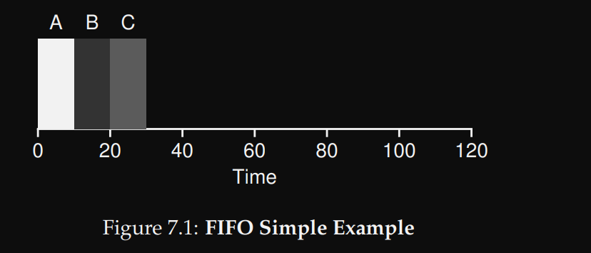

الالجوريزم ده كويس طول ما كل الـjops بتاخد نفس الـrun time او حتي متقاربة في الوقت.
لكن لو الفرق كبير بين الـjops, فالاداء هيكون وحش جداً, مثال:

هنا كلهم وصلوا في نفس الوقت, ولكن A خدت وقت كبير جدا 100 ثانية عشان تتنفذ و B,C فضلوا مستنينها كتير جدا في حين انهم لو كانوا بدأو هما الاول كان خلصوا من بدري.
يعني اكنك في super market واستنيت واحد قدامك محمل عربية كاملة لحد ما يخلص, في حين ان نت بس عاوز تشتري زجاجة مياه.

الـaverage turnaround time =

$$\frac{100 + 110 + 120}{3} = 110$$ وده وقت كبير جدا كا متوسط.

#+DOWNLOADED: screenshot @ 2026-06-11 22:02:13
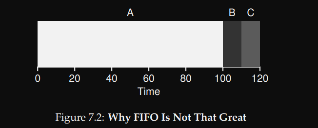

***** SJF - shortest jop first
:PROPERTIES:
:ID:       eed18769-7c0d-4463-9572-9e75bf2281b6
:END:

ده الجوريزم بيحل مشكلة FIFO, عن طريق انه بينفذ الـjops الاقصر الاول.

$$\frac{10 + 20 + 120}{3} = 50 $$ وده افضل بكتير من FIFO.

#+DOWNLOADED: screenshot @ 2026-06-12 02:26:11
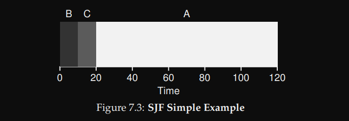

ولكن افتراض ان كل الـjops وصلت في نفس الوقت, ده افتراض خيالي مش بيحصل في الحقيقة, وممكن نرجع لنفس المشكلة الاولانية تاني.
هنا A وصلت عند 0, B و C وصلوا عند 10, والاتنين هيفضلوا مستنين A كتير جدا لحد ما تخلص.

$$\frac{100 + 100 + 110}{3} = 103.33$$

#+DOWNLOADED: screenshot @ 2026-06-12 03:04:51
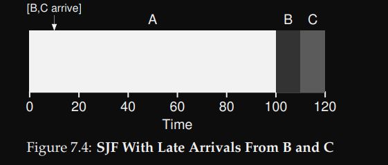

***** STCF Shortest time-to-completion first | PSJF Preemptive shortest jop first
:PROPERTIES:
:ID:       1a1b57b5-cff0-4ff7-a64b-b1e76b7c5093
:END:

الالجورزم ده اذكي لانه عنده القابيلة انه يوقف الـjop اللي شغال عليها ويروح ينفذ jop ثانية هتاخد وقت اقصر

$$\frac{10 + 20 + 120}{3} = 50$$

#+DOWNLOADED: screenshot @ 2026-06-12 03:16:18
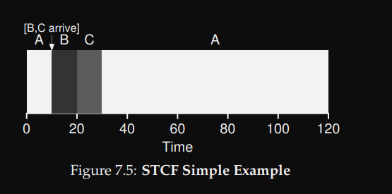

**** Response time:
:PROPERTIES:
:ID:       8fa402c9-9e69-474c-928d-18ae5d797edc
:END:

كل الخوراوميات اللي فاتت دي كانت بتهتم بالـturnaround time او يعني الـjop دي هتاخد وقت اد ايه لحد ما تخلص؟ ولكن ده كان كويس جدا زمان في الـOSes اللي كانت بتشتغل بنظام الـbatching

لكن اتضح مع كونسبت الـtime sharing, ان الوقت اللي الـjop هتتنفذ فيه لاول مرة (response time) اهم من الوقت الكلي اللي هتاخده لحد ما تخلص (turaround time)

*Trunaround time* = $$Tcompletion - Tarrival$$

*Response Time*   = $$Tfirstrun - Tarrival$$

#+DOWNLOADED: screenshot @ 2026-06-12 06:30:15
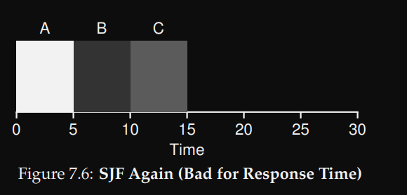

تخيل ان =C= هي REPL او shell او اي interactive program, فا كدا الـuser بعد ما دخل الـinput وداس enter, استنا 15 ثانية كاملين عقبال ما البرنامج يرجعله output.

فا اه الوقت اللي البرامج بتخلص فيه بقا اسرع لكن الوقت اللي بتبدأ فيه ما زال بطئ

احنا عاوزين مثلا اول ما ندخل input للـshell وندوس enter, يرد علينا في لحظتها والا البرنامج مبقاش interactive خالص, فالـresponse time مهم جدا حتي لو البرنامج في الاخر هيخلص ابطئ حاجة بسيطة.

***** Round Robin
:PROPERTIES:
:ID:       24897458-b534-4def-afa5-22b5c0d5d6b5
:END:

الـround robin بيهتم بالـresponse time, وكدا النظام بقا اكثر تفاعليه حتي لو كل jop هتاخد وقت اكتر شوية لحد ما تخلص, بسبب ان في context switching كتير بيحصل وده بيجي شوية علي حساب الـturnaround time

ولكن الـScheduler مش وظيفته يكون مثالي, وهو وظيفته يكون متوازن.

#+DOWNLOADED: screenshot @ 2026-06-12 06:30:35
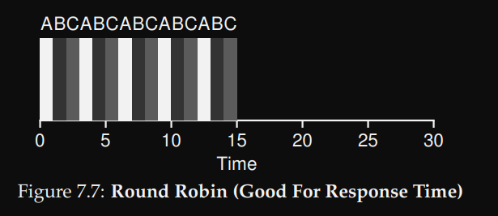

كل ما قل الـtime slice كل ما الـresponse time هيقل وده يبان كويس ولكن عدد الـcontext switches هيزيد جامد وبالتالي الـturnaround time هيزيد, وده هيحط overhead كبير جدا علي الاداء العام, لان الـcontext switching عملية مكلفة.

فا لازم الـtime slice يكون اقل ما يمكن بحيث الـresponse time يكون سريع ولكن في نفس الوقت ميجيش جامد علي حساب الـturnaround time ويزود عدد الـcontext switches اللي بيحصل.

**** Incorporating I/O
:PROPERTIES:
:ID:       6fd340e7-6e81-428e-8c51-0c624febcb6f
:END:

لو عندنا 2 jops كل واحدة فيهم محتاجة 50ms من وقت الـCPU, ولكن الـjop A بتعمل I/O request كل 10ms.

لو الـscheduler في الحالة دي STCF, فا لو A هي اللي وصلت الاول, B هيفضل مستنيها كتير جدا لان الـSTCF مش بيعمل context switching.

لكن لو الـscheduler شغال بـRR, فا هيعتبر ان الـ10ms I/O دي jop جديدة منفصلة وهيعمل overlap بين وقت الـCPU و وقت الـDisk بحيث نستفيد من الموارد اقصي استفادة ممكنة.

#+DOWNLOADED: screenshot @ 2026-06-12 21:24:02
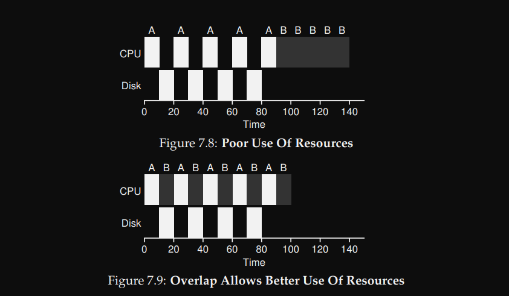

** Multi-level Feedback
:PROPERTIES:
:ID:       a7e23327-fc54-401c-97c9-36759fab5643
:END:

- الـMLFQ بيقسم الـjops لـqueues, وكل queue بيبقي ليه priorty مختلفة.

- القواعد الاساسية:
  1. لو priority(A) > priority(B), A runs (B doesn't).
  2. لو priority(A) = priority(B), A & B run in RR.

- الـMLFQ هو scheduler بيتعلم طول ما هو شغال عشان يعرف يعمل توقعات افضل في المستقبل.
- الوظيفة الاساسية للـMLFQ بتكمن في اعطاء كل jop الـpriority المناسبة
  - فا مثلا لو في jop بتسيب الـCPU كتير مقابل انها بتستني input من الـkeyboard, فا الـMLFQ هيديها priority عالية لان دي المفروض interactive program بياخد input من الـuser.
  - لكن لو jop تانية بتستهلك CPU كتير, الـMLFQ هيقلل الـpriority level بتاعها.

    #+DOWNLOADED: screenshot @ 2026-06-15 20:00:33
    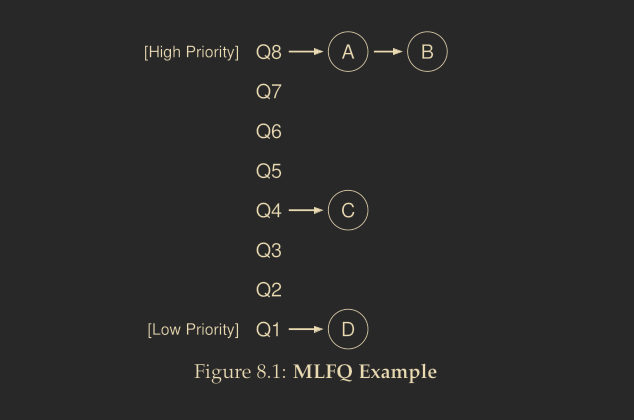

     كل jop بتدخل النظام جديد, بتبقي محطوتة في اعلي priority, بعد كدا الـscheduler بيحدد وقت معين بيكون هو الوقت اللي كل jop مسموحلها تقضيه علي مستوي priority معين, قبل ما الـschedulare يقرر انه يقلل الـpriority بتاعتها. (allotment)

    فا هنلاقي عندنا نوعين من الـjops:
    - CPU intensive: دي jops بتستهلك CPU كتير والـresponse time مش مهم بالنسبة لها.
    - interactive jops ودي jops بتعمل I/O requests وبتسيب الـCPU كتير فا الresponse time مهم بالنسبة لها.

      #+DOWNLOADED: screenshot @ 2026-06-15 21:24:52
      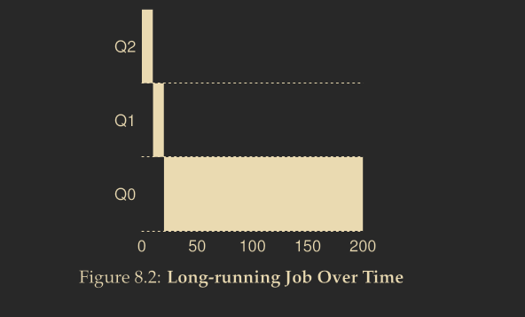

      لما الـjop بتخلص الـallotment بتاعها من غير ما تعمل IO requests يبقي الـjop دي بتستهلك CPU كتير والـscheduler بيقلل الـpriority بتاعها (move down to lower priority queue)

      لو الـjop عملت IO request قبل ما نخلص الـallotment بتاعها, يبقي دي interactive jop فا الـschdeluer بيعلي الـpriority بتاعتها او بيسبها في نفس المستوي من غير يقلله عشان الـpriority تفضل سريعة, والـallotment بيتعمله reset.

**** MLFQ approximate SJF

بما ان كل الـjops بتبدأ في اعلي priority, والـshort jops اللي بتحتاج وقت اقل من الـallotment او الـtime slice اللي محدده الـscheduler, ديما هتخلص الاول في priority عالي, لكن الـlong running jops اللي محتاجة وقت اكبر من الـallotment, فا هتفضل الـpriority بتاعتها تقل كل شوية والـshort jops هي اللي بتاخد الاولية الاعلي, لذلك فا الـMLFQ نوعا ما بيقدر يحاكي الـSJF بطريقة ذكية بدون ما يعرف الـruntime بتاع كل jop مسبقا زي الـSJF.

- لحد دلوقتي عندنا 3 مشاكل:
  1. كل ما الـshort jobs هتزيد الـCPU هينشغل معاها اكتر لان الـlong-running jobs عمالة تقل في الـpriority والـCPU مش هيقربلها خالص (starvation).
  2. لو الـlong-running jobs اتحولت من CPU bound لـinteractive, فا برضوا هتفضل في priority قليلة.
  3. ممكن المطورين يخدعوا الـscheduler عن طريق انهم يخلوا البرنامج يشتغل 99% من وقت الـallotment بشكل عادي وفي اخر الوقت خالص يقوموا عاملين IO request عشان الـscheduler ميقللش الـpriority.

#+begin_example
Allotment = 10ms ;; Keeps reseting

Run 9ms
Do fake I/O
Run 9ms
Do fake I/O
...
#+end_example

**** Priority Boots Rule:

       الـrule دي بتحل اول مشكلتين عن طريق انها كل مدة معينة بتنقل جميع الـjobs للـhigh priority queue من تاني, والمدة دي مش ثابتة, الـscheduler بيحددها علي حسب سلوك النظام.

**** Better Accounting Rule:

الـrule دي بتقول بدل ما هنعمل reset للـAllotment لما الـjob تعمل IO, لا الـscheduler هيوقف العداد, ولما الـjob تصحي تاني هيكمل عند اخر وقت وقفت عنده. وكدا حلينا مشكلة خداع الـscheduler, ولما الـjob تستهلك الـallotment بتاعها وتقل في الـpriority, هيتعملها boost تاني بعد مدة معينة.

** Lottery Scheduling

الـlottery scheduler هو scheduler بيهتم اكتر بالمشاركة العادلة او التناسبية.
بدل ما بيهتم بتحسين الـturnaround time او الـresponse time, هو بيهتم اكتر بمشاركة وقت الـCPU بطريقة نسبية, يعني كل proccess بتاخد نسبة معين من وقت الـCPU.

*** Tickets
:PROPERTIES:
:ID:       0553b5fb-20b5-4fa1-b944-5ccd8259c447
:END:

واحدة من الاليات المستخدمة لتنفيذ المشاركة النسبية هي الـtickets, كل process ليها عدد معين من الـtickets بيمثل النسبة اللي هتحصل عليها من وقت الـCPU.

مثال:

- process A: has 75 tickets.
- process B: has 25 tickets.

  هنا process A في الاغلب هتحصل علي 75% من الـCPU time, و process B هتصحل علي 25%

  كل ما الـtime slice بتخلص, الـscheduler بيعمل قرعة, يختار فيها ticket عشوائي والـprocess اللي معاها الـticket ده هي اللي هتتنفذ في الـtime slice الجاية.

  يعني مثلا كل الـtickets من 1 لـ 75 مع process A, وكل الـtickets من 76 لحد 100 مع process B, فا لو الـscheduler مثلا اختار الـticket رقم 45 فا process A هي اللي هتتنفذ

  ممكن process B تكون محظوظة والـtickets بتاعتها تكسب اكتر من مرة ورا بعض, ولكن مع مرور الوقت دائما النسبة هتكون 75 - 25, فا الية عمل النظام ده بتشتغل بشكل *احتمالي* مش *حتمي*.

  #+DOWNLOADED: screenshot @ 2026-06-17 18:09:03
  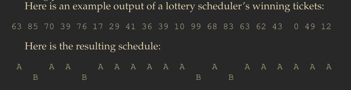

**** Implementation
:PROPERTIES:
:ID:       d1d182c6-c87a-42c5-aba8-47e259b3af77
:END:
  #+DOWNLOADED: screenshot @ 2026-06-17 18:42:21

  التنفيذ العملي للكلام ده هيكون بسيط, اولا هنحتاج random number generator كويس ودقيق, وهنحتاج data structure نخزن فيها الـjops زي الـList.

  هناخد الرقم العشوائي اللي طلع واللي المفروض يكون >= العدد الكلي للـtickets, وهنلف علي jop في الـList, ونجمع عدد tickets في counter, والـjop اللي هيكون عندها عدد tickets اكبر من او بيساوي الـrange الحالي هي اللي هتكسب وهتتفذ.
  

#+DOWNLOADED: screenshot @ 2026-06-17 19:17:55
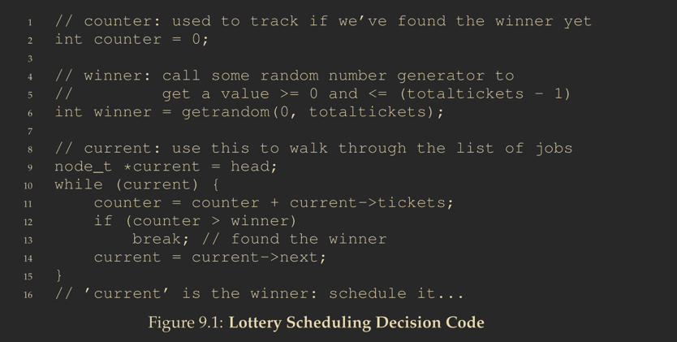

*** Problems with lottery scheduler

**** Not fair with short jobs (short runtime)

الـlottery scheduler مش بيبقي عادل مع الـjobs اللي الـruntime بتاعها قصير, فا مثلا لو عندنا 2 jobs الـruntime بتاعهم واحدك (R = 10), وكل jop عندها نفس عدد الـtickets, فابالتالي النسبة المتوقعة لكل job انها تاخد 50% من الـCPU time.

ولما الـscheduler يعمل القرعة, ممكن job من الاتنين تكسب كذا مرة ورا بعض بالحظ, والتانية تفضل مستنياها, وده طبيهي مش دي المشكلة.

لكن المشكلة بتظهر لما يكون الـruntime قصير فا ساعتها الـjop اللي كسبت عدد مرات كتر هتخلص الاول مع ان المفروض انهم يخلصوا مع بعض في نفس الوقت, لكن لو الـruntime كبير فا مع مرور الوقت النسبة هتقرب من 50 50 والـ2 jobs تقريبا هيخلصوا مع بعض وهتكون نسبة العدالة اكبر.

**** How to assign tickets?

ازاي هنقسم الـtickets علي الـjobs وهيكون بناءا علي ايه؟ ممكن ندي الـuser عدد من الـtickets ونخليه يقسمها هو بنائا علي اهمية الـjobs بالنسباله, ولكن ده مش ميعتبرش حل لان مش دائما الـuser هيكون عارف ازاي يعمل كدا. وتظل مشكلة الـticket assignment ملهاش حل جذري لحد دلوقتي.

*** Stride scheduler

الـstride scheduler هو شبه الـlottery scheduler ولكن بيشتغل بطريقة *deterministic* مش بطريقة عشوائية.

احنا مازال عندنا نفس concept الـtickets ولكن القرار اللي بيحدد مين الـjob اللي عليها الدور تشتغل هيتم بشكل حتمي مش عشوائي.

هناخد عدد الـtickets اللي بتملكه كل job ونقسمه علي عدد ثابت كبير ولكين مثلا 10000, والناتج هيكون اسمه الـstride او الخطوة.

بعد كدا كل job بتشتغل بنجمع الـstride بتاعها علي عداد خاص بيها اسمه الـpass value.

والـjob اللي هيجي عليها الدور بعد هتكون الـjob اللي عندها اصغر *pass value*.

*مثال:*

عندنا 3 jobs هما A, B, C والـtickets بتاعتهم هي 100, 50, 250 بالترتيب.

- هنقسم العدد الثابت علي كل tickets عشان نحسب الـstride لكل job:
  - $$ A = 10000 / 100 = 100 \; stride$$
  - $$ B = 10000 / 50 = 200 \; stride$$
  - $$ C = 10000 / 250 = 40 \; stride$$
- الـPass value بتاعتهم كلهم هتساوي 0 في الاول فا هنختار واحدة منهم تبدأ بشكل عشوائي, ولكن هنختار A.
- A هتشتغل لـtime slice معين وبعد كدا هنجمع الـstride بتاعها علي الـpass value يعني
   الـpass = 100 + 0 = 100.
- كدا الوضع الحالي بقا (A=100, B=0, C=0), هنختار واحد عشوائي من B و C وليكن B
- B هتشتغل لـtime slice, وبعد كدا والـpass = 200.
- كدا الوضع الحالي (A=100, B=200, C=0), فا هنختار C عشان هي اصغر pass فيهم.
- C هتشتغل وهيبقي الـpass = 40.
- كدا الوضع الحالي (A=100, B=200, C=40), فا C هتشتغل تاني, وهكذا..

  وهنلاحظ في كل job اشتغلت فعلا عدد مرات موازي لنسبة الـtickets اللي معاها بشكل عادل اكتر.

**** The problem with Stride scheduler

مشكلة الـstride scheduler ان لو في job جديدة دخلت النظام في نص ما A,B,C شغالين, الـjob الجديدة هتاخد pass value بـ0, وهيبقي ليها الاولوية عن الثلاثة الباقيين وهتحتكر الـCPU لفترة كبيرة لحد ما الـpass value بتاعها يزيد ويبقي قريب من الباقيين.

علي عكس الـlottery scheduler اللي لو job جديدة دخلت, كل اللي الـscheduler هيعمله انه هيزود عدد الـtickets بتاعها علي العدد الكلي للـtickets, والرقم العشوائي الجديد اللي هيطلع هتضمن الـjob الجديدة دي والعملية هتكمل عادي بشكل سلس.

*** CFS - Complete fair scheduler
:PROPERTIES:
:ID:       66d60d82-4239-4529-8d3e-f98700d0454e
:END:

  - الـCFS هو scheduler ذكي وسريع جدا وكان هو المستخدم بشكل اساسي في Linux حتي 2007.
  - بيشتغل عن طريق انه بيجمع الـruntime بتاع كل process في متغير اسمه الـvruntime, وبيحدد الـjob اللي عليها الدور عن طريق انه بيختار الـjob اللي عندها اقل vruntime.
  - الـpriorites فيه بتشتغل عن طريق الـNiceness او الـnice level, كل process ليها nice-level من -20:19 بيـMap لـweight, و الفرق بين الـweights ثابت.
  - لو الـnice-level زاد, معني كدا ان الـprocess دي مش بتستهلك CPU كتير وبالتالي الـCFS هيحددلها time slice قصيرة.
  - الـtime slice مش ثابت وبيتحدد بنائا علي الـweights:

    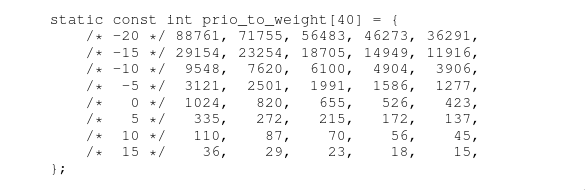

    #+DOWNLOADED: screenshot @ 2026-06-24 09:03:06
    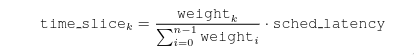

  - الـCFS بيعرف متغير تاني اسمه الـmin_granualrity وده اقل time slice ممكن الـschedluer يشتغل بيها, عشان نمنعه انه يشتغل في time slices صغيرة جدا فا يعمل context switching كتير.

  - لو سبنا الـvruntime يزيد بطريقة متضاعفة, الـjobs اللي الـtime slice بتاعتها كبيرة الـvruntime بتاعها هيزيد بشكل كبير مع الوقت والـpriority بتاعتها هتقل والـCPU مش هيقربلها بعد كدا.

  - الـvruntime الجديد بيتحسب عن طريق معادلة ذكية بيتخلي الـvruntime بتاع الـprocesses كلها يزيد بشكل متقارب حتي لو الفرق في الـtime slice بينهم كبير.

  #+DOWNLOADED: screenshot @ 2026-06-24 09:01:57
  

**** Red-Black Tree

- الـCFS مش بيخزن الـjobs في List, لان الـsearching في الـlist بيبقي O(n), وده بطئ نسبيا بالذات لو النظام فيه processes كتيرة شغالة.
- بدل كدا هو بيستخدم الـred-black tree وهي نوع ان انواع الـbalanced trees, و الـsearching و الـsorting فيها بيكون O(logn), وده اسرع بكتير.
- الـscheduler بيخزن بس الـrunning و الـready jobs في الـtree, وبيشيل الـsleep او الـblocked jobs.
- ولما job ترجع تبقا ready بيرجعها الـtree تاني وساعتها الـsorting بيقا سريع ومش بيحط overhead علي الـCPU.

-------

**** IO

لما برنامج يدخل في وضع الـsleep, ويرجع يشتغل تاني, مينفعش يكمل علي اخر vruntime كان واقف عنده, لان في برامج تانية في الشجرة كانت شغالة والـvruntime بتاعها زاد, فا لو خلينا البرنامج ده يكمل من عند اخر vruntime, كدا هيحتقر الـCPU لفترة طويلة.

الـCFS لما برنامج ينام فترة طويلة ويصحي بيخلي الـvruntime بتاعه مساوي لأقل vruntime موجود في الشجرة.

ولكن ده بيأثر علي الـshort jobs اللي بتسيب الـCPU كتير, لانها كل مرة بترجع تاني بتلاقي الـvruntime بتاعها مساوي للـvruntime بتاع processes تانية اشتغلت لفترات طويلة و مش بيكون ليها الاولوية اللي تستحقها.

عشان كدا الـCFS مبقاش مستخدم لانه مش احسن حاجة في سرعة الاستجابة (response time).

**** Summary

اختيار الـData structure الصح هو اساس حل اي مشكلة.
