#+TITLE: Operating System: Three Easy Pieces Book
#+AUTHOR: Ziad Ahmed
#+DATE: Jun 02 2026
:PROPERTIES:
#+STARTUP:  content inlineimages
:END:

\\

* Introduction

** Virtualization

- الOS بياخد physical resources زي الـCPU, memory, disk وبيحولهم لـvirtual form من نفسهم, اقوي واسهل في الاستخدام.
- الـOS ممكن نعتبره اكنه *virtual machine* مبنية فوق الـhardware.
- طبعا عشان نقدر نستفيد من الـvirtual machine دي ونطلب منها اللي احنا عاوزينه, فا الـOS بيوفرلنا APIs بالحاجات اللي نقدر نطلبها منه, والـAPIs دي بيكون اسمها *system calls*.

*** CPU Virtualization

- الـOS بيوهم كل برنامج انه عنده CPU خاص بيه لوحده ومتاح طول الوقت عشان بينفذله الـinstructions بتاعته.
- فالـOS بياخد الـCPU ويحوله لعدد لا متناهي من الـvirtual CPUs, ولكن في الحقيقة هو CPU واحد (او 4/6/8 حسب عدد الـcores) ولكن بيخدم او بيبدل علي كل البرامج (time sharing).

*** Memory Virtualization

- الـOS بيعمل virtual address space لكل برنامج بيكون private مفيش برنامج تاني يقدر يقرأ منه او يكتب فيه, وبيوهم البرنامج انه واخد الـphysical memory كلها لوحده.
- والـOS بيـmap الـvirtual address space ده لـphysical address حقيقية في الـmemory بمساعدة الpage tables.
- والـmemory virtualization مش بس بيسمح للبرامج انها تتشارك في الmemory, لا ده كمان بيخلي الmemory اسهل في الاستخدام, البرنامج بيطلب الـmemory من الـOS من غير ما يشغل باله هل في مساحة فاضية ولا لا؟ ازاي احمي الdata بتاعتي من البرامج التانية, الخ...

  - هنا هنلاحظ ان الـchild والـparent عندهم نفس الـvirtual address ولكن بتـMap لـphysical adresses مختلفة.

#+begin_src c
int var = 5;

// Child
if (fork() == 0) {
    var = 10;
 }
// parent
printf("var: %d", var); // 5
#+end_src

** Concurrency

*** Atomicity:

- تنفيذ عدة instruction دفعة واحدة بدون ما توقف (pause) او مقاطعة (interrupt).

** Persistence

*** File system

- الـfile system هو software بيعمل abstraction للـdisk, وبينظم تخزين الملفات علي الdisk.
- الـabstraction هنا مش معناه ان كل برنامج ليه virtual disk خاص بيه, بالعكس احنا عاوزين الملفات تكون مشتركة بين البرامج, يعني مثلا ممكن نعمل ملف فيه C code, ونفس الملف ده هيعدي علي الtext editor ثم الcompiler ثم الOS هينفذه.
  ولكن الabstraction هنا معناه ان البرنامج ممكن يقرأ ويكتب علي الdisk بدون ما يشغل باله , هل في مساحة فاضية؟ ايه نوع الdisk ده؟ ازاي اتكلم معاه؟, الخ...

* Virtualization

** The Process
*** What is the Process?

- الـprogram هو مجرد ملف فيه مجموعة من الـinstructions والـstatic data متخزنين علي الـdisk.
- الـprocess هي الـprogram لما يشتغل والـinstructions بتاعته تبدا تتنفذ. وهي اساس الـ *isolation* في الـOS
- الـprocess هي عبارة عن حزمة كاملة فيها:
  - ء *address space* خاص بيها معزول عن الـprocesses التانية. (stack, heap, data, code, ...).
  - ء *execution context* زي الـPC, registers, stack pointer وحاجات تانية بتعرف الCPU الحالة بتاعت process عشان يعرف يكمل من اخر نقطة وقف عندها.
  - ء *resources* ملفات مفتوحة, etc..., sockets.
- الـOS بيشغل اكتر من process في نفس الوقت, والـprocess بتوفرلنا مفهوم الـsoftware threads اللي بتعمل مسارات تنفيذ متعددة داخل نفس الـprocess
- اذا الـprocess هي اساس الـ *virtualization* و *conurrency* في الـOS.

*** Process API

- الـOS بيوفر APIs كتير جدا لكل المميزات اللي هو بيوفرها.
- من اهم الـAPIs اللي لازم تكون متوفرة
  - process creation
  - process killing
  - waiting
  - process status

*** Process Creation
:PROPERTIES:
:ID:       4c6db0cc-bb93-4848-8aa2-5db3975f3873
:END:

#+DOWNLOADED: screenshot @ 2026-06-02 17:42:03
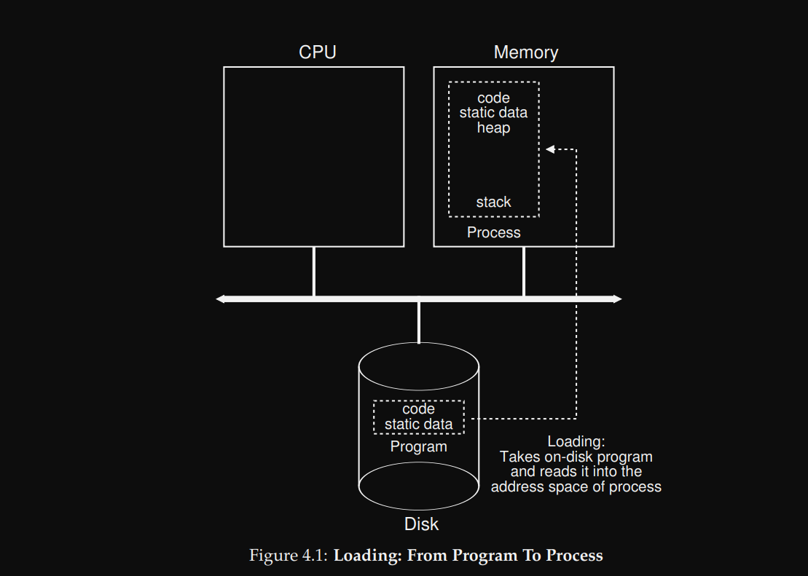

الـprogram بيبقي متخزن علي الـdisk في شكل قابل للتنفيذ (executable format), الـOS بيقرأ الـexecutable ده ويعمل load للـinsturctions والـdata اللي فيه علي الـmemory في الـaddress space الخاص بالـprocess.

*** Process States
:PROPERTIES:
:ID:       80392b68-62b9-473f-a1aa-343aa381655d
:END:

#+DOWNLOADED: screenshot @ 2026-06-02 18:16:14
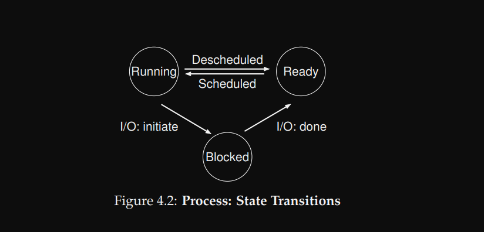

- الـprocess ليها 3 حالات مختلفة:
  - ء Running: معناها ان الـprocess شغالة دلوقتي والـCPU بينفذ الـinstructions بتاعتها.
  - ء Ready: الـprocess جاهزة انها تكمل تنفيذ ولكن الـOS لسببا ما اختار انه يركنها دلوقتي (policy).
  - ء Blocked: الـprocess عملت حاجة بتطلب انتظار زي طلب كتابة علي الـdisk, فالـOS بيركن الـprocess شوية لحد ما الـdisk يرد ويخلي الـCPU يروح يكمل تنفيذ process تانية.

#+DOWNLOADED: screenshot @ 2026-06-02 18:27:43
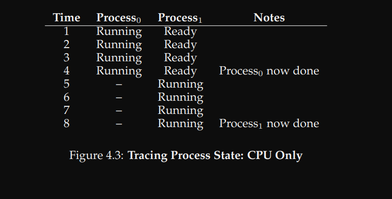

#+DOWNLOADED: screenshot @ 2026-06-02 18:28:00
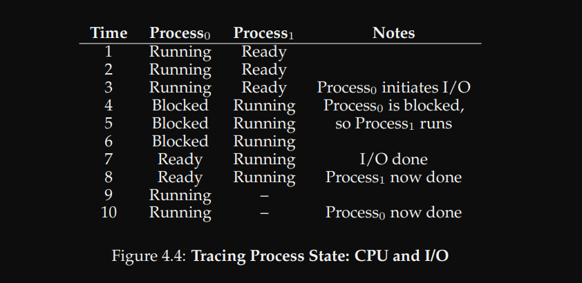

*** Introduction to UNIX System Calls
**** fork()

- when we call fork() it will clone the address space of the *parent*, and
  create new process called *child*.
- the parent and child has the same virtual address space but it maps to
  different pyhsical addresses, so they same to identical but they are two
  different processes.
#+BEGIN_SRC C :tangle ./code/fork.c
#include <unistd.h>
#include <stdio.h>
#include <stdlib.h>
#include <sys/wait.h>

int main() {
    pid_t pid = fork();

    if (pid < 0)
        exit(1);
    if (pid > 0) {
        printf("parent: hello from parent\n");
        wait((int*) 0);
    } else {
        printf("child: hello from child\n");
        exit(1);
    }

    return 0;
}
#+END_SRC
**** exec()

- the exec() function overrites the address space of the current process with
  the data and instruction of the new executable
- it doesn't return to main() function again, unless an error occurred.
- by convention it ignores the first string in the argv, because it doesn't to
  know the name of the executable when have the executable itself.
#+BEGIN_SRC C :tangle ./code/exec.c
#include <unistd.h>
#include <stdlib.h>
#include <stdio.h>

int main() {
    // change "echo" to "bla bla" and it will still work fine.
    char *argv[] = {"echo", "hello", 0};
    execv("/bin/echo", argv);
    fprintf(stderr, "exec error");
}
#+END_SRC

#+RESULTS:
: hello
**** Pipes & Redirects
***** The low-level idea behind them

- لما بنفتح ملف باستخدام =open()= بيتعمل حاجتين:
  1. في الmemory space بتاعت الprocess بيتعمل FD Table.
  2. في الkernel بيتعمل Open File Descriptions في الOpen File Table.

#+BEGIN_EXAMPLE
PROCESS A (FD Table)          OPEN FILE TABLE            INODE/VNODE TABLE
    +-----------------------+     +----------------------+      +-------------------+
    | Index (FD) | Pointer  |     |  Flags, Offset, Ptr  |      | File Metadata/Ops |
    |------------|----------|     |----------------------|      |-------------------|
    |   fd = 0   |    *-----+---->| [ Flags | * ]--------+--+-->| Inode: /dev/pts/0 |
    |------------|----------|     +----------------------+  |   | (Terminal)        |
    |   fd = 1   |    *-----+---->| [ Flags | * ]--------+--+   +-------------------+
    |------------|----------|     +----------------------+  |
    |   fd = 2   |    *-----+---->| [ Flags | * ]--------+--+
    |------------|----------|     +----------------------+      +-------------------+
    |   fd = 3   |    *-----+---->| [ Flags | * ]--------+----->| Inode: data.txt   |
    +-----------------------+     +----------------------+      | (On Disk)         |
                                                                +-------------------+
#+END_EXAMPLE

- FD Table:

  - جدول بسيط جواه الProcess بيخزن entries كل entry فيها index و pointer,
    الindex هو مجرد id للملف داخل الprocess. والpointer بيشاور علي الopen file
    description الخاص بالملف ده في الkernel

- Open File Table

  - دي centralized table في الkernel بيتخزن فيها الstate بتاعت كل الملفات المفتوحة علي مستوي الOS كله

  - كل ملف مفتوح بيبقي ليه record في الtable دي

- Open File Description:

  - ده الobject الحقيقي في الkernel, فيه الstate بتاعت الملف (reference count, offset, flags, ...)
  - ممكن يشاور عليه file descriptors مختلفة من اي process شغالة (reference count - shared pointers)

-----

- دالة =open()= بتعمل open file descriptor جديد كل مرة, فا ممكن تفتح نفس الملف كذا
  مرة ولكن بstate مختلفة.
  - سواء fd3 و fd4 ولكن كل واحد بيشاور علي open file descriptor مختلف
  - ال =dup()= ممكن تخلي كذا fd مختلف يشاور علي نفس الopen file descriptor في الkernel

#+BEGIN_SRC C
// the same file opened two times
int fd3 = open("file.txt", O_RDONLY); // description جديدة
int fd4 = open("file.txt", O_RDONLY); // description تانية مستقلة

int fd5 = dup(fd3);
#+END_SRC

-----
***** Another important info

- الfd الجديد ديما بياخد *اصغر* رقم متاح
- اغلب الposix/unix utilies مصممة انها تقرأ من الstdin لو ما اتبعتلهاش argument محددة

-----
***** Redirects

لما في الshell بتعمل =cat < input.txt=

1. الshell بيعمل fork لprocess جديدة.
2. بيقفل الstdin, فا كدا رقم 0 بقا متاح
3. بيفتح الملف اللي احنا هنبعته, والfd بتاعه هياخد رقم 0 (المفروض)
4. بينادي علي الcat executable وهو هيقرا من الملف

#+BEGIN_SRC C
char *argv[2] = {"cat", 0};

if (fork() == 0) {
    close(0);
    open("input.txt", O_RDONLY);
    exec("cat", argv);
 }
#+END_SRC

-----
***** dup()

- الdup() بترجع fd جديد بيشاور علي نفس الopen file description اللي بيشاور عليه الfd القديم, فا كدا بقا عندنا 2 fd بيشاورا علي نفس الobject في الkernel, يعني الref count بتاع الobject ده بيقا 2

- الopen file description في الkernel بيبقا ليه ref count, والkernel عمره ما هيقفل الobject ده الا لما الref count يبقي ب0 (shared pointer)

#+begin_src C
int savestdin = dup(0); // cloned the open file desc of stdin in a new fd
#+end_src

-----
***** dup2()

- الdup2() تختلف عن dup() في حاجات بسيطة ولكنها مهمة
- *اولا* بدل مكان الkernel هو اللي بيحدد الfd الجديد زي في dup(), لا, احنا اللي بنحدد الfd الجديد اللي هيتشارك مع الfd القديم في نفس الofd
- *ثانيا* عمليه الduplication بتحصل بطريقة *Atomic* وده اهم ما فيها
  - عمليه الduplication بتتم في خطوات كتير جدا
    1. فحص هل الnew fd مفتوح اصلا ولا لا؟
    2. فحص هل هو الnew fd هو نفس الold fd ولا لا
    3. قفل الملف اللي كان محجوز في الnew fd
    4. نسخ الopen file description

- ودي خطوات كتير اوي وممكن يتم مقاطعتها في النص, وهنرجع لنفس مشكلة الthread safety اللي كود الredirect
- ولكن dup2 بتعمل كل دا في خطوة واحدة

#+begin_src C
dup2(savestdin, 0); // clone 'savestdin' to stdin
#+end_src

-----
***** Thread-safe Redirection

- مثال علي thread unsafe redirection
  1. بنقفل الstdin عشان نستخدم الfd 0 للملف بتاعنا
  2. بنفتح الملف اللي عاوزينه ياخد الfd 0, بس هنا ممكن thread تانية تكون فتحت ملف جديد قبلنا, وفي الحالة دي الthread التاني هيكون خد مننا الfd 0 والthread الاولي هتاخد رقم تاني ومن هنا هتحصل بلاوي كتير

- Non thread-safe example:
#+BEGIN_SRC C
if (fork() == 0) {
    close(0);
    open("input.txt", O_RDONLY);
    exec("cat", argv);
 }
#+END_SRC

- Thread-safe example: طريقة اكثر احترافية وامان
#+begin_src C
if (fork() == 0) {
    int fd = open("input.txt", O_RDONLY);
    dup2(fd, 0); // atomic duplication
    close(fd); // we dont need it anymore
    exec("cat", argv);
 }
#+end_src

-----
***** Pipes (Anonymous Pipe)

الpipe هي ماسورة نقل بيانات بين الprocesses او i/o byte stream , بتنقل البيانات في خط احادي (unidirectional).

الاستخدام الاشهر للpipes هو اننا نخلي الoutput بتاع process يبقي الinput بتاع process تانية او بمعني اخر بنربط الstdout بتاع اول process بstdin بتاع ثاني process.
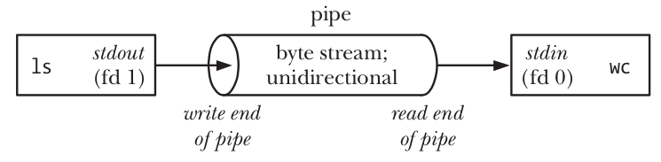

الinterface:
=int pipe(int fd[2])= الpipe بترجع 2 file descriptors بيمثلوا طرفين الماسورة, fd[0] بيعبر عن الread end و fd[1] بيعبر عن الwrite end.

ولكن الfds دي مش بتmap لfiles علي الdisk, الpipe اصلا هو عبارة عن buffer في الmemory بتاعت الkernel.

بيبقي ليه حجم ثابت ولو اتملأ (يعني الprocess اللي بتكتب بعتت داتا كتير) الprocess دي مش هتعرف تبعت داتا تاني لحد ما الprocess اللي بتقرا تسحب شوية داتا عشان تفضي مكان.

الkernel بيحدد برضو buffer تاني اسمه الPIPE_BUF وده الbuffer اللي بننقل بيه الداتا من الbuffer الكبير (pipe) خلال الماسورة, يعني نقدر نعتبره المغرفة اللي بننقل بيها الداتا, الPIPE_BUF ده ليه حجم ثابت برضو غالبا بيبقي 4kb ولو الداتا اللي بتتنقل اصغر من الحجم ده, هتتنقل كتلة واحدة *atomic*.

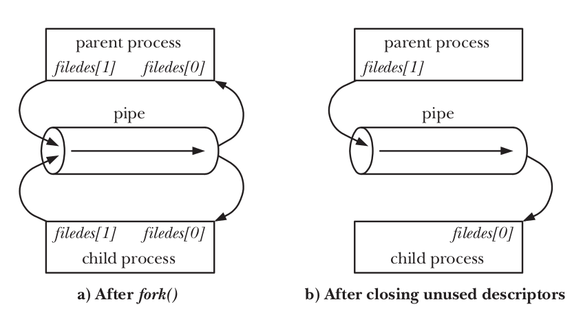

----

- Simple Example

#+begin_src c :tangle ./code/pipe.c
#include <stdio.h>
#include <unistd.h>

int main()
{
    int pfd[2];
    pipe(pfd); // Creating the pipe.

    if (fork() > 0) {
        close(pfd[0]); // Closing the read end
        write(pfd[1], "msg", 4);
        close(pfd[1]); // Closing the write end
    } else {
        char buf[4];
        close(pfd[1]); // Closing the write end
        read(pfd[0], buf, 4);
        printf("%s", buf); // msg
        close(pfd[0]); // Closing the read end
    }
    return 0;
}
#+end_src

#+RESULTS:
: msg

-----

- Real world example

  #+begin_src bash
ls | grep string
  #+end_src

  - لو grep اشتغل قبل ls, هيفضل في حالة blocking لحد ما ls يكتب داتا, او لحد ما الfd[0] يتقفل.

#+begin_src c
//  parent: shell

int fd[2];
pipe(fd);

// child: ls
if (fork() == 0) {
    close(fd[0]);
    dup2(fd[1], 1); // map the stdout of the 'ls' process to the write end
    exec("/bin/ls", args);
    exit(0);
}

// child: grep
if (fork() == 0) {
    close(fd[1]);
    dup2(fd[0], 0); // map the stdin of the 'grep' process to the read end
    exec("/bin/grep", args);
    exit(0);
}

// close the original fd[2], to terminate the pipe and prevent grep,
// from waiting for ever because it thinks that the read stream still going
close(fd[0]);
close(fd[1]);

// clear the zombie processes
wait(NULL);
wait(NULL);
#+end_src

-----

- ملحوظة الpipe ممكن تشتغل كا bidirectional عادي, لكن هيحصل مشاكل deadlocks و race conditions, فا دا مش محبب

#+begin_src C
#include <stdio.h>

#include <unistd.h>
#include <sys/wait.h>
#include <stdlib.h>

int main() {
    int pfd[2];
    pipe(pfd); // Creating the pipe.

    if (fork() > 0) {
        char buf[4];
        write(pfd[1], "msg\0", 4);
        wait(0);
        read(pfd[0], buf, 4);
        printf(buf);
        exit(0);
    } else {
        char buf[4];
        read(pfd[0], buf, 4);
        printf(buf);
        write(pfd[1], "zoz", 4);
        exit(0);
    }
    return 0;
}
#+end_src
*** Process Waiting
**** wait()

- الـ =wait()= بتخلي الـparent يستني اقرب child process هتخلص.
- الـ =wait()= مصممة انها تشتغل من الاعلي للاسفل (top down) في الـ *process tree*, فا مينفعش الـchild يستني الـparent.
هي مصممة انها تستني الـchild process فقط لكن العكس غير ممكن.
- لو استخدمتها في process ملهاش ابناء, هتفشل وهترجع =1-=, يعني اكنها مش موجودة مش هتعمل اي حاجة.

#+begin_src c
int main(int argc, char *argv[])
{
    int pid = fork();

    switch (pid) {
    case -1: {
        char *msg = "fork(): something went wrong\n";
        write(STDERR_FILENO, msg, strlen(msg));
        exit(1);
    }
    case 0: {
        wait(NULL); // will fail and return -1
        msg = "child: hello dad\n";
        write(STDERR_FILENO, msg, strlen(msg));
        exit(1);
    }
    default:
        char *msg = "parent: hello son\n";
        write(STDERR_FILENO, msg, strlen(msg));
        break;
    }
    wait(NULL);
    return 0;
}
#+end_src
**** waitpid()

الـ =waitpid(pid, &status, options)= بتدينا تحكم اكبر من =wait= , بالذات لو عندك اكتر من child process.

 - =pid=:

   - لو =pid > 0=   استنا child معين.
   - لو =pid = 0=   استنا اي child من نفس الـ *process group*.
   - لو =pid = -1= استنا اقرب child هيخرج عمتا (نفس سلوك =wait=).
   - لو =pid < -1= استنا اي child من *group* تاني

 - =options=:

   - لو =0= مش هيعمل حاجة (blocking).
   - لو =WNOHANG= الـparent مش هيقف لو الـchild لسه مخلصش, وهترجع 0, او الـpid بتاع الـchild لو خلص (non-blocking).
   - لو =WNOTRACING= لو الـchild اتوقف مؤقتا بـC-z او اي signal تانية, الـparent هيكمل شغل ومش هيستناه (non-blocking).

**** wait & waitpid status

الـstatus بتاعت الـchild بتبقي متخزنة bitwise, يعني مثلا الـexit code بيبقي متخزن في *ثاني* byte في الـstatus integer, فا قراءة الـstatus بتبقي صعبة, لكن في *macros* بتساعدنا نقرأ الـstatus بشكل سهل.

#+begin_src c
WIFEXITED(status)      // is it exited normally?
WEXITSTATUS(status)    // what is the exit code? (if WIFEXITED(status) == true)

WIFSIGNALED(status)    // is it killed with a signal?
WTERMSIG(status)       // what is the signal number? (if WIFSIGNALED(status) == true)

WIFSTOPPED(status)     // is it stopped?
WSTOPSIG(status)       // which signal stopped it?
#+end_src

** Direct Execution
*** The Problem

- عشان الـOS يحقق الـvirtualization لازم ببساطة جدا يقسم الـ *physical CPU* بين كل الـprocesses اللي شغالة.
- عشان يعمل الكلام ده ببساطة جدا هيشغل كل process شوية صغيرين بعد كدا يوقفها وينقل علي process تانية وهكذا... (time sharing)

- ولكن عشان نحقق مفهوم الـvirtualization بشكل سليم, هيقابلنا تحديين:
  - ازاي نعمل الكلام ده بشكل سريع بدون ما نحط overhead كبير علي النظام (performance challenge).
    - مش عاوزين الـOS يبقي بطئ ولا ياخد وقت كبير في التبديل بين الـprocesses.
  - ازاي في نفس الوقت الـOS يبقي عنده تحكم كامل علي كل الـprocesses اللي شغالة (control challenge).
    - مش عاوزين كل process تفضل شغالة للابد او تعمل حاجة مش المفروض تعملها.

*** The Solution

عشان نحل المشكلتين دول هنستخدم *mechanism* اسمه الـ *limited direct execution*.

**** Limited Direct Execution

الـ mechanism ده بينقسم لجزئين:

**** Direct Execution

- عشان نحقق سرعة في الاداء, هنخلي البرامج تشتغل بشكل native / مباشر علي الـCPU, فا مثلا لما الـOS يقرر يشغل برنامج:
  - يعمل entry ليه في الـprocess list.
  - يخصصله memory.
  - يعمل load ليه علي الـmemory, (يعمل load للـstack, heap,code, etc..).
  - يعمل jump علي الـentry point, زي (main()) ويبدأ ينفذ البرنامج.
  - يرجع الـoutput.
- وكل ده بيشتغل بطريقة سريعة ومباشرة, ولكن مازال عندنا مشكلة في التحكم:
  - ازاي نوقف الـprocess (pause - resume)؟
  - ازاي نمنع اي process انها تعمل حاجة مش المفروض تعملها؟
  - ازاي نخلي الـprocess متشتغلش للأبد؟
  - ازاي نخليها متدخلش علي memory مش بتاعتها؟
- ازاي نخلي الـprocess تعمل privelged opertations زي I/O او memory allocation, ولكن تحت اشراف الـOS؟

**** Limititations

***** User mode

الـprocess في الـuser mode مينفعش تنفذ اي *privileged operations* زي انها تعمل I/O request او تحجز memory زيادة, لو اي process حاولت تعمل اي حاجة زي كدا الـCPU هيحول التحكم للـkernel وهو هيكتشف الخطأ وهيقفل الـprocess دي.

***** Kernel mode

ده الـmode اللي بيشتغل فيه الـkernel, ويقدر ينفذ اي حاجة هو عاوزها بدون قيود.

***** System calls

ازاي نخلي اي process تستفيد من بعض مميزات الـkernel mode ولكن تحت اشراف الـkernel؟

الـsystem call وظيفتها تحول الـCPU من الـuser mode للـkernel mode عشان ينفذ privileged insturctions.
- اّلية العمل:
  - الـsystem call نفسها هي عبارة عن assembly instruction بتعرف الـkernel نوع الـservice اللي احنا عاوزينها, ولكن الـinstruction دي بتبقا abstracted بـlibrary wrapper (glibc for example) بيسهل علينا استخدام الـsystem call.
  - الـwrapper بيحط الـsystem call arguments في مناطق معينة في الـstack او في registers معينة (غالبا بتتحط في registers),بيتفق عليها glibc والـkernel.
  - بعد كدا بيحط الـ *syscall number* برضو في register معين.
  - بعد كدا بينادي علي الـ *hardware-specific trap instruction* اللي بتحول من الـuser mode للـkernel mode زي *syscall* في x86 او *ecall* في RISC-V.
  - الـkernel بيتولي زمام الامور من النقطة دي وبيحفظ حالة user mode process في الـkernel stack زي:
    - قيم الـregisters.
    - program counter (PC)
    - stack pointer
- عشان لما يرجع, يرجع عند نفس النقطة (return from trap)
- وبرضو الـwrapper بيوفر سهولة في error handling لو حصل مشاكل لان الـkernel عادة بيرجع errors مبتكونش human readable.

#+begin_example
Your Program
     |
     |  Procedure Call
     v
glibc read()
     |
     |  System Call
     v
Kernel sys_read()
     |
     v
Kernel returns
     |
     v
glibc read()
     |
     v
Your Program
#+end_example

**** Trap

الـtrap insturction بتدخل الـkernel من entry معينة الـkernel هو اللي بيحددها, عشان يحمي نفسه من الـmalicious processes.

***** Trap Table

طب ازاي هيعرف الـaddress او الـentry point اللي محددها الـkernel؟
مثال:
- مثلا لو المستخدم نفذ system call زي دا, فالـwrapper هيعمل شوية حاجات وبعد كدا في الاخر هينادي علي الـtrap instruction زي *syscall*
- هنا الـCPU عرف انه محتاج يدخل للـkernel mode, بس هيدخل منين؟ الـkernel فيه ملايين السطور من الكود!

#+begin_src c
read(fd, buf, 100);
    |
    v
 syscall
#+end_src

 هنا يجي دور الـ *trap table*, هي table الي kernel بيعملها اثناء الـboot في الاول خالص وبيعرف الـCPU عنوانها. بيكون فيها *trap numbers* وكل رقم من دول بيـMap لعنوان *handler* معين هيتنفذ لما يحصل حدث معين, الحدث ده ممكن يبقي:
 - System call
 - Interrupt
   * keyboard
   * mouse
   * disk
   * timer
 - Exception
   * divide by zero
   * page fault
   * bad instruction

- مثال تخيلي علي الـtrap table
- كلمة handler معناها كود بيتنفذ لما يحصل حدث معين.

  #+begin_example
Trap Number     Handler Address
--------------------------------
0               divide_by_zero_handler
13              protection_fault_handler
14              page_fault_handler
32              timer_interrupt_handler
80              system_call_handler
  #+end_example

***** More about security - user input

الـtrap tables بتحمي الـkernel mode, عن طريق انها بتعمل *hardware trapping mechanism* بيخلينا نحول من الـuser mode للـkernel mode بطريقة امنة, الا ان ده مش بيضمن الامان المطلق, لسه في حاجات كتير الـkernel لازم ياخد باله منها بخصوص الحماية, زي الـuser input, لازم الـ *system call handler* يفحص الـuser arguments كويس جدا, قبل ما يروح يكلم الـhardware, لان الـuser ممكن يكون باعت malicious input او addresses. فالـkernel بيتعامل مع الـuser input بحذر شديد.

***** return-from-trap instruction

الـ *return-form-trap* هي instruction بترجع للـ calling process وبتعمل pop للقيم بتاعت الregisters من الkernel stack وبتخفض الـprivilege للـuser mode وتكمل تنفيذ الuser process من اخر نقطة.

***** Trap frame

الـtrap frame هو حالة الـuser process اللي الـCPU هيرجعلها بعد كدا لما يرجع للـuser mode, لما بننادي علي الـtrap instruction الـtrap handler بيحفظ snapshot لحالة الuser process قبل ما ينادي الـsyscall handler الفعلي. والـsnapshot ده بيبقي اسمه الـ *trap frame* وبيتخزن في الـkernel stack.

**** Switching between processes - Timer

***** The  Problem

الـcpu virtualization قائم علي فكرة التبديل بين الـprocesses, ولكن ازاي هنعمل الكلام ده؟ الفكرة تبان بسيطة ولكن هي في الحقيقة tricky شوية.

لما الـprocess بتشتغل بيبقي الـcpu مشغول معاها والـos ميقدرش يستعيد زمام الامور تاني (regain control), لان ازاي الـos هيستعيد زمام الامور وهو مش شغال اصلا؟ الـcpu مشغول مع process تانية.

***** The Old Solution - Cooperative approach

الطريقة الوحيدة للـos انه يرجع زمام الامور من تاني بعد ما كان الـcpu مشغول مع process تانية, هي ان الـprocess دي تعمل *exception* او *interruption* او تنادي *system call*, وساعتها الـcpu بيحول من الـuser mode للـkernel mode وبيرجع زمام الامور للـos تاني.

زمان كان الحل للموضوع ده هي ان الـos كان بيثق في الـprocess اللي شغالة انها هتعمل interruption او exception بحيث الـcpu يحول من الـuser mode للـkernel mode, ولكن الحل ده كان كويس زمان لما كان نفس الـvendor اللي بيبيع الـhardware هو نفسه بيديك معاه operating system وهو نفسه اللي بيديك software عشان يشتغل داخل الـos ده, فكان الـos والـsoftwares بتشتغل بشكل متعاون مع بعضها لان الـos كان بيقدر يتوقع سلوك الـsoftwares دي.

ولكن دلوقتي ومع وجود الـthird-party software, الطريقة دي بقت غير مناسبة تماما, لان الـos مبقاش يقدر يثق في البرنامج اللي شغال.
ممكن البرنامج ده ميستخدمش اي system calls خالص, او يعمل اي exception او interruptions, او ممكن يخش في infinite loop ويفضل شغال للابد, فا ساعتها الـcpu هيفضل مشغول مع الـprocess علي طول والـos مش هيعرف يرجع التحكم علي النظام تاني, وكان لو برنامج هنج بيهنج الـos معاه ومفيش طريقة الـos يتعافي منها غير اننا نعمل reboot للـsystem.

***** The Real Solution - Non-Cooperative approach - Timer

ولكن الحل العبقري للحوار ده هو ان الـos يستعين بالـhardware, فا اتعمل الـ *timer*.

الـtimer هو physical device بيعد كل كام milisecond ويبعت timer interrupt للـcpu يخليه يحول من الـuser mode للـkernel mode بشكل اجباري, وساعتها الـos بيستعيد زمام الامور وممكن بعد كدا يوقف الـprocess دي ويكمل تنفيذ process تانية او يشغل process جديدة او يعمل اللي هو عاوزه حسب الـpolicies اللي ماشي عليها.

**** Context Switching

بمجرد ما الـos استعاد زمام الامور من تاني, سواء بطريقة cooperative عن طريق system call او بطريقة non-cooperative عن طريق timer interrupt, فالمهم انه لازم ياخد قرار معين, والجزء المسؤل عن اتخاذ القرار هو الـ *Scheduler* وبيشتغل بـpolicies معينة

ولكن لو كان القرار هو التبديل للـprocess فا التبديل ده اسمه الـ *context switch*, وهو ببساطة جدا ان الـos بيعمل push للـexecution context بتاع الـprocess الحالية علي kernel stack ويعمل pop للـexecution context بتاع الـprocess اللي هنبدل ليها (soon to be executed) من الـkernel stack, بحيث ان الـcpu يبقا عارف هو رايح فين وراجع فين.

** CPU Scheduiling

*** Workload Assumptions

عشان نعمل scheduling policy, لازم نحط assumptions, وواحدة من الـassumptions دي هي الـworkload assumptions.
الـworkload هو جزء اساسي في بناء اي scheduling policy, وكل ما نسحب الـworkload بشكل ادق كا ما الـpolicy تكون مظبوطة اكتر.

امثلة علي الـworkload assumptions, زي:

- هل الـjobs هتاخد نفس الوقت في التنفيذ ولا لا؟
- هل الـjobs كلها هتوصل النظام في نفس الوقت؟
- هل وقت تنفيذ كل job معروف؟ (runtime)
- هل الـjobs هتعمل IO requests ولا هتستخدم الـCPU فقط؟

  والـscheduling algroithm بياخد قرار علي الافتراضات دي.

*** Scheduling Metrics

عشان نعرف نقارن بين الـscheduling algorithms محتاجين metric نقيس بيها اداء كل الجوريزم.

امثلة علي الـscheduling metrics:

**** Turnaround time

الـturnaround time هو الـexecution time + waiting time.
او الـcompletion time - arrival time.

الـarrival time هو الوقت اللي البرنامج وصل فيه للنظام واتحول لـprocess/jop.

***** FIFO
:PROPERTIES:
:ID:       b95a02dc-b2b5-43e9-bb35-a7b57aa03214
:END:

ده الجوريزم بسيط جدا بيعتمد علي نظام الطابور, يعني الـjop اللي هتوصل الاول هي اللي هتتنفذ الاول.

لو اعتبرنا ان احنا عندنا 3 jops وكلهم وصلوا مع بعض وكلهم عندهم نفس الـruntime
فا هنا الـaverage turnaround time هيكون:

$$\frac{10+20+30}{3} = 20$$s

#+DOWNLOADED: screenshot @ 2026-06-11 21:08:43
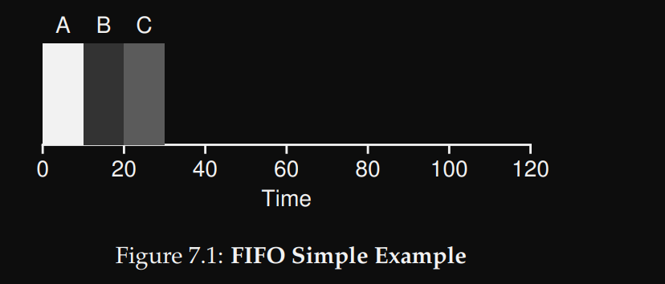

الالجوريزم ده كويس طول ما كل الـjops بتاخد نفس الـrun time او حتي متقاربة في الوقت.
لكن لو الفرق كبير بين الـjops, فالاداء هيكون وحش جداً, مثال:

هنا كلهم وصلوا في نفس الوقت, ولكن A خدت وقت كبير جدا 100 ثانية عشان تتنفذ و B,C فضلوا مستنينها كتير جدا في حين انهم لو كانوا بدأو هما الاول كان خلصوا من بدري.
يعني اكنك في super market واستنيت واحد قدامك محمل عربية كاملة لحد ما يخلص, في حين ان نت بس عاوز تشتري زجاجة مياه.

الـaverage turnaround time =

$$\frac{100 + 110 + 120}{3} = 110$$ وده وقت كبير جدا كا متوسط.

#+DOWNLOADED: screenshot @ 2026-06-11 22:02:13
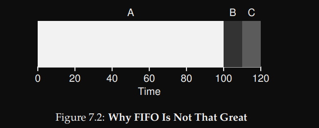

***** SJF - shortest jop first
:PROPERTIES:
:ID:       eed18769-7c0d-4463-9572-9e75bf2281b6
:END:

ده الجوريزم بيحل مشكلة FIFO, عن طريق انه بينفذ الـjops الاقصر الاول.

$$\frac{10 + 20 + 120}{3} = 50 $$ وده افضل بكتير من FIFO.

#+DOWNLOADED: screenshot @ 2026-06-12 02:26:11
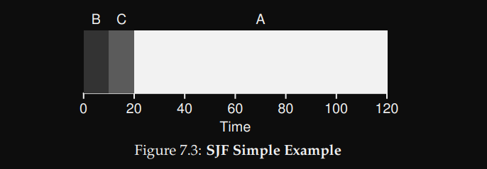

ولكن افتراض ان كل الـjops وصلت في نفس الوقت, ده افتراض خيالي مش بيحصل في الحقيقة, وممكن نرجع لنفس المشكلة الاولانية تاني.
هنا A وصلت عند 0, B و C وصلوا عند 10, والاتنين هيفضلوا مستنين A كتير جدا لحد ما تخلص.

$$\frac{100 + 100 + 110}{3} = 103.33$$

#+DOWNLOADED: screenshot @ 2026-06-12 03:04:51
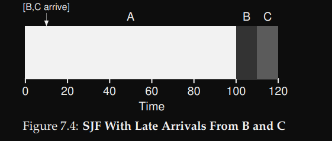

***** STCF Shortest time-to-completion first | PSJF Preemptive shortest jop first
:PROPERTIES:
:ID:       1a1b57b5-cff0-4ff7-a64b-b1e76b7c5093
:END:

الالجورزم ده اذكي لانه عنده القابيلة انه يوقف الـjop اللي شغال عليها ويروح ينفذ jop ثانية هتاخد وقت اقصر

$$\frac{10 + 20 + 120}{3} = 50$$

#+DOWNLOADED: screenshot @ 2026-06-12 03:16:18
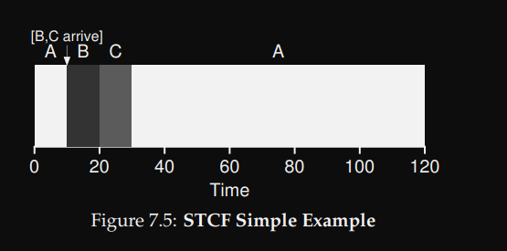

**** Response time:
:PROPERTIES:
:ID:       8fa402c9-9e69-474c-928d-18ae5d797edc
:END:

كل الخوراوميات اللي فاتت دي كانت بتهتم بالـturnaround time او يعني الـjop دي هتاخد وقت اد ايه لحد ما تخلص؟ ولكن ده كان كويس جدا زمان في الـOSes اللي كانت بتشتغل بنظام الـbatching

لكن اتضح مع كونسبت الـtime sharing, ان الوقت اللي الـjop هتتنفذ فيه لاول مرة (response time) اهم من الوقت الكلي اللي هتاخده لحد ما تخلص (turaround time)

*Trunaround time* = $$Tcompletion - Tarrival$$

*Response Time*   = $$Tfirstrun - Tarrival$$

#+DOWNLOADED: screenshot @ 2026-06-12 06:30:15
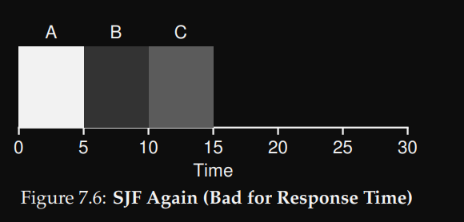

تخيل ان =C= هي REPL او shell او اي interactive program, فا كدا الـuser بعد ما دخل الـinput وداس enter, استنا 15 ثانية كاملين عقبال ما البرنامج يرجعله output.

فا اه الوقت اللي البرامج بتخلص فيه بقا اسرع لكن الوقت اللي بتبدأ فيه ما زال بطئ

احنا عاوزين مثلا اول ما ندخل input للـshell وندوس enter, يرد علينا في لحظتها والا البرنامج مبقاش interactive خالص, فالـresponse time مهم جدا حتي لو البرنامج في الاخر هيخلص ابطئ حاجة بسيطة.

***** Round Robin
:PROPERTIES:
:ID:       24897458-b534-4def-afa5-22b5c0d5d6b5
:END:

الـround robin بيهتم بالـresponse time, وكدا النظام بقا اكثر تفاعليه حتي لو كل jop هتاخد وقت اكتر شوية لحد ما تخلص, بسبب ان في context switching كتير بيحصل وده بيجي شوية علي حساب الـturnaround time

ولكن الـScheduler مش وظيفته يكون مثالي, وهو وظيفته يكون متوازن.

#+DOWNLOADED: screenshot @ 2026-06-12 06:30:35
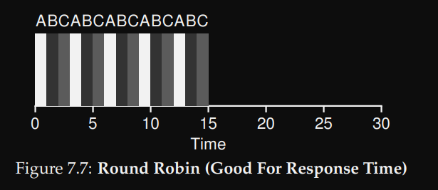

كل ما قل الـtime slice كل ما الـresponse time هيقل وده يبان كويس ولكن عدد الـcontext switches هيزيد جامد وبالتالي الـturnaround time هيزيد, وده هيحط overhead كبير جدا علي الاداء العام, لان الـcontext switching عملية مكلفة.

فا لازم الـtime slice يكون اقل ما يمكن بحيث الـresponse time يكون سريع ولكن في نفس الوقت ميجيش جامد علي حساب الـturnaround time ويزود عدد الـcontext switches اللي بيحصل.

**** Incorporating I/O
:PROPERTIES:
:ID:       6fd340e7-6e81-428e-8c51-0c624febcb6f
:END:

لو عندنا 2 jops كل واحدة فيهم محتاجة 50ms من وقت الـCPU, ولكن الـjop A بتعمل I/O request كل 10ms.

لو الـscheduler في الحالة دي STCF, فا لو A هي اللي وصلت الاول, B هيفضل مستنيها كتير جدا لان الـSTCF مش بيعمل context switching.

لكن لو الـscheduler شغال بـRR, فا هيعتبر ان الـ10ms I/O دي jop جديدة منفصلة وهيعمل overlap بين وقت الـCPU و وقت الـDisk بحيث نستفيد من الموارد اقصي استفادة ممكنة.

#+DOWNLOADED: screenshot @ 2026-06-12 21:24:02
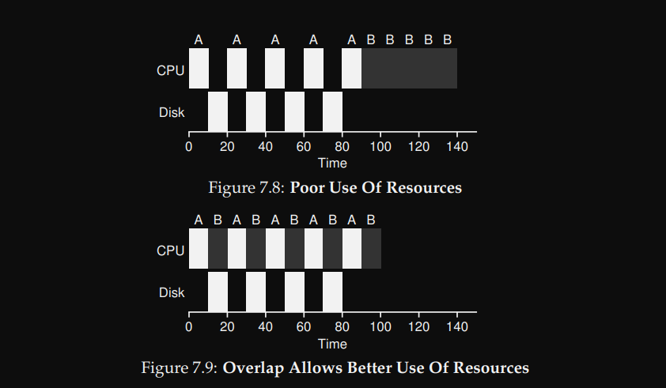

** Multi-level Feedback
:PROPERTIES:
:ID:       a7e23327-fc54-401c-97c9-36759fab5643
:END:

- الـMLFQ بيقسم الـjops لـqueues, وكل queue بيبقي ليه priorty مختلفة.

- القواعد الاساسية:
  1. لو priority(A) > priority(B), A runs (B doesn't).
  2. لو priority(A) = priority(B), A & B run in RR.

- الـMLFQ هو scheduler بيتعلم طول ما هو شغال عشان يعرف يعمل توقعات افضل في المستقبل.
- الوظيفة الاساسية للـMLFQ بتكمن في اعطاء كل jop الـpriority المناسبة
  - فا مثلا لو في jop بتسيب الـCPU كتير مقابل انها بتستني input من الـkeyboard, فا الـMLFQ هيديها priority عالية لان دي المفروض interactive program بياخد input من الـuser.
  - لكن لو jop تانية بتستهلك CPU كتير, الـMLFQ هيقلل الـpriority level بتاعها.

    #+DOWNLOADED: screenshot @ 2026-06-15 20:00:33
    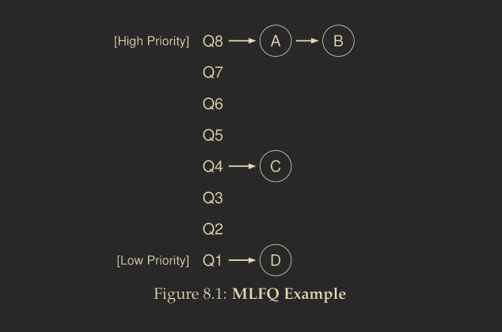

     كل jop بتدخل النظام جديد, بتبقي محطوتة في اعلي priority, بعد كدا الـscheduler بيحدد وقت معين بيكون هو الوقت اللي كل jop مسموحلها تقضيه علي مستوي priority معين, قبل ما الـschedulare يقرر انه يقلل الـpriority بتاعتها. (allotment)

    فا هنلاقي عندنا نوعين من الـjops:
    - CPU intensive: دي jops بتستهلك CPU كتير والـresponse time مش مهم بالنسبة لها.
    - interactive jops ودي jops بتعمل I/O requests وبتسيب الـCPU كتير فا الresponse time مهم بالنسبة لها.

      #+DOWNLOADED: screenshot @ 2026-06-15 21:24:52
      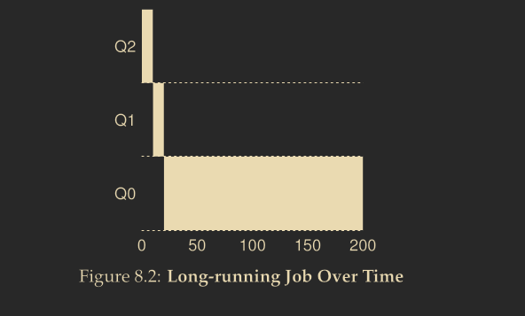

      لما الـjop بتخلص الـallotment بتاعها من غير ما تعمل IO requests يبقي الـjop دي بتستهلك CPU كتير والـscheduler بيقلل الـpriority بتاعها (move down to lower priority queue)

      لو الـjop عملت IO request قبل ما نخلص الـallotment بتاعها, يبقي دي interactive jop فا الـschdeluer بيعلي الـpriority بتاعتها او بيسبها في نفس المستوي من غير يقلله عشان الـpriority تفضل سريعة, والـallotment بيتعمله reset.

**** MLFQ approximate SJF

بما ان كل الـjops بتبدأ في اعلي priority, والـshort jops اللي بتحتاج وقت اقل من الـallotment او الـtime slice اللي محدده الـscheduler, ديما هتخلص الاول في priority عالي, لكن الـlong running jops اللي محتاجة وقت اكبر من الـallotment, فا هتفضل الـpriority بتاعتها تقل كل شوية والـshort jops هي اللي بتاخد الاولية الاعلي, لذلك فا الـMLFQ نوعا ما بيقدر يحاكي الـSJF بطريقة ذكية بدون ما يعرف الـruntime بتاع كل jop مسبقا زي الـSJF.

- لحد دلوقتي عندنا 3 مشاكل:
  1. كل ما الـshort jobs هتزيد الـCPU هينشغل معاها اكتر لان الـlong-running jobs عمالة تقل في الـpriority والـCPU مش هيقربلها خالص (starvation).
  2. لو الـlong-running jobs اتحولت من CPU bound لـinteractive, فا برضوا هتفضل في priority قليلة.
  3. ممكن المطورين يخدعوا الـscheduler عن طريق انهم يخلوا البرنامج يشتغل 99% من وقت الـallotment بشكل عادي وفي اخر الوقت خالص يقوموا عاملين IO request عشان الـscheduler ميقللش الـpriority.

#+begin_example
Allotment = 10ms ;; Keeps reseting

Run 9ms
Do fake I/O
Run 9ms
Do fake I/O
...
#+end_example

**** Priority Boots Rule:

       الـrule دي بتحل اول مشكلتين عن طريق انها كل مدة معينة بتنقل جميع الـjobs للـhigh priority queue من تاني, والمدة دي مش ثابتة, الـscheduler بيحددها علي حسب سلوك النظام.

**** Better Accounting Rule:

الـrule دي بتقول بدل ما هنعمل reset للـAllotment لما الـjob تعمل IO, لا الـscheduler هيوقف العداد, ولما الـjob تصحي تاني هيكمل عند اخر وقت وقفت عنده. وكدا حلينا مشكلة خداع الـscheduler, ولما الـjob تستهلك الـallotment بتاعها وتقل في الـpriority, هيتعملها boost تاني بعد مدة معينة.

** Lottery Scheduling

الـlottery scheduler هو scheduler بيهتم اكتر بالمشاركة العادلة او التناسبية.
بدل ما بيهتم بتحسين الـturnaround time او الـresponse time, هو بيهتم اكتر بمشاركة وقت الـCPU بطريقة نسبية, يعني كل proccess بتاخد نسبة معين من وقت الـCPU.

*** Tickets
:PROPERTIES:
:ID:       0553b5fb-20b5-4fa1-b944-5ccd8259c447
:END:

واحدة من الاليات المستخدمة لتنفيذ المشاركة النسبية هي الـtickets, كل process ليها عدد معين من الـtickets بيمثل النسبة اللي هتحصل عليها من وقت الـCPU.

مثال:

- process A: has 75 tickets.
- process B: has 25 tickets.

  هنا process A في الاغلب هتحصل علي 75% من الـCPU time, و process B هتصحل علي 25%

  كل ما الـtime slice بتخلص, الـscheduler بيعمل قرعة, يختار فيها ticket عشوائي والـprocess اللي معاها الـticket ده هي اللي هتتنفذ في الـtime slice الجاية.

  يعني مثلا كل الـtickets من 1 لـ 75 مع process A, وكل الـtickets من 76 لحد 100 مع process B, فا لو الـscheduler مثلا اختار الـticket رقم 45 فا process A هي اللي هتتنفذ

  ممكن process B تكون محظوظة والـtickets بتاعتها تكسب اكتر من مرة ورا بعض, ولكن مع مرور الوقت دائما النسبة هتكون 75 - 25, فا الية عمل النظام ده بتشتغل بشكل *احتمالي* مش *حتمي*.

  #+DOWNLOADED: screenshot @ 2026-06-17 18:09:03
  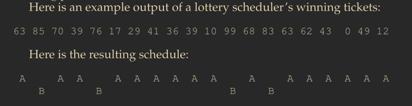

**** Implementation
:PROPERTIES:
:ID:       d1d182c6-c87a-42c5-aba8-47e259b3af77
:END:
  #+DOWNLOADED: screenshot @ 2026-06-17 18:42:21

  التنفيذ العملي للكلام ده هيكون بسيط, اولا هنحتاج random number generator كويس ودقيق, وهنحتاج data structure نخزن فيها الـjops زي الـList.

  هناخد الرقم العشوائي اللي طلع واللي المفروض يكون >= العدد الكلي للـtickets, وهنلف علي jop في الـList, ونجمع عدد tickets في counter, والـjop اللي هيكون عندها عدد tickets اكبر من او بيساوي الـrange الحالي هي اللي هتكسب وهتتفذ.
  

#+DOWNLOADED: screenshot @ 2026-06-17 19:17:55
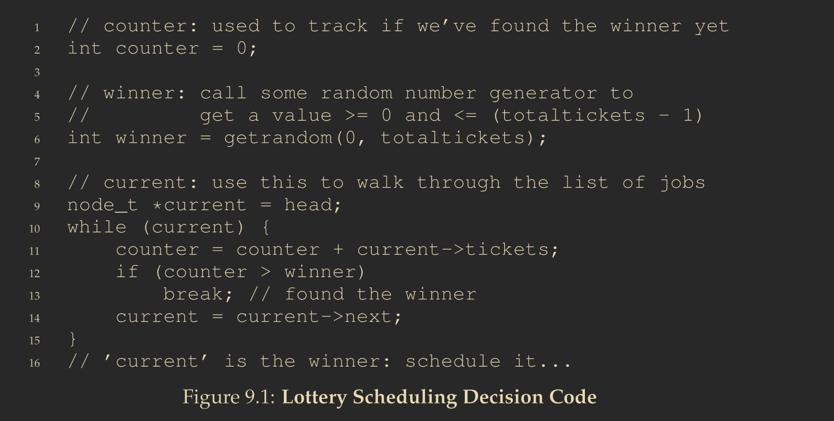

*** Problems with lottery scheduler

**** Not fair with short jobs (short runtime)

الـlottery scheduler مش بيبقي عادل مع الـjobs اللي الـruntime بتاعها قصير, فا مثلا لو عندنا 2 jobs الـruntime بتاعهم واحدك (R = 10), وكل jop عندها نفس عدد الـtickets, فابالتالي النسبة المتوقعة لكل job انها تاخد 50% من الـCPU time.

ولما الـscheduler يعمل القرعة, ممكن job من الاتنين تكسب كذا مرة ورا بعض بالحظ, والتانية تفضل مستنياها, وده طبيهي مش دي المشكلة.

لكن المشكلة بتظهر لما يكون الـruntime قصير فا ساعتها الـjop اللي كسبت عدد مرات كتر هتخلص الاول مع ان المفروض انهم يخلصوا مع بعض في نفس الوقت, لكن لو الـruntime كبير فا مع مرور الوقت النسبة هتقرب من 50 50 والـ2 jobs تقريبا هيخلصوا مع بعض وهتكون نسبة العدالة اكبر.

**** How to assign tickets?

ازاي هنقسم الـtickets علي الـjobs وهيكون بناءا علي ايه؟ ممكن ندي الـuser عدد من الـtickets ونخليه يقسمها هو بنائا علي اهمية الـjobs بالنسباله, ولكن ده مش ميعتبرش حل لان مش دائما الـuser هيكون عارف ازاي يعمل كدا. وتظل مشكلة الـticket assignment ملهاش حل جذري لحد دلوقتي.

*** Stride scheduler

الـstride scheduler هو شبه الـlottery scheduler ولكن بيشتغل بطريقة *deterministic* مش بطريقة عشوائية.

احنا مازال عندنا نفس concept الـtickets ولكن القرار اللي بيحدد مين الـjob اللي عليها الدور تشتغل هيتم بشكل حتمي مش عشوائي.

هناخد عدد الـtickets اللي بتملكه كل job ونقسمه علي عدد ثابت كبير ولكين مثلا 10000, والناتج هيكون اسمه الـstride او الخطوة.

بعد كدا كل job بتشتغل بنجمع الـstride بتاعها علي عداد خاص بيها اسمه الـpass value.

والـjob اللي هيجي عليها الدور بعد هتكون الـjob اللي عندها اصغر *pass value*.

*مثال:*

عندنا 3 jobs هما A, B, C والـtickets بتاعتهم هي 100, 50, 250 بالترتيب.

- هنقسم العدد الثابت علي كل tickets عشان نحسب الـstride لكل job:
  - $$ A = 10000 / 100 = 100 \; stride$$
  - $$ B = 10000 / 50 = 200 \; stride$$
  - $$ C = 10000 / 250 = 40 \; stride$$
- الـPass value بتاعتهم كلهم هتساوي 0 في الاول فا هنختار واحدة منهم تبدأ بشكل عشوائي, ولكن هنختار A.
- A هتشتغل لـtime slice معين وبعد كدا هنجمع الـstride بتاعها علي الـpass value يعني
   الـpass = 100 + 0 = 100.
- كدا الوضع الحالي بقا (A=100, B=0, C=0), هنختار واحد عشوائي من B و C وليكن B
- B هتشتغل لـtime slice, وبعد كدا والـpass = 200.
- كدا الوضع الحالي (A=100, B=200, C=0), فا هنختار C عشان هي اصغر pass فيهم.
- C هتشتغل وهيبقي الـpass = 40.
- كدا الوضع الحالي (A=100, B=200, C=40), فا C هتشتغل تاني, وهكذا..

  وهنلاحظ في كل job اشتغلت فعلا عدد مرات موازي لنسبة الـtickets اللي معاها بشكل عادل اكتر.

**** The problem with Stride scheduler

مشكلة الـstride scheduler ان لو في job جديدة دخلت النظام في نص ما A,B,C شغالين, الـjob الجديدة هتاخد pass value بـ0, وهيبقي ليها الاولوية عن الثلاثة الباقيين وهتحتكر الـCPU لفترة كبيرة لحد ما الـpass value بتاعها يزيد ويبقي قريب من الباقيين.

علي عكس الـlottery scheduler اللي لو job جديدة دخلت, كل اللي الـscheduler هيعمله انه هيزود عدد الـtickets بتاعها علي العدد الكلي للـtickets, والرقم العشوائي الجديد اللي هيطلع هتضمن الـjob الجديدة دي والعملية هتكمل عادي بشكل سلس.

*** CFS - Complete fair scheduler
:PROPERTIES:
:ID:       66d60d82-4239-4529-8d3e-f98700d0454e
:END:

  - الـCFS هو scheduler ذكي وسريع جدا وكان هو المستخدم بشكل اساسي في Linux حتي 2007.
  - بيشتغل عن طريق انه بيجمع الـruntime بتاع كل process في متغير اسمه الـvruntime, وبيحدد الـjob اللي عليها الدور عن طريق انه بيختار الـjob اللي عندها اقل vruntime.
  - الـpriorites فيه بتشتغل عن طريق الـNiceness او الـnice level, كل process ليها nice-level من -20:19 بيـMap لـweight, و الفرق بين الـweights ثابت.
  - لو الـnice-level زاد, معني كدا ان الـprocess دي مش بتستهلك CPU كتير وبالتالي الـCFS هيحددلها time slice قصيرة.
  - الـtime slice مش ثابت وبيتحدد بنائا علي الـweights:

    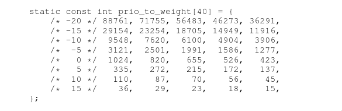

    #+DOWNLOADED: screenshot @ 2026-06-24 09:03:06
    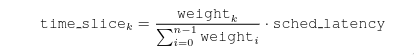

  - الـCFS بيعرف متغير تاني اسمه الـmin_granualrity وده اقل time slice ممكن الـschedluer يشتغل بيها, عشان نمنعه انه يشتغل في time slices صغيرة جدا فا يعمل context switching كتير.

  - لو سبنا الـvruntime يزيد بطريقة متضاعفة, الـjobs اللي الـtime slice بتاعتها كبيرة الـvruntime بتاعها هيزيد بشكل كبير مع الوقت والـpriority بتاعتها هتقل والـCPU مش هيقربلها بعد كدا.

  - الـvruntime الجديد بيتحسب عن طريق معادلة ذكية بيتخلي الـvruntime بتاع الـprocesses كلها يزيد بشكل متقارب حتي لو الفرق في الـtime slice بينهم كبير.

  #+DOWNLOADED: screenshot @ 2026-06-24 09:01:57
  

**** Red-Black Tree

- الـCFS مش بيخزن الـjobs في List, لان الـsearching في الـlist بيبقي O(n), وده بطئ نسبيا بالذات لو النظام فيه processes كتيرة شغالة.
- بدل كدا هو بيستخدم الـred-black tree وهي نوع ان انواع الـbalanced trees, و الـsearching و الـsorting فيها بيكون O(logn), وده اسرع بكتير.
- الـscheduler بيخزن بس الـrunning و الـready jobs في الـtree, وبيشيل الـsleep او الـblocked jobs.
- ولما job ترجع تبقا ready بيرجعها الـtree تاني وساعتها الـsorting بيقا سريع ومش بيحط overhead علي الـCPU.

-------

**** IO

لما برنامج يدخل في وضع الـsleep, ويرجع يشتغل تاني, مينفعش يكمل علي اخر vruntime كان واقف عنده, لان في برامج تانية في الشجرة كانت شغالة والـvruntime بتاعها زاد, فا لو خلينا البرنامج ده يكمل من عند اخر vruntime, كدا هيحتقر الـCPU لفترة طويلة.

الـCFS لما برنامج ينام فترة طويلة ويصحي بيخلي الـvruntime بتاعه مساوي لأقل vruntime موجود في الشجرة.

ولكن ده بيأثر علي الـshort jobs اللي بتسيب الـCPU كتير, لانها كل مرة بترجع تاني بتلاقي الـvruntime بتاعها مساوي للـvruntime بتاع processes تانية اشتغلت لفترات طويلة و مش بيكون ليها الاولوية اللي تستحقها.

عشان كدا الـCFS مبقاش مستخدم لانه مش احسن حاجة في سرعة الاستجابة (response time).

**** Summary

اختيار الـData structure الصح هو اساس حل اي مشكلة.

** Multi-CPU Scheduling

- الـجزء ده يفضل قرأته بعد الـConcurrency.

** Address Space

*** Address space and Ioslation
:PROPERTIES:
:ID:       a9001197-e189-4e5b-92d1-672cccb1e4d3
:END:

عشان نحقق الـtime sharing بشكل سريع, لازم كل البرامج اللي في النظام تبقي متحملة علي الـmemory, حتي البرامج الموقوفة او في حالة sleep, والحالة او الـexecution context بتاع كل برنامج يكون متخزن علي الـmemory

لان لو الـOS بيحمل البرنامج اللي شغال حاليا فقط علي الـmemory وبعد كدا لما بعوز يبدل لبرنامج تاني يقوم ماسح البرنامج ده من الـmemory ومخزن الحالة بتاعته علي الـdisk عشان يحمل البرنامج الجديد من علي الـdisk, فا كدا الـtime sharing هيكون بطئ جدا.

لما بتعمل minimize لبرنامج في الـtask bar وتيجي تفتحه تاني, البرنامج ده مش بيفتح من اول وجديد, لا هو كان بس موقوف او واخد priority قليلة و بعد كدا رجع خد priority عالية تاني.

وعشان كل الـprocesses اللي في النظام متحملة في الـmemory وقاعد مستنية, فا لازم يكون فيه حماية و *isolation* ما بينهم.

الـvirtual address space هو اللي بيحقق مفهوم الـ *isolation* بحيث كل برنامج موهوم انه واخد مساحة لوحد من 0 لحد 2^64, والـOS بمساعدة الـhardware بيترجم العنواين الوهمية دي لعنواين حقيقية علي الـphysical memory.

ولو برنامج حاول يحجز مساحة اكبر من مساحة الـphysical memory, الـOS بيعمل swap ويخزن حالة البرامج الموقوفة او الخاملة علي الـ disk (البرامج المفتوحة بس مش بنسخدمها بقالنا فترة كبيرة) عشان يفضي مساحة للبرامج النشطة.

**** Example of Address space

- تقسيمة الـAddress space مش ثابتة وفي بعض الحالات اللي ليها علاقة بالـConcurrecy بنحتاج نعدل في التقسيمة.

#+DOWNLOADED: screenshot @ 2026-06-27 04:04:04
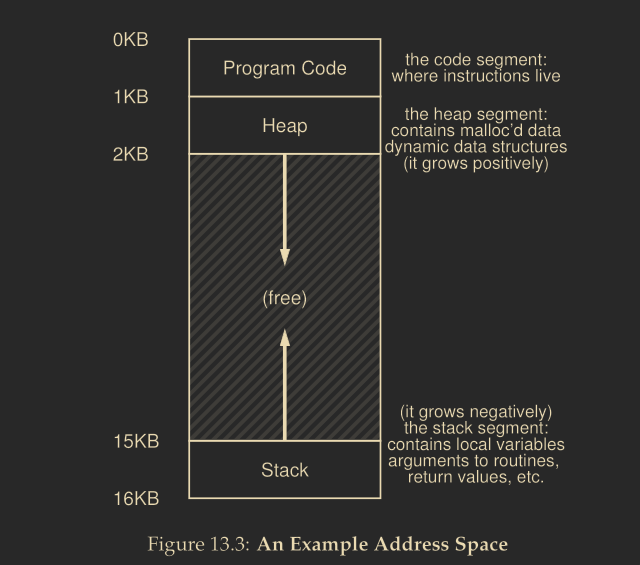

***** Why heap and stack grow towards each others?

- لان مش كل البرامج بتستخدم الاتنين بنفس النسبة, في برامج بتستخدم الـstack اكتر من الـheap او العكس, ولو الـOS خصص مساحة ثابتة لكل واحد فيهم, ده هيبقي غير عادل لان ممكن الـstack يتملي والبرنامج يضرب مع ان الـheap فاضي او العكس.
- لاكن التصميم الذكي ده بيخليهم يتشاركوا مع بعض في مساحة كبيرة بدل ما كان كل واحد فيهم واخد مساحة اصغر لوحده, والبرنامج مش هيقف الا لو الاتنين تصادموا مع بعض.

** Memory API

- السكشن ده مجرد شرح لـmalloc, free, calloc, mmap, valgrind

** Memory Translation

- الـMemory virtualization بيواجه نفس المشكلة اللي واجهت الـCPU virtualization, ازاي نبني بيئة افتراضية حوالين الـmemory تبقا سهلة ومرنة وفي نفس الوقت الـOS يبقي عنده تحكم علي البيئة دي بيحيث يمنع اي برنامج من الوصول لمساحة مش بتاعته.

- الاجابة في الـhardware-based address translation / address translation, الـOS بمساعدة الـhardware بيقوم بتحويل الـvirtual addresses لـphysical address مع اي عملية fetch, load, store للتعليمات.

- وبكدا عملنا وهم لكل برنامج انه عنده ذاكرته الخاصة المعزولة والتعامل مع الـmemory بقا مرن جدا مع ان الحقيقة البشعة هي ان كل البرامج بتتشارك في نفس المساحة.

*** Dynamic Relocation - اقدم فكرة لترجمة العنواين علي الملأ

- الـDynamic relocation هي كانت اقدم وابسط فكرة عشان يتم الترجمة بين الـvirtual address والـphysical address.
- فكرته بتتمحور حوالين اننا عندنا 2 registers في الـCPU:
  - الـ *Base register*: وده بيتخزن فيه اول عنوان للبرنامج في الذاكرة الحقيقية.
  - الـ *Bound register*: وده بيتخزن فيه حجم البرنامج الكلي, عشان منعديهوش.

**** ألية الترجمة:

- اي عنوان وهمي البرنامج بيطلب انه يقرأ او يكتب عليه, المعالج بيترجمه فورا (on the fly) لعنوان حقيقي عن طريق المعادلة البسيطة دي: *Physical Address = Virtual Address (offset) + Base*

  ولو الـ *offset* اصغر من الـ *bound* يبقي تمام, لكن لو اكبر بيرمي *segmentation fault* ومش بيعمل العملية الحسابية دي اصلا.

- والجزء المسؤل عن الترجمة في المعالج اسمه Memory Management Unit MMU.

- طبعا عملية الترجمة بتتم في الـkernel mode عشان نحمي الـregisters.

- مثال:

  - base: 32k (program starts in physical memory at 32k)
  - bound: 2k (size of program)
  - offset: 200
    - *translated physical address* = base + offset = 32768 + 2000 = 34768

***** مسؤليات الـOS

الـhardware هو اللي بيعمل الترجمة, لكن الـOS برضو بيعمل حاجات مهمة فيما يتعلق بالذاكرة

- عند الـ *process create* الـOS بيروح يدور في الـ *Free list* عشان يشوف مكان فاضي في الذاكرة يكون علي قد البرنامج واول ما يلاقيه بحجزه للبرنامج ويعلم عليه انه مستخدم.
- عند الـ *process termination* الـOS بيروح يسترد الذاكرة بتاعت البرنامج ويرجعها تاني للـfree list عشان تبقي متاحة للبرامج التانية.
- عند الـ *context switch* الـOS بينقل القيم اللي في الـ *base / bound registers* الخاصة بالـprocess دي ويخزنهم في الـ *PCB struct*, وبعد كدا يحط فيهم الـbase/bound بتوع الـprocess الجديدة.
- عند الـ *execptions* لما برنامج بحاول يقرأ او يكتب علي عنوان برا الحدود بتاعته, الـhardware بيعمل interupt وبيروح ينفذ الـhandler الخاص بالمشكلة دي من الـtrap table, ولكن من غير الـOS مكانش هيبقا فيه trapping mechanism.

**** Internal Fragmentation - base/bound مشكلة نظام الـ

الـOS في نظام الـ *base/bound registers* بيتعامل مع ذاكرة كل برنامج علي انها *Contigous* , فلما برنامج جديد يشتغل, الـOS لازم يديله مساحة contigous في الذاكرة وبتكون مساحة اكبر من الـbinary نفسه بكتير عشان يعمل حساب الـheap/stack لانهم بيكبروا بشكل ديناميكي اثناء التشغيل.

فكان الـOS مش بيقدر يقسم ذاكرة البرنامح علي كذا مكان, يا أما يتحط في الذاكرة بشكل متتالي يا أما يقوله مفيش مكان.

وده بيعمل هدر كبير جدا في الذاكرة لان معظم البرامج واخدة مساحة اكبر بكتير من اللي محتاجها.

** Segmentation

- في طريقة الـBase and Bound القديمة كان البرامج بتتخزن بشكل contigous في الذاكرة, وكان في مساحة كبيرة بيتم اهداراها بسبب الـinternal fragmentation.

- فكرة الـ *Segmentation* ان الـOS بيقسم كل جزء في البرنامج (stack, heap, code,..) لـsegment, وكل جزء هيبقا ليه Base و Bound خاص بيه.

- و بكدا الـoperating system يقدر يقسم الـmemory بتاعت البرنامج, علي كذا مكان في الـPhysical memory.

*** ازاي الـOS هيحدد كل segment؟

- *Explicit approach*

  الـOS بقسم الـvirtual address لاجزاء وبيخزن metadata فيه, بيخصص اكبر 2 bits وبيخزن فيهم قيمة بتعبر عن نوع الـsegment, والباقي بيعبر عن الـoffset

  *مثال:*

  وليكن العنوان اللي البرنامج طالبه هو 4200, فا بيتكتب كدا 1000 0110 0000 01

  01 مثلا معناها الـheap segment, فا كدا الـMMU عرف العنوان ده بتاع انهي segment

  بقيت الرقم اللي هو 1000 0110 0000 بيساوي 104, وده الـoffset

  هياخد الـoffset يجمعها علي الـBase بتاع الـheap.

- *عيب* الطريقة دي انها بتقص 4 bits من حجم العنوان, 2 bit للـsegment و 2 تانيين مهدرين في التقسيمة, وده طبعا ببيجي علي حساب الـoffset لاننا مش بنقدر نخزن offset كبير, اخرنا فقط 4kb (الـ12 bit الباقيين) وبالتالي كل segment اخره 4kb في المساحة.

- *Implicit approach*

في بعض الانظمة, مش بتعتمد علي تقسيم الـbits وتخزين data فيها, بل بتعتمد علي نوع العملية, يعني لو الـaddress جي من الـPC يبقي ده عنوان للـcode segment, لو جاي من الـstack pointer يبقي ده عنوان للـstack segment, لو جي من حاجة غيرهم يبقي ده عنوان للـheap segment.

- *What about the stack* (Nigative offset)

  عشان الـstack بيبدأ من الاخر ويكبر لتحت, فالـMMU بيقوم طارح الـBound (4kb) من الـoffset, والقيمة السالبة اللي هتطلع, هيجمعها علي الـBase, وبكدا يبقي اتحرك لتحت, وفي نفس الوقت معداش الـbound.

*** Support for sharing - Protection bits
:PROPERTIES:
:ID:       9decafc6-c1fa-4131-acce-5eef49833215
:END:

لو فتحنا كذا instance من نفس البرنامج, فا كل instance هي عبارة عن process منفصلة بـaddress space منفصل, ولكن في بعض الاجزاء ممكن يتم مشاركتها بينهم زي الـ *Code segment*.

الـOS بيخزن الـ *Code segment* مرة واحدة فقط في الـphysical memory, ويخلي كل الـinstances يشاوروا عليها.

#+DOWNLOADED: screenshot @ 2026-07-06 23:34:35
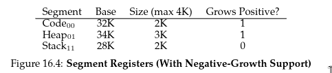

الـOS بيستخدم protection bits, لكل segment عشان يحمي الـsegments الشتركة.

** Free Space Management - Memory Allocators

*** Internal vs External Fragmentation

**** Internal fragmentation

- ده بيحصل لما البرنامج يطلب مساحة في الذاكرة, ولكن الـOS بيديله مساحة اكبر من اللي هو محتاجها, فا بيبقي في مساحة مهدورة داخل الـblock اللي اتحجز,
- و ده بسبب الـ *Memory aligning* وبسبب ان الـOS بيقسم الذاكرة لأجزاء *ثابتة* سواء في الأنظمة القديمة اللي بتعمل fixed partitioning او في الأنظمة الحديثة اللي بتستخدم نظام الـPaging.
- فا مثلا البرنامج ممكن يكون طالب 3kb ولكن الذاكرة متقسمة لبلوكات حجمها 4kb فا في 1kb تم اهداره.

**** External fragmentation
:PROPERTIES:
:ID:       0c7b5c1b-abda-4242-b851-2dfc7b873365
:END:

#+DOWNLOADED: screenshot @ 2026-07-09 07:56:23
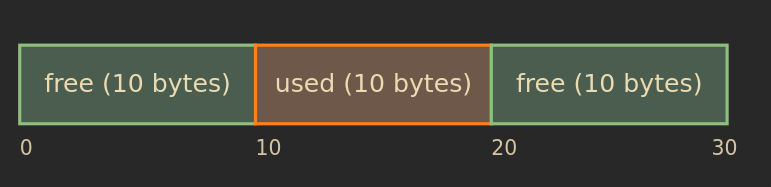

- ده بيحصل في الانظمة اللي بتسمح للبرامج انها تطلب مساحات متغيرة الحجم علي قد احتياجها بالظبط, زي نظام الـsegmentation او الـdynamic allocation, وهنا مفيش هدر بيحصل داخل الـblock اللي اتحجز لان البرنامج خد memory علي قد اللي محتاجه بالظبط.
- ولكن الهدر بيحصل مع مرور الوقت لما البرنامج يقعد يحجز مساحات متغيرة في اوقات مختلفة فا بيسيب وراه فراغات كتير في الميموري, الفراغات دي مساحتها الكلية ممكن تكون كبيرة وتكفي لبرنامج تاني جديد, ولكن المشكلة انها متقسمة علي مناطق مختلفة مش contiguous.

*** User-level-memory-allocation libraries

**** Splitting and Coalescing

***** Spliting (التقطيع)

- لو برنامج طلب مساحة من الميموري مثلا حجمها 1kb واصغر block فاضي في الـذاكرة هو 10kb, فا الـOS هيقطع 1kb من البلوك ده يديها للبرنامج ويسيب الـ9kb الباقيين في الـfree list, وبكدا يبقي الـOS حل مشكلة الـinternal fragmentation.

  #+begin_example <free list>
  head -> [addr:0,  len:10] -> [addr:20, len:10] -> NULL
  #+end_example

  #+begin_example <free list>
  head -> [addr:0, len:10] -> [addr:21, len:9] -> NULL
  #+end_example

***** Coalescing (الدمج)

- لما برنامج كان واخد مساحة من الـmemory وعملها free, الـOS بيبص علي جيرانها اللي فوقيها وتحتها ولو لاقاهم فاضيين برضو, بيقوم دامجهم مع بعض, وبكدا يكون حل مشكلة الـexternal fragmentation, وده من ذكاء تصميم الـmemory allocators.

#+begin_example <free list>
head -> [addr:10, len:10] -> [addr:0, len:10] -> [addr:20, len:10] -> NULL
#+end_example

#+begin_example <free list>
head -> [addr:0, len:30] -> NULL
#+end_example

**** Tracking size via headers

لما البرنامج بيطلب مساحة في الذاكرة الـallocator بيحجز قبلها حاجة اسمها الـheader وده بيكون عبارة عن struct, شايل معلومات عن المساحة دي, عشان كدا الـ =()free= مش بتاخد حجم المساحة, هي بس بتاخد pointer علي المساحة دي, وبعد كدا الـallocator بيرجع خطوة لورا =ptr - 1= عشان يقرأ الـheader ويعرف حجم المساحة المحجوزة. =header_t *hptr = (header_t *) ptr - 1=

- الـmagic number هو رقم ثابت بيعرف الـblock ده عشان يتاكد ان مفيش اي corruption.
- لما البرنامج بيطلب مساحة حجمها N bytes, الـallocator بيدور علي قطعة حجمها N bytes + header size

#+begin_src c
typedef struct {
    int size;
    int magic;
} header_t;

void free(void *ptr) {
    header_t *hptr = (header_t *) ptr - 1;
    ...
#+end_src

**** Embedding A Free List

الـallocator زي =()malloc= بيعمل list فيها كل المساحة الفاضية في الـheap والـlist دي بتتخزن في الـheap نفسه,

- Free list
#+begin_src c
typedef struct __node_t {
    int size;
    struct __node_t *next;
} node_t;
#+end_src

- الـalocator =()malloc= خد مساحة حجمها 4kb من الـOS, وطرح منها حجم الـnode اللي بتشاور علي المساحة الفاضية, عشان يقدر بعد كدا يبني free list فيها nodes بتشاور علي كل chunk فاضية.
- وكدا كل

#+begin_src c
node_t *head = mmap(NULL, 4096, PROT_READ|PROT_WRITE,
                     MAP_ANON|MAP_PRIVATE, -1, 0);
head->size = 4096 - sizeof(node_t); // 4088
head->next = NULL;
#+end_src

- لما مثلا نطلب من malloc مساحة حجمها 100 bytes, بيقوم طارح 108 bytes من الـfree list ويديني pointer بيشاور عليهم بعد الـheader.

#+begin_src c
// before malloc:
free list: [size: 4088] -> NULL

// after malloc(100)
free list: [size: 3080] -> NULL
#+end_src

- وبعد كدا لما اعملهم free, هيقوم راجع خطوة لورا عشان يقرأ الـheader, ويقوم عامل node جديدة للـchunk دي في الـfree list, وكمان لو الـfree list فيها chunk تانية فاضية قريبة في العنوان من نفس الـchunk دي هيقون دامجهم علي بعض (coalescing).

#+begin_src c
// after free
free list: [size: ~100] -> [size: 3980] -> NULL

free list: [size: ~4088] -> NULL
#+end_src

- ولكن الـcoalescing مش هيفيدنا لو القطع الفاضية دي مش متجاورة في الـvirtual memory

#+begin_example
Virtual heap addresses:  [0-100] free   [100-200] used   [200-300] free
#+end_example

*** Growing the Heap

الـallocator لما مساحة الـheap بتخلص, بيروح يعمل systemcall ويوسع مساحة الـheap, وغالبا الـallocator بيبدأ بمساحة heap صغيرة ولو البرنامج احتاج مساحة اكبر, بيعمل system call.

*** Basic Strategies - Allocator Policies

الـAllocator عنده استراتيجيات مختلفة في البحث عن اكتر بلوك فاضي في الـfree list يكون مناسب لحجم المساحة اللي البرنامج طالبها.

**** Best fit

- ودي استراتيجية للبحث عن *اصغر* بلوك فاضي يكون اكبر من او يساوي حجم المساحة اللي البرنامج محتاجها, وده هيكون افضل بلوك مناسب للحجم ده, وبعد كدا يعمله split للحجم اللي البرنامج محتاجه.

- عيب الطريقة دي: انها بطيئة لان الـallocator بيعمل full search في الـfree list, ولكن دي اكتر طريقة efficient من حيث الـexternal fragmentation.

**** First fit

- وهنا الـallocator بيدور علي *اول* فاضي يكون اكبر من او يساوي المساحة المطلوبة, وده بيكون سريع لان عادتا الـallocator مش هيحتاج يعمل full search.

  - عيب الطريقة دي: هي ان بداية الـfree list غالبا هيكون مليان blocks فاضية كتير, فا الـexternal fragmentation كله هيبقي في اول الـlist, و لما الـallocator يجي يبحث تاني في الـlist, هياخد وقت اكبر لان الـlist عدد العناصر اللي فيها زاد.

**** Next fit

وده زي الـfirst fit بالظبط ولكن الـallocator لما بيجي يبحث مش بيبحث من اول الـlist, هو بيكون عنده pointer علي اخر مكان وقف عنده وبيكمل بحث من المكان ده, والطريقة دي مش بتقلل الـexternal fragmentation ولكنها بتوزعه بالتساوي علي الـlist كلها.

**** Worst fit

ودي عكس تمام الـBest fit, لانها بتدور علي *اكبر* block فاضي, بحيث لما تعمله split, الـblock اللي هيتبقي يكون كبير برضوا ونقلل الـexternal fragmentation, ولكن الطريقة دي طبعت بتزود الـfragmentation مش بتقلله لانها بتخلص علي كل الـblocks الكبيرة بسرعة جدا.

----

- الـBest fit والـ First fit هما الطريقتين الاكثر استخداما والاكثر كفاءة.

** Paging: introduction

*** Paging vs Segmentation

لما نيجي نعمل virtualize للـmemory, في طريقتين اساسيين, هما الـsegmentation و الـpages.

- الـsegmentation مبقاش مستخدم لانه بيقسم الـvirtual address space لـvariable-sized segments زي الـ (code, stack, head), وطبعا لما الـprocess تتمسح من الmemory بتسيب وراها فراغات كتير مكان الـsegments دي, (external fragmentation).

- الطريقة الثانية هي استخدام الـ *paging*: الـpaging بيقسم الـvirtual address space لـfixed-sized units وكل unit او قطعة من دول بيكون اسمها *page*, وبالمثل في الـphysical memory, بتكون مقسمة لاجزاء متساوية برضو اسمها الـ *page frames*, وكل *frame* ممكن يستوعب *page* واحدة من اي process.

  - الـpaging بيحل مشكلة الـexternal fragmentation, لانه قسم الـmemory لاجزاء متساوية, وكمان لان كل برنامج بيقسم في الـphysical memory مش بس في الـvirtual memory زي الـsegmentation.

  - فا لو البرنامج محتاج مثلا 4 pages, كل page هتتخزن في اي frame فاضي في الـphysical memory, حتي لو في مناطق متفرقة, مش لازم يكونو متتاليين, وبكدا الـpaging مش بيهدر اي memory خالص من ناحية الـexternal fragmentation.

*** Example on paging
:PROPERTIES:
:ID:       35572091-20ac-4d44-a489-3f14f2fd8f8b
:END:

تخيل عندنا address space مساحته 64kb, مقسوم علي 4 pages وكل page حجمها 16 byte, والـphysical memory مساحتها 128 bytes مقسمة علي 8 page frames.

الـOS ممكن يحط الـpages دي في اي frames فاضية مش شرط تكون متجاورة.

#+DOWNLOADED: screenshot @ 2026-07-18 11:41:40
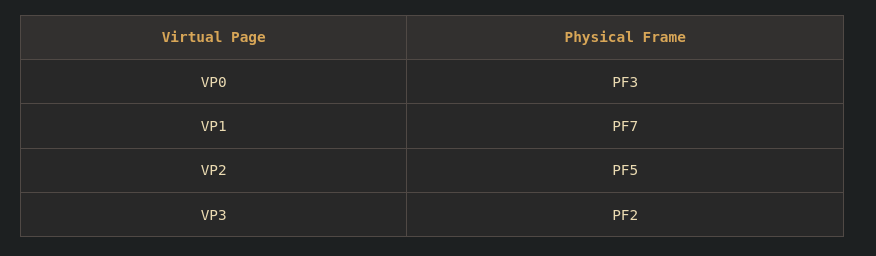

وكدا الـframes 1, 4, 6, فاضيين وممكن اي pages تانية من اي process تتخزن فيهم بشكل طبيعي.

عشان الـos يعرف كل page اتحطت في انهي frame في الـmemory, بيحتفظ بجدول في كل process اسمه الـ *page table* ودي بتبقي per-process data structure.

*** Address Translation
:PROPERTIES:
:ID:       0c518303-4aae-44cc-91ad-c8effbf593f2
:END:

- الـvirtual address space في الانظمة الحديثة بيكون مقسم لاجزاء كتيرة بشكل ذكي ومعقد, لكن الفكرة العامة البسيطة اننا بيبقي عندنا جزئين , الـVPN وده الجزء اللي بيخزن رقم الـpage, والـoffset وده بيخزن الـoffset في الـmemory.

  لو عندنا address space مساحته 64bytes فا احنا محتاجين virtual address مساحته 6 bits (log(64)) عشان نخزن عنوان كل byte في الـ64.

  الـ64kb مقسمين علي 4 pages كل page حجمها 16 byte, اذا احنا محتاجين:

  - 2 bits for VPN - log(4 pages)
  - 4 bits for offset - log(16 bytes page size)

    #+DOWNLOADED: screenshot @ 2026-07-18 12:28:45
    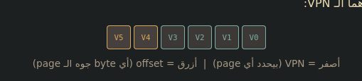

- لو البرنامج عاوز يقرأ من virtual address 21, فا لما يتحول binary هيكون =010101=
  - اول 2 bits هيكونوا =01= يعني الـVPN 1
  - والـ4 الباقيين هيكونوا =0101= يعني 5 offset
- اذا الـvirtual address 21 معناه احنا عاوزين الـbyte رقم 5 في الـpage رقم 1.

  - الـ VPN رقم 1, هتترجم لـ PFN رقم 7 (111) والـoffset هيفدل زي ما هو

    #+DOWNLOADED: screenshot @ 2026-07-18 12:35:53
    

    - اذا الـphysical address هيكون =1110101= يعني 117, اذا احنا محتاجين نقرأ الـbyte رقم 117 في الـphysical memory.

*** Page table stored in physical memory

الـpage tables في الانظمة الحديثة بتكون ضخمة جدا, يعني مثلا لو عندنا address space حجمه 32bit يعني 4 مليار byte والـpage size بيساوي 4kb, يعني احنا عندا 4bil/4kb هيساوي 1m page (20 bits), يعني الـpage table هيكون فيها مليون entry, ولو كل entry بياخد 4 bytes, يعني حجم الـpage table هيكون 4mb, ولو عندنا 100 process شغالين, اذا احنا محتاجين نخزن 400mb في الـcache, وده استحالة يحصل, لان الـcache غالي جدا وحجمه صغير

- فالـpage tables بتتخزن في الـphysical memory, وبيكون في register في الـCPU اسمه page table base register وده بيخزن عنوان الـpage table في الـphysical memory.

*** Page Table Entry (PTE)

ابسط شكل للـPage table بيكون عبارة عن array (linear page table), بيكون الـVPN هو الـindex اللي بيـmap للـPFN, الـPFN مش مجرد رقم الـframe, لا هو بيخزن معلومات تانية كتير:

- الـValid bit: ودي بتحدد هل الـpage اللي البرنامج عاوز يقرأ منها مستخدمة فعلا وتبع البرنامج ولا مش تبعه اصلا سواء فاضية او تبع برنامج تاني, وفي الحالة دي هيرمي segmentation fault.

- الـProtection bits: ودي بتحدد الصلاحيات بتاعت كل page, مثلا الـcode هيكون read only, والـheap هيكون read/write

- الـPresent bit: وده بيقول هل الصفحة في الـRAM ولا في الـdisk.

- الـDirty bit: وده بيقول هل الـpage اتغيرت في الـRAM ولا لسا مساوية لنفس حالتها في الـDisk.

- الـReference bit: وده بيقول هل الـpage دي استخدمت ولا لا.

*** Paging is slow

بما ان الـPage table مخزنة في الـRAM, فا كل ما الـprocess تحاول تقرأ حاجة من الـmemory, فا الـCPU لازم:
- يستخرج الـVPN من الـvirtual address.
- وبعد كدا يقرا الـpage table من الـRAM ويشوف الـVPN ده تبع انهي PTE.
- وبعد كدا يستخرج الـPFN ويضيفله الـoffset عشان يسحب الـphysical address.
- وبعد كدا يروح للـRAM تاني عشان يقرأ الـphysical address ده.

فا كل instruction الـCPU عاوز يقرأها لازم يعدي علي الـRAM كتير, وده بيبقي بطئ مقارنة بحاجة زي الـcache.

** Translation-Lookaside Buffer (TLB)

- نظام الـpaging بيتطلب mapping information كتير, ولان الـPage tables بكون مخزنة في الـRAM فا عملية الترجمة بتكون مكلفة وكل instruction الـCPU محتاج بنفذها بتطلب memory access زيادة للترجمة ثم القراءة, يعني clock cycles اكتر لكل instruction.

- الحل كان في استعانة الـOS بالـHardware, اتضاف *hardware cache* صغير في الـMMU اسمه *TLB*, وظيفته انه يخزن *احدث* الـvirtual-to-physical translations, بحيث انها تقلل عدد المرات اللي الـCPU مضطر يروح فيها للـRAM.

*** اَلية عمله - Working Mechanism

البرنامج عاوز يقرأ من virtual address معين, فا الـHardware بيعمل الاتي:

- يستخرج الـ *VPN* و الـ *offset* من العنوان.
- يدور علي الـVPN ده في الـTLB.
- لو لقاه يبقي ده *cache hit* فا هيقوم واخد الـ *PFN* من الـTLB entry, ويضيف عليه الـ *offset* ويروح الـRAM عشان يقرأ البيانات اللي فيه, وكل ده من غير ما يلمس الـ *Page table* خالص ولا memory access كتير.
- لو ملقاش الـVPN في الـTLB يبقي ده *cache miss*, وساعتها الـCPU هيضطر يروح للـPage table, ولكن بعد كدا هيروح يخزن ترجمة الـPage دي في الـTLB, والمرة الجاية هتكون *hit*.

#+begin_src C++
// شرح مبسّط لمنطق الـ hardware عند كل access
VPN = extract_vpn(virtual_address)
(found, entry) = tlb_lookup(VPN)

if found:                         // TLB hit
    if not allowed(entry.protection_bits):
        raise PROTECTION_FAULT
    physical_address = (entry.PFN << shift) | offset
    access_memory(physical_address)     // سريع، بلا لمس للـ page table

else:                              // TLB miss
    pte = read_page_table_entry(VPN)    // extra memory reference
    if not pte.valid:
        raise SEGMENTATION_FAULT
    if not allowed(pte.protection_bits):
        raise PROTECTION_FAULT
    tlb_insert(VPN, pte.PFN, pte.protection_bits)
    retry_instruction()                 // المرة الجاية هتبقى hit
#+end_src

*** Example, Spatial locality and temporal locality
:PROPERTIES:
:ID:       feb685e4-77a5-430e-824d-7221739fb54a
:END:

لو عندنا array متخزنة علي 3 pages, كل page حجمها 16-bytes, وعندنا loop بيمر علي كل عناصر الـarray.
كل access للـarray بيتحول لسؤال: هل الـVPN موجود في الـTLB ولا لا؟

#+DOWNLOADED: screenshot @ 2026-07-18
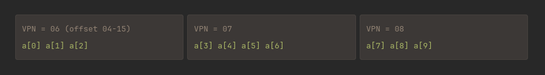

#+DOWNLOADED: screenshot @ 2026-07-18
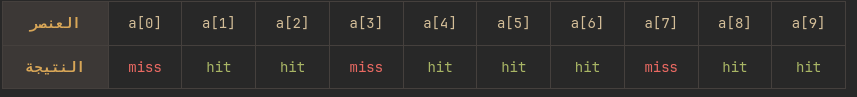

عدد الـ *hits* متخطي الـ70%, اول access فقط لكل صفحة بيبقي *miss* والباقي كله *hits*, وكل ما حجم الـpage بيكون اكبر كل ما الـhit rate بيعلي لان عدد العناصر المجاورة اللي بتستفاد من الـcaching بيكون اكبر (*spatial locality*).

ولو نفس الـloop اتكررت تاني علي نفس الـarray وكان لسا نفس الـpages محفوظة في الـTLB,
هناخد 100% cache hits وده اسمه (*temporal locality*).

*** ASID

الـTLB ممكن يكون في TLB entries لكذا process بنفس الـVPN, يعني ممكن يكون فيه VPN 10 بتاع process و VPN 10 بتاع process ثانية, فا عشان نحل المشكلة دي اثناء الـContext swithing:

- اما بنعمل flush للـTLB ونسمح كل الـentries (بنخلي الـvalid bit ب0 في كل الـentries).
- اما بنستخدم *ASID bit* في الـTLB entry, بتكون عبارة عن ID لكل process, فا نقدر نخزن TLB entries بنفس الـVPN لـproceses مختلفة.

*** Shared Pages

ممكن يكون كذا TLB entry بنفس الـVPN ولكن بـASID مختلف وكلهم بيشاوروا علي نفس الـPFN.

*** Replacement Policy

لما الـTLB بيتملي, فا افضل policy مستخدمة عشان نفضي مكان لـentries جديدة, هي اننا مسح entries قديمة بشكل *عشوائي*.

في policies ثانية زي الـLRU ولكن ليها عيوب كبيرة.

** Multi-Level Page Tables
:PROPERTIES:
:ID:       473c6a96-2a8f-403b-91ee-4ed28d4bf39c
:END:

*** Problem

- الـPage Tables بيكون حجمها كبير جداّ, بالذات في الـaddress spaces الكبيرة زي الـ32bit و الـ64bit, حجمها بيوصل لمئات الميجابايتس.
- في الـaddress spaces الكبيرة اللي بنستخدمها في الانظمة الحديثة الـ64bit, ممكن عدد الصفحات فيه يوصل لملايين, وبالبتالي عدد الـentries في الـPage table برضو هيوصل لملايين والـPage table بتكون كبيرة.

*** Possible Solutions

**** Paging + Segmentation

- في حلول كتيرة طلعت زي اننا نستخدم ميكس بين الـsegmentation والـpaging بحيث بدل ما يكون عندنا page table للـaddress space كله, لا نقسم الـaddress space لـsegments وكل segment يكون ليها page table لوحدها وbase register بيشاور علي مكانها في الـmemory.

- *ولكن* ده هيرجعنا لنفس مشاكل الـSegmentation والـexternal fragmentation اللي بتسببه

**** Big Page Size

- ممكن برضو نخلي حجم الـPage الواحدة كبير جدا, مثلا 16kb بدل 4kb وده هيقلل عدد الـPages وبالتالي عدد الـentries في الـPage table هيقل وهتبقي اصغر وكمان الـhit rate هيكون اعلي.

- *ولكن* ده هيزود الـinternal fragmentation بشكل كبير جداّ

*** Real Solution
:PROPERTIES:
:ID:       3b952601-e4df-4d7b-9975-68a21031d0ef
:END:

#+DOWNLOADED: screenshot @ 2026-07-23 18:08:15
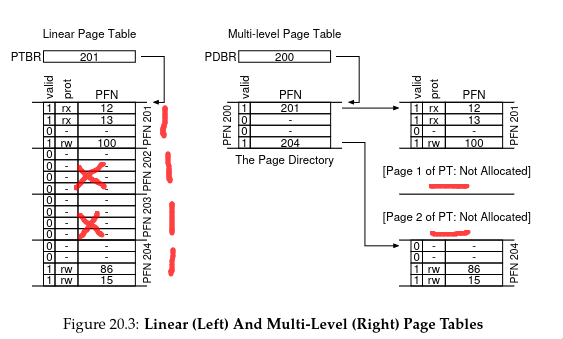

- هنقسم الـPage table الكبيرة لقطع بحجم الـPage الواحدة (page-sized units), ولكن ده مازال معملش اي حاجة جديدة, الفكرة اننا هنخزن الـunits دي في data structure جديدة اسمها الـ *Page directory*, وهنخزن فقط الـ *valid entries*.
- فا الـpage directory هيكون عبارة *فهرس* لكل الـPage tables الفرعية اللي فيها للـentries اللي بتشاور علي الـpages المستخدمة فعلا من البرنامج, مش كل الـentries لكل الـpages في الـaddress space.
- الـValid entry في الـpage directory بيكون اسمها *PDE*.
- الـpage-sized units دي بتكون عبارة عن Page Table فرعية صغيرة.

**** تقسيمة الـVirtual address

الـvirtual address في الانظمة الحديثة بتقسم لـ:

- PDI: Page Directory index -> index for the approbriate page table
- PTI: Page Table index     -> index for the approbriate PTE -> VPN
- offset: the amount of steps inside the physical address.

**** عيوب الـMulti-level page tables
:PROPERTIES:
:ID:       9f5ef83f-3445-4325-afa5-aa3a6413f7bf
:END:

#+DOWNLOADED: screenshot @ 2026-07-23 17:31:37
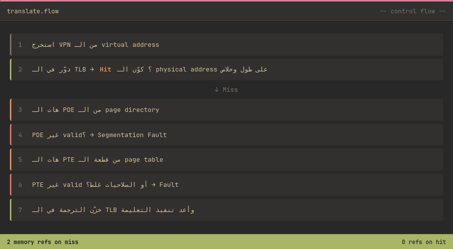

- النظام ده بيوفر مساحة ولكنه بيجي علي حساب الوقت, الـ *TLB miss* بيكون مكلف جداّ لان ساعتها الـhardware بيضطر يروح الـmemory مرتين (2 memory lockup), مش مرة واحدة زي الـlinear page table:

  - هيروح مرة للـPage Directory عشان يجيب الـPDE.
  - ومرة تانية للـPage Table عشان يجيب الـPTE.

- ده غير ان الكود اللي بيهندل الـmiss هيكون معقد اكتر وبالتالي الـhardware هيستهلك cycles اكتر.

- وفي الانظمة الحديثة الـ64bit, بتستخدم مستويات اكتر ممكن يوصل لـ4 او 5 مستويات, لان الـPage Directory بيكون كبير وبيتقسم لاجزاء اصغر. فالـTLB miss بيكون ابطأ بسبب الـPage wake الكبير.

- الـ *Page walk* هي سلسلة من الـmemory lookups اللي الـMMU بيعملها لما يحصل TLB miss عشان يجيب الـPTE.

** Swapping: Mechanisms

*** Swap Space
:PROPERTIES:
:ID:       fd9575b7-9beb-4161-93fe-c26f65592a3f
:END:

- نظام التشغيل بيحجز مساحة علي الـdisk مخصوصة لنقل الصفحات ذهاباَ واياباَ بين الـRAM والـdisk ودي بنسميها الـswap space.

  #+DOWNLOADED: screenshot @ 2026-08-02 23:18:07
  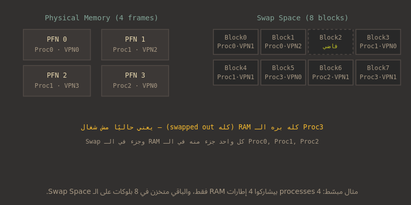

  - الـswap space مش هي المكان الوحيد اللي الـOS بيجيب منه صفحات, اي ملف binary بيكون فيه code و static data segments, ممكن الـOS بيشيل الصفحات المخصصة ليهم من الـRAM ولما يعوزها تاني, يروح يجيبها من الـbinary نفسه بدل ما يروح للـswap space, لان في الحالتين احنا مازلنا بنتعامل مع الـdisk.

*** Present Bit
:PROPERTIES:
:ID:       6ad34e42-e0b8-4e30-aef7-1321e713acd2
:END:

الـpresent bit هي اللي بتعرفنا هل الـPage موجودة في الـRAM ولا اتعملها swap علي الـdisk.

لما بيحصل memory reference لأي page:

1. الـMMU بيستخرج الـVPN من الـvirtual address.
2. بيروح يشوف الترجمة الخاصة متكيشة في الـTLB ولا لا, لو لقاه يبقي ده (TLB hit) وبياخد الـphysical address ويروح يجيب الداتا علي طول.
3. لو مش موجود يبقي TLB miss, فا بيضطر يروح للـPage table في الـmemory ويجيب الـPTE الخاص بالـVPN ده.
4. في الـPTE بيكون في valid bit و present bit, لو الصفحة valid و present بيجيب الـPFN  يحطه في الـTLB ويعيد الـprocess دي تاني.
5. لكن لو مش present او valid يبقي ده *Page fault*.

   #+DOWNLOADED: screenshot @ 2026-08-02 23:30:30
   

*** Page Fault

- الـPage fault هو لما الصفحة تكون مش valid والـprocess عاوزة تعمل access لـmemory مش بتعاعتها, او لما تكون الصفحة مش present ومش موجودة في الـRAM اصلا, وساعتها الـPFN بيكون بيشاور علي عنوان في الـdisk مش الـmemory.

- الـOS هو اللي بيتعامل مع حالات الـPage fault, وبيكون في page-fault handler مخصص للنوع ده من الـexceptions.

**** كيفية التعامل مع الـPage fault:
:PROPERTIES:
:ID:       6a50cf13-bfab-48c9-94db-694ce6c3cad0
:END:

- لما بيحصل page fault الـOS بيدور في الـPTE عشان يجيب الـPFN ويطلع منه العنوان بتاع الصفحة علي الـdisk. بعدين يبعت I/O request للـdisk عشان يجيب الصفحة ويرجعها تاني للـmemory

لما عملية القراءة من الديسك بتخلص, نظام التشغيل بيعمل الخطوات دي:

1. بيدحث الـpresent bit في الـPTE من 0 لـ 1.
2. بيعدل العنوان اللي بيشاور عليه الـPFN للعنوان الجديد في الـRAM.
3. بيعيد تنفيذ الـinstruction الاولي اللي كانت عاوزة تجيب الـPage وسببت Page fault.

- لما يعيد الـinstruction دي تاني, هتتسبب في cache miss, فا هيروح للـPage table تاني عشان ييجيب الـPFN الجديد, ويكيش الترجمة في الـTLB.

- لما الـOS بيعمل IO request للـdisk عشان يجيب الـpage, الـprocess بتكون في حالة blocked, والـOS بيخلي الـCPU يروح ينفذ اي process تانية لحد ما الـdisk يرد.

  #+DOWNLOADED: screenshot @ 2026-08-03 00:49:27
  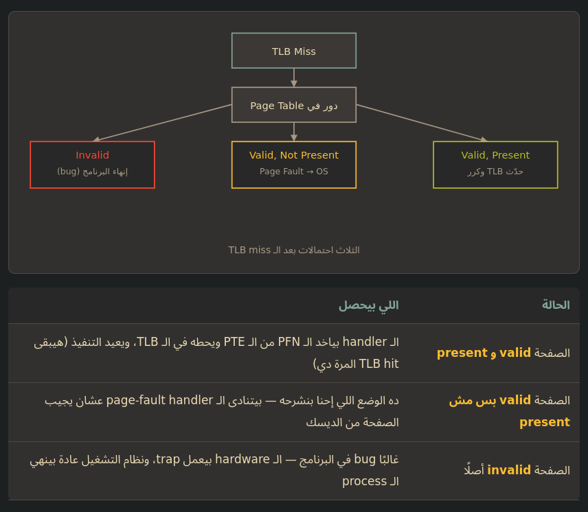

*** Page-Replacement Policy

- لما بتكون الـpage معمولها swap ونيجي نرجعها تاني علي الـmemory, ممكن الـmemory ميكونش فيها ماكن فاضي, في الحالة دي الـOS مضطر يفضي مكان في الـRAM عن طريق انه يعمل swap لبعض الـpages عشان يفضي مكان للـpage الجديدة.

- ولكن قرار اختيار انهي page هيتعملها swap out ده قرار مهم جدا لان لو الـOS اختار الصفحة الغلط ده هيـأثر علي اداء البرنامج بشكل كبير جدا ممكن يوصله انه يخليه يشتغل بسرعة الـdisk مش الـmemory.

*** امتي بيحصل Replacement؟

- الـOS مش بيستني لحد ما الـRAM تتملي خالص وبعد كدا يبدأ يعمل swap عشان يفضي مساحة, لا الـOS بيشتغل بشكل استباقي اول ما الـRAM usage يوصل لنسبة معينة قبل ما يتملي.

- الـOS بيحدد قيمتين مهمين هما الـ High watermark والـ Low watermakr:

  1. لما الـOS يلاحظ ان عدد الصفحات الفاضية بقا اقل من الـlow watermark.
  2. بيقوم يشغل thread في الخلفية (page/swap daemon) وده مسؤول ان يطلع صفحات ويعملها swap عشان يفضي مساحة, لحد ما عدد الصفحات الفاضية يوصل للـhigh watermark.
  3. بعد كدا الـthread بينام تاني.

- الـthread ده بيعمل swap للصفحات في مجموعة مع بعد (batching) بدل ما صفحة في المرة عشان يبقي اسرع.

** Concurrency and Threads

*** Thread

- الـThread هي execution path مختلف داخل الـMain thread, ليها PC و registers و stack خاص بيها.
- فيما عدا ذلك هي بتتشارك مع الـThreads الاخري في نفس الـAddress space.
- الـContext switching بين الـthreads سريع جدا, لانه نفس الـaddress space وبالتالي نفس الـpage table, وبالتالي نفس الـTLB cache. الـexecution context بتاع الـthread بيتحفظ في الـTCB.
- الـThreads بتقدر تتوصل مع بعض او يعني بتتشارك في نفس الـData من غير IPC.
- الـthreads بتستخدم عشان نعمل parallelism وعشان نتفادي الانتظار اثناء اثناء وقوف البرنامج في عمليات الـIO البطئية. (overlap)

**** Thread Stack
:PROPERTIES:
:ID:       901cc7a0-dd1b-45a1-b1e2-8faced6ce2bd
:END:

- كل thread ليها stack خاص بيها عشان يكون عندنا tracing واضح للـexecution path بتاع كل thread, وكمان عشان نخزن فيه الـlocal variables, parameters و الـreturn addresses بتاعت الـfunctions اللي الـthread بينفذها.

- كل stack من دول بيتخزن في المنطقة الفاضية اللي بين الـmain stack والـheap, ولكن دي مش مشكلة لان المنطقة دي بتكون كبيرة وحتي لو عندما recursion او web server مثلا بيحجز الاف الـthreads, فا احنا ممكن نغير حجم الـstack بتاع كل thread.

#+DOWNLOADED: screenshot @ 2026-08-05 19:14:18

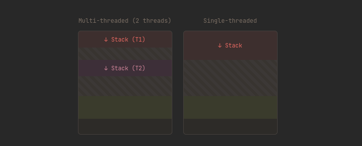
*** Example:
:PROPERTIES:
:ID:       736c8a4b-c25b-4cf9-8a56-b0505cafa75e
:END:

#+begin_src C :results output
#include <pthread.h>
#include <stdio.h>

void *say_hello(void *arg)
{
    printf("%s\n", (char *)arg);
    return NULL;
}

int main()
{
    pthread_t t1, t2;

    printf("main: begin\n");
    pthread_create(&t1, NULL, say_hello, "worker-1: A");
    pthread_create(&t2, NULL, say_hello, "worker-2: B");

    pthread_join(t1, NULL);
    pthread_join(t2, NULL);
    printf("main: end\n");

    return 0;
}
#+end_src

#+RESULTS:
: main: begin
: worker-1: A
: worker-2: B
: main: end

#+DOWNLOADED: screenshot @ 2026-08-05 20:56:29
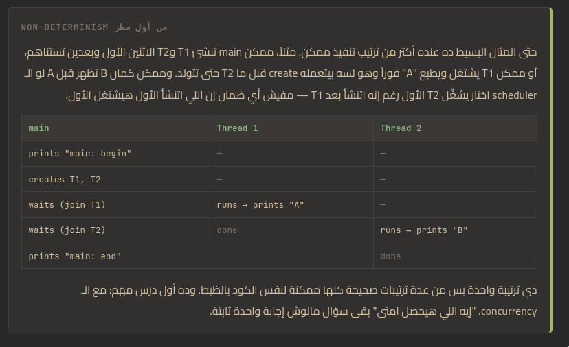

*** Threads Problem:
:PROPERTIES:
:ID:       924e49ec-7d56-43dd-beb0-8003f0d5ecc3
:END:

#+begin_src C :results output
#include <stdio.h>
#include <pthread.h>

static volatile long counter;

void *bump(void *arg)
{
    for (long i = 0; i < 10000000; i++) {
        counter+= 1;
    }

    return NULL;
}

int main(void)
{
    pthread_t t1, t2;

    pthread_create(&t1, NULL, bump, NULL);
    pthread_create(&t2, NULL, bump, NULL);
    pthread_join(t1, NULL);
    pthread_join(t2, NULL);

    printf("counter = %ld\n", counter);
    return 0;
}
#+end_src

#+RESULTS:
: counter = 10428422

#+DOWNLOADED: screenshot @ 2026-08-05 21:41:22
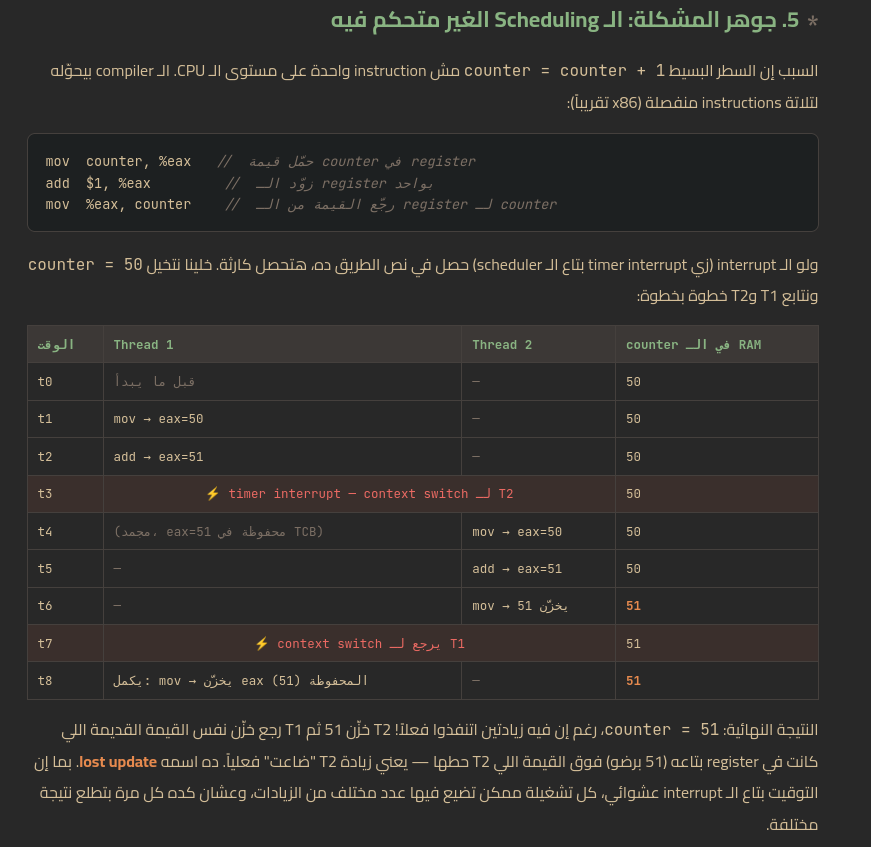

- ترتيب تنفيذ الـthreads مش متوقع ومتوقف علي الـscheduler.
- مشاركة الـData بين الـthreads بينتج عنها race conditions و indeterminate programs الـoutput بتاعها غير متوقع.
- عشان نحل المشكلة دي كان لازم الـhardware يتدخل ويوفرلنا ادوات تساعدنا نقلل الـrace conditionsi علي الـcritical sections زي الـlocks والـcondition variables والاداوت دي بنسميها synchronization primitives.

** Thread API

*** Simple Example on Deadlocks

- الـDeadlock هو حالة بتحصل لما يكون thread او اكتر بفضلوا مستنين بعض للأبد, كل واحد فيهم ماسك resource التاني محتاجها.

  - لو اعتبرنا ان p1 اتنفذ الاول, فا هيدخل علي الـif وهيقفل m1 و m2 وبعض كدا لما يخرج هيفتحهم تاني وخلاص علي كدا.

  - ولكن ممكن الـscheduler يقرر انه يوقف p1 عند السطر (1) ويعمل context switching لـp2.

  - هيدخل p2 في الـelse عند السطر (3) ويقفل m2, وبعد كدا ينزل عند السطر (4) عشان يقفل m1, هيلاقي ان m1 اتقفل بالفعل من p1 فا هيتجمد ويفضل مستني p1 لحد ما يفتح m1.

  - الـscheduler هيقوم راجع لـp1 تاني مكان ما وقف عند السطر (1) ولما يكمل وينزل عن السطر (2) هيلاقي ان p2 قفل m2 بالفعل (race condition) , فا برضو هيتجمد ويفضل مستني p2 يفتح m2

  - كدا الاتنين هيفضلوا مستنين بعض للأبد.

#+begin_src C
#include <stdio.h>

#include "common_threads.h"

kpthread_mutex_t m1 = PTHREAD_MUTEX_INITIALIZER;
pthread_mutex_t m2 = PTHREAD_MUTEX_INITIALIZER;

void *worker(void *arg)
{
    if ((long long)arg == 0) {
        Pthread_mutex_lock(&m1); // 1
        Pthread_mutex_lock(&m2); // 2
    } else {
        Pthread_mutex_lock(&m2); // 3
        Pthread_mutex_lock(&m1); // 4
    }
    Pthread_mutex_unlock(&m1);
    Pthread_mutex_unlock(&m2);
    return NULL;
}

int main(int argc, char *argv[])
{
    pthread_t p1, p2;
    Pthread_create(&p1, NULL, worker, (void *)(long long)0);
    Pthread_create(&p2, NULL, worker, (void *)(long long)1);
    Pthread_join(p1, NULL);
    Pthread_join(p2, NULL);
    return 0;
}
#+end_src

- Solution
  - this global lock prevents any race condition.
  #+begin_src C
#include <stdio.h>

#include "common_threads.h"

pthread_mutex_t g  = PTHREAD_MUTEX_INITIALIZER;
pthread_mutex_t m1 = PTHREAD_MUTEX_INITIALIZER;
pthread_mutex_t m2 = PTHREAD_MUTEX_INITIALIZER;

void *worker(void *arg)
{
    pthread_mutex_lock(&g);

    if ((long long)arg == 0) {
        Pthread_mutex_lock(&m1); // 1
        Pthread_mutex_lock(&m2); // 2
    } else {
        Pthread_mutex_lock(&m2); // 3
        Pthread_mutex_lock(&m1); // 4
    }
    Pthread_mutex_unlock(&m1);
    Pthread_mutex_unlock(&m2);
    return NULL;
}

int main(int argc, char *argv[])
{
    pthread_t p1, p2;
    Pthread_create(&p1, NULL, worker, (void *)(long long)0);
    Pthread_create(&p2, NULL, worker, (void *)(long long)1);
    Pthread_join(p1, NULL);
    Pthread_join(p2, NULL);
    return 0;
}
#+end_src

** Lock-based Concurrent Data Structures

*** Concurrent Data Structures

**** Concurrent Counters

- الـ *Global lock* التقليدي بيمنع الـrace conditions ولكنه بطئ شوية لانه بيزود الـrace علي الـlock نفسه.
  - كل الـthreads بتتنافس علي الـlock في نفس الوقت ولما thread بيقفل الـlock باقي الـthreads بتفضل مستنية فا في CPU cycles كتير بيتضيع في الا شئ.

  - وكمان بيحصل context switching كتير لان الـthreads لما بتستني شوية وتلاقي ان الـlock لسا متفتحش الـOS بيعمل context switching عشان ميضيعش وقت الـCPU اكتر من الازم وطبعا الـcontext switching مكلف وبيجي علي حساب اداء البرنامج.

  - و اصلا مبيكونش في اي paralleism حقيقي, لان كل الـthreads بتشتغل ورا بعض مش مع بعض.

*Global Counter very bad performance*
- 1M locks
- A lot of cache invalidations between cores

#+begin_src C
volatile int counter = 0;
pthread_mutex_t glock = PTHREAD_MUTEX_INITIALIZER;

void *worker(void *args)
{
    for (int i = 0; i < 1000000; i++) {
        pthread_mutex_lock(&glock);
        counter++;
        pthread_mutex_unlock(&glock);
    }

    return NULL;
}

int main(int argc, char *argv[])
{
    pthread_t thrds[15];

    for (int i = 0; i < 15; i++) {
        pthread_create(&thrds[i], NULL, worker, NULL);
    }

    for (int i = 0; i < 15; i++) {
        pthread_join(thrds[i], NULL);
    }

    printf("counter: %d\n", counter);
    pthread_mutex_destroy(&glock);

    return 0;
}
#+end_src

---------------------------------------------------------------------------------

- الطريقة دي بتستخدم local resource كل thread بيشتغل عليها لوحده ومفيش حد بينافسه فيها, كل thread بيزود في local counter خاص بيه من غير ما يتنافسه علي global resource.

- ولكن مازال لازم نعمل flush للـlocal counters دي في الـglobal counter, وفي الحالة دي مضطرين نستخدم lock بس هنخلي الـflush يتعمل كل threshold معين عشان نقلل التنافسية علي الـlock.

- الـapprox counter بيستخدم لما تكون عاوز يبقي عندك القابلية انك تقرأ قيمة من الـcounter في اي وقت من خلال thread ثالث خالص وتحصل علي قيمة معقولة وقريبة اثناء ما الـthreads التانية شغالة بتعد.

*Approximate/Sloppy Counter (1000 locks with this specific input)*

#+begin_src C
int counter;
pthread_mutex_t glock = PTHREAD_MUTEX_INITIALIZER;

void *worker(void *args)
{
    int local = 0;

    for (int i = 0; i < 1000000; i++) {
        local++;

        if (local >= 1024) {
            pthread_mutex_lock(&glock);
            counter += local;
            pthread_mutex_unlock(&glock);
            local = 0;
        }
    }

    if (local >= 1024) {
        pthread_mutex_lock(&glock);
        counter += local;
        pthread_mutex_unlock(&glock);
        local = 0;
    }

    return NULL;
}

int main(int argc, char *argv[])
{
    pthread_t thrds[15];

    for (int i = 0; i < 15; i++) {
        pthread_create(&thrds[i], NULL, worker, NULL);
    }

    for (int i = 0; i < 15; i++) {
        pthread_join(thrds[i], NULL);
    }

    printf("counter: %d\n", counter);
    pthread_mutex_destroy(&glock);

    return 0;
}
#+end_src

- الـ Trade-off بتاع الـthreshold
  - لو قيمة الـthreshold *صغيرة* هناخد اداء اضعف عشان التنافسية علي الـlock هتزبد وبالتالي هيحصل context switching كتير, ولكن قيمة الـcounter هتكون دائما قريبة من القيمة الحقيقة.

  - لو قيمة الـthreshold *كبيرة* هناخد اداء افضل ولكن قيمة الـcounter بتكون متأخرة شوية عن القيمة الحقيقية.

- الـapprox counter اسرع بالضعف من الـglobal counter.

#+begin_example
gcc -o approx2 approx_counter2.c && time ./approx2
counter: 15000000

________________________________________________________
Executed in    4.58 millis    fish           external
   usr time   24.14 millis  258.00 micros   23.89 millis
   sys time    0.30 millis  303.00 micros    0.00 millis

ziad@nixpc ~/P/o/h/t/code (main)> gcc -o normal normal_counter.c && time ./normal
counter = 15000000

________________________________________________________
Executed in    9.43 millis    fish           external
   usr time    8.68 millis  226.00 micros    8.46 millis
   sys time    1.31 millis  252.00 micros    1.06 millis
#+end_example

- لو هنستخدم array زي كدا فا لازم نعمل padding بين الـlocal resources عشان الـcache lines.

#+begin_src C
// prevents false sharing
typedef struct {
    uint32_t value;
    uint8_t padding[60];
} PaddedInt;

typedef struct {
    PaddedInt lvalue[NUM_THRDS];
    int gvalue;
    pthread_mutex_t glock;
} Counter;
#+end_src

 او تستخدم الـalignas اللي بتضيف padding برضو بس بطريقة انظف (C11)

#+begin_src C
#include <stdalign.h>

typedef struct {
    alignas(64) uint32_t value;
} PaddedInt;
#+end_src

--------------------------------------------------------------------------------

لكن لو عاوز اسرع حاجة ممكنة ومش هامك انك تقرأ قيمة الـcounter اثناء ما العد شغال وهتقرأه فقط بعد ما العد يخلص, فا ممكن نعمل حاجة شبه الـsloppy counter ولكن بـaggregation في الاخر مش periodic sync.

*Aggregation at the end (only 15 locks)*

#+begin_src C :results output
#include <pthread.h>
#include <stdio.h>

int counter;
pthread_mutex_t glock = PTHREAD_MUTEX_INITIALIZER;

void *worker(void *args)
{
    int local = 0;

    for (int i = 0; i < 1000000; i++) {
        local++;
    }

    pthread_mutex_lock(&glock);
    counter += local;
    pthread_mutex_unlock(&glock);

    return NULL;
}

int main(int argc, char *argv[])
{
    pthread_t thrds[15];

    for (int i = 0; i < 15; i++) {
        pthread_create(&thrds[i], NULL, worker, NULL);
    }

    for (int i = 0; i < 15; i++) {
        pthread_join(thrds[i], NULL);
    }

    printf("counter: %d\n", counter);
    pthread_mutex_destroy(&glock);

    return 0;
}
#+end_src

** Condition Variables

- الـcondition variables هي اداة من ادوات كتيرة بتساعدنا نكتب كود متزامن بين الـthreads.

*** Busy Waiting

- الـbusy waiting هي ابسط طريقة ممكنة لتزامن اكتر من thread مع بعض, هنا الـmain thread بيخلص وبيقفل من غير ما يستني اي child thread, ممكن نعمل loop بتشيك علي var معين لحد عشان نجبر الـmain thread انها تستني.

  - الطريقة دي كارسية لان الـCPU بيفضل مستني في الـloop مش بيعمل اي حاجة واسهلاك الـCPU بيروح في الهواء بالذات لو الـchild thread بيعمل حاجة ثقيلة فا الـCPU هيفضل مستني كتير.

  - الـchild process هتتحول لـzombie وهتفضل موجودة لحد نهاية مدة البرنامج وكمان مش هنعرف نقرأ الـreturn value.

#+begin_src C :results output
#include <pthread.h>
#include <stdio.h>

volatile int done = 0;

void *child(void *arg)
{
    printf("child\n");
    done = 1;
    return NULL;
}

int main(int argc, char *argv[])
{
    printf("parent begin\n");

    pthread_t c;
    pthread_create(&c, NULL, child, NULL);

    while (done == 0)
        ;

    printf("parent end\n");

    return 0;
}
#+end_src

#+RESULTS:
: parent begin
: child
: parent end

*** Join

- افضل بمراحل من الـbusy waiting, الـOS بيحط الـmain thread في حالة blocked وبيعمل context switching عشان ميضيعش وقت الـCPU.
- لما الـchild thread تخلص هيتم تنظيف الموارد الخاصة بيها و قراءة الـreturn value.

#+begin_src C :results output
#include <pthread.h>
#include <stdio.h>

void *child(void *arg)
{
    printf("child\n");
    return NULL;
}

int main(int argc, char *argv[])
{
    printf("parent begin\n");

    pthread_t c;
    pthread_create(&c, NULL, child, NULL);
    pthread_join(c, NULL);

    printf("parent end\n");

    return 0;
}
#+end_src

*** Condition Variables

الطريقتين اللي فاتوا بيخلونا نستني الـlifetime كامل بتاع الـthread, ولكن احيانا بنحتاج نستني شرط معين بس, الـcondition variables بتحل المشكلة دي عن طريق انها بتنيم الـthread اللي مستني الشرط يتحقق وتحطه في queue من الانتظار لحد ما الـthread اللي غير الشرط يعمل signal عشان يصحي الـthread ده تاني.

#+begin_src C
int pthread_cond_wait(pthread_cond_t *c, pthread_mutex_t *m);
int pthread_cond_signal(pthread_cond_t *c);
#+end_src

الـ =wait= هدفها انها تعمل unlock وتنيم الـthread بشكل atomic.

الـ =signal= مش بتصحي اللي عليه الدور, هي بتصحي من الـqueue بشكل عشوائي. (FIFO no guaranteed)

---------------------------------------------------------------------------------

- الـparent هتنشأ الـchild thread, وبعد كدا في احتمالين واحد فيهم هيحصل:

- الاحتمال الاول - الـchild اتنفذ الاول:

  - ان الـchild thread يشتغل علي طول قبل ما الـparent يعمل join(), وفي الحالة دي هيغير الـcondition variable ويعمل signal عشان يصحي اي thread كان نايم علي الـvariable ده ولكن مفيش حد كان نايم عليه بس مش هتفرق لان الـsignal هترجع عادي جدا.

    - وبعد كدا لما الـparent ينفذ الـ =thr_join= هيخش يلاقي الـdone بقت ب1 فهيخرج عادي من غير ما يستني.

- الاحتمال الثاني - الـ =thr_join= اتنفذ الاول:

- او الـparent هيخش ينفذ الـ =thr_join= قبل ما الـchild thread يلحق يشتغل, وساعتها هيلاقي الـdone لسا ب0 فهيعمل unlock وينام لحد ما الـchild يبعتله signal, وساعتها هيرجع من الـblocked state والـlock مقفول ها هيقوم فاتحه تاني وخارج.

#+begin_src C :results output
#include <pthread.h>
#include <stdio.h>

pthread_cond_t c = PTHREAD_COND_INITIALIZER;
pthread_mutex_t m = PTHREAD_MUTEX_INITIALIZER;
int done;

void thr_exit()
{
    pthread_mutex_lock(&m);
    done = 1;
    pthread_cond_signal(&c);
    pthread_mutex_unlock(&m);
}

void thr_join()
{
    pthread_mutex_lock(&m);
    while (done == 0)
        pthread_cond_wait(&c, &m);
    pthread_mutex_unlock(&m);
}

void *child(void *arg)
{
    printf("child\n");
    thr_exit();
    return NULL;
}

int main(int argc, char *argv[])
{
    printf("parent begin\n");

    pthread_t c;
    pthread_create(&c, NULL, child, NULL);
    thr_join();

    printf("parent end\n");

    return 0;
}
#+end_src

#+RESULTS:
: parent begin
: child
: parent end

**** Producer-Consumer Bounded Buffer Pattern
:PROPERTIES:
:ID:       acaf9b82-368f-4c62-a8ab-304618679b46
:END:

#+DOWNLOADED: screenshot @ 2026-08-09 18:17:42
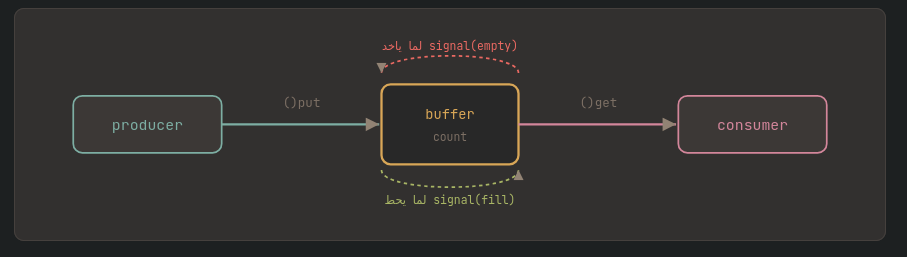

- لما يكون عندنا جهة بتنتج data وجهة تانية بتستهلكها, الـpattern ده بيستخدم في فصل الـproducer عن الـconsumer لما يكون الاتنين بيشتغلوا بـrate او سرعة مختلفة
- لان لو الـproducer اسرع من الـconsumer, النظام او الـmemory هيتملوا بسرعة والنظام هيضرب.

#+begin_example
        Producer
           │
           │  produces at its own rate
           ▼
     ┌─────────────┐
     │    Queue    │
     └─────────────┘
           │
           │  consumes at its own rate
           ▼
        Consumer
#+end_example

- *مثال واقعي*:
  لو عندنا server بيستقبل requests, فا الـrequests ممكن تيجي بسرعة جدا في حالة زروة علي الموقع مثلا بيجي sec/requests 100, والـworkers المسؤلة عند هندلة الـrequests دي ممكن تكون بتشتغل بسرعة ابطأ مثلا sec/requests 60 فا الـmemory هتتملي والـserver هيقع.

#+begin_example
Requests
   ↓
Producer
   ↓
[ Queue ]
   ↓
Workers
   ↓
Database
#+end_example

لكن الـpattern ده بيعمل queue والـproducer بيحط jobs جديدة طول ما الـqueue فيه مكان فاضي, والـconsumer بيستهلك منه براحته بالسرعة اللي يقدر عليها.

لو الـbuffer اتملي علي اخره الـproducer هيقف لحد ما الـconsumer يستهلك شوية ويفضي مكان.

-------------------------------------------------------------

- الـbuffer بيشتغل بشكل circular وبيتعمله flip لما يتملي عشان نفضيه تاني ونحط jobs جديدة.

#+begin_src C
#include <pthread.h>
#include <stdio.h>

#define LOOPS 10
#define MAX 5

static int buffer[MAX];
static int fill_ptr;
static int empty_ptr;
static int count; // num of elements stored in buffer
pthread_mutex_t m = PTHREAD_MUTEX_INITIALIZER;
pthread_cond_t empty = PTHREAD_COND_INITIALIZER;
pthread_cond_t fill = PTHREAD_COND_INITIALIZER;

void put(int val)
{
    buffer[fill_ptr] = val;
    fill_ptr = (fill_ptr + 1) % MAX;
    count++;
}

int get()
{
    int val = buffer[empty_ptr];
    empty_ptr = (empty_ptr + 1) % MAX;
    count--;
    return val;
}

void *producer(void *arg)
{
    for (size_t i = 0; i < LOOPS; i++) {
        pthread_mutex_lock(&m);
        while (count == MAX) {
            pthread_cond_wait(&empty, &m);
        }
        put(i);
        pthread_cond_signal(&fill);
        pthread_mutex_unlock(&m);
    }
    return NULL;
}

void *consumer(void *arg)
{
    for (int i = 0; i < LOOPS; i++) {
        pthread_mutex_lock(&m);
        while (count == 0) {
            pthread_cond_wait(&fill, &m);
        }
        int tmp = get();
        printf("consumed %d\n", tmp);
        pthread_cond_signal(&empty);
        pthread_mutex_unlock(&m);
    }
    return NULL;
}

int main(int argc, char *argv[])
{
    pthread_t t1, t2;
    pthread_create(&t1, NULL, producer, NULL);
    pthread_create(&t2, NULL, consumer, NULL);
    pthread_join(t1, NULL);
    pthread_join(t2, NULL);

    return 0;
}
#+end_src

**** Coverting Condition

- ممكن نصحي كل الـthreads اللي نايمة علي cv معين من خلال =pthread_cond_broadcast=

** Semaphores

- الـsemaphores هي اداة واحدة ممكن نستخدمها كا *lock* عشان نحمي الـcritical section او كا *cond variable* عشان نخلي الـthreads تنام ومنضيعش CPU cycles علي الفاضي, بتساعدنا عشان نحل مشاكل معقدة وبشكل ابسط من استخدام locks مع الـcond variables.

- هو عبارة عن object فيه integer value, ومن خلالها نقدر نتحكم في اداء الـthreads.
- بنغير في الـvalue عن طريق =sem_wait= و =sem_post= في الـPOSIX
- لو القيمة سالبة الـthread بينام, وساعتها القيمة دي بتساوي عدد الـthreads اللي مستنية.
- لما القيمة بتزيد بـ1 من خلال =sem_post= في thread بيصحي من الـqueue.

  *** =sem_wait=

  - بتنقص القيمة بـ1, فا لو القيمة الابتدائية كانت بـ1 هتبقي 0, وساعتها الـthread بيكمل شغل عادي جدا.

  - بعد كدا اي thread تاني بيدخل الـcritical section وينادي =sem_wait= بينقص القيمة لتحت الـ0 فا بينام, لحد ما الـthread اللي شغال يزود القيمة, وساعتها في thread من اللي نايمين بيصحي.

**** =sem_post=

- بتزود القيمة بـ1, عشان تبعت signal ان الـthread خلص, وتصحي thread تاني من اللي كانوا مستنين.

*** Semaphore As Lock (Binary Semaphore)

- استخدام الـsemaphores كا mutex lock مباشر جدا.
  - الـthread بيدخل ينادي =sem_wait= فا بينقص القيمة لـ0, ويكمل شغل عادي لحد ما يخلص المليون عدة بتوعوا, وبعد كدا ينادي =sem_post= عشان يصحي الـthread التاني.
  - لو الـthread التاني حاول يخش الـcritical section قبل ما الـthread الاول يخلص, القيمة هتنزل بالسالب والـthread هينام لحد ما التاني ينادي =sem_post=.

#+begin_src C :results output
#include <pthread.h>
#include <semaphore.h>
#include <stdio.h>

sem_t s;
int counter;

void *count(void *arg)
{
    int local = 0;

    for (int i = 0; i < 1000000; i++) {
        local++;
    }

    sem_wait(&s);
    counter += local;
    sem_post(&s);

    return NULL;
}

int main(int argc, char *argv[])
{
    sem_init(&s, 0, 1);
    pthread_t t1, t2;
    pthread_create(&t1, NULL, count, NULL);
    pthread_create(&t2, NULL, count, NULL);
    pthread_join(t1, NULL);
    pthread_join(t2, NULL);

    printf("counter %d\n", counter);
    return 0;
}
#+end_src

#+RESULTS:
: counter 2000000

*** Semaphore as Condition Variable (Ordering)

- الـSemaphore ممكن تستخدم كا CV برضو, لان السر كله في القيمة الابتدائية.

- *لو الـparent اشتغل الاول:*
  - هنا القيمة الابتدائية خليناها بـ0 وبعد كدا الـmain thread نادي علي =sem_wait= فا القيمة نزلت لـ-1 فا نيم نفسه لحد ما الـchild يخلص.

  - الـchild هيخش يشتغل وبعد ما يخلص هنادي =sem_wait= فا القيمة هترجع بـ0 والـmain thread هيصحي.

- *لو الـchild اشتغل الاول:*
  - لو الـchild اشتغل الاول قبل ما الـparent ينادي =sem_wait= اصلا, فا الـchild هيخلص وهينادي علي =sem_post= فا هيزود القيمة لـ1.

  - الـparent هيروح ينادي =sem_wait= القيمة هتنزل لـ0 والـthread هيكمل شغل عادي من غير ما ينام لان بالفعل الـchild اشتغل وخلص فا مش محتاجين نستني.

- وفي الحالتين قدرنا نوصل للترتيب اللي احنا عاوزينه.

#+begin_src C :results output
#include <pthread.h>
#include <semaphore.h>
#include <stdio.h>

sem_t s;

void *child(void *arg)
{
    printf("child\n");
    sem_post(&s);
    return NULL;
}

int main(int argc, char *argv[])
{
    sem_init(&s, 0, 0); // inital value = 0

    printf("parnet start\n");

    pthread_t t;
    pthread_create(&t, NULL, child, NULL);

    sem_wait(&s); // value = -1 (main thread sleep)

    printf("parnet end\n");
    return 0;
}
#+end_src

#+RESULTS:
: parnet start
: child
: parnet end
